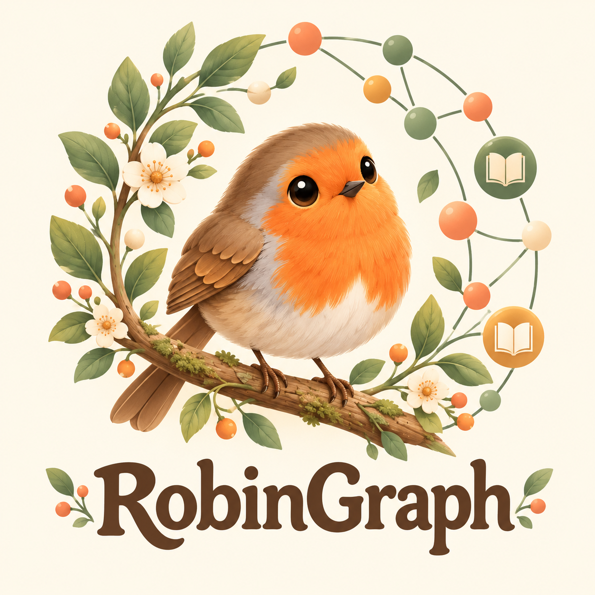

<p align="center">
  
</p>

# RobinGraph

RobinGraph는 **새를 좋아하는 마음에서 시작한 조류 지식 탐색 프로젝트**입니다. 궁금한 새의 이름과 특징을 알아보는 데서 출발해, 어떤 환경에서 살아가는지, 다른 새와는 어떤 관계인지까지 살펴볼 수 있도록 만들고 있습니다.

그래프 데이터베이스와 LLM을 이용해 분류·생태·외관·관찰 기록과 문헌 자료를 연결하고, 한국어 질문에 답변과 출처를 함께 제공합니다. 조류 도감 카드를 뒤집어 특징을 살펴보고, 아종이나 비슷한 새를 찾아 비교할 수 있습니다.

이름은 **꼬까울새(European Robin, *Erithacus rubecula*)**의 Robin과 정보 사이의 연결을 뜻하는 Graph를 합쳤습니다. 주황빛 붉은 가슴을 가진 꼬까울새는 영국의 정원에서 친숙하게 만날 수 있는 작은 새로, 정원사가 흙을 파면 드러나는 벌레를 먹으려고 가까이 따라오기도 합니다. [RSPB의 꼬까울새 소개](https://www.rspb.org.uk/birds-and-wildlife/robin)

정원사가 뒤집은 흙에서 먹이를 발견하는 꼬까울새처럼, 새에 관한 작은 질문을 따라 새로운 지식과 연결을 발견하기를 바라는 마음을 이름에 담았습니다.

현재 구현 설명은 **2026-10-09 기준**입니다. 실제 종 데이터가 적재된 [NAS TEST 대화 화면](https://robingraph-test.dove-nest.com/chat)에서 기능을 검증하고 있습니다. 로컬 합성 fixture는 DB·외부 API 없이 기본 응답과 UI를 확인하는 용도이며, 실제 종 데이터 환경과 제공 범위가 다릅니다.

## 목차

- [현재 제공 기능](#현재-제공-기능)
- [로컬에서 빠르게 실행](#로컬에서-빠르게-실행)
- [실제 종 데이터 환경](#실제-종-데이터-환경)
- [외부 API와 MLflow 설정](#외부-api와-mlflow-설정)
- [구조와 API](#구조와-api)
- [문헌 검색과 평가](#문헌-검색과-평가)
- [NAS 배포와 패키징](#nas-배포와-패키징)
- [테스트](#테스트)
- [문서 안내](#문서-안내)
- [기여자](#기여자)

## 현재 제공 기능

### 질문과 종 설명

- **한국어 자연어 질문**: 일반 소개, 먹이, 서식 환경, 활동 시간, 외관, 아종, 분류, 관찰 기록, 문헌 근거를 구분합니다. 명확한 규칙으로 처리할 수 있는 질문을 먼저 해석하고, 설정에 따라 Jev System1 의도 분석 또는 임베딩 기반 라우터를 사용합니다. 낮은 확신도나 모호한 이름은 추가 확인으로 처리합니다.
- **종 설명과 선택적 관계 탐색**: 기본 정보·외관·생활과 먹이·재미있는 사실과 가용 사진을 첫 설명에 제공합니다. `더 알아보기`에서 아종·통칭/가축형·생태 관계 등 탐색 항목을 선택하면 후속 조회합니다. 일반 소개에서 비교 후보를 항상 자동 조회하지 않습니다.
- **출처와 자료 부족 표시**: 확인된 자료로 답변하고, 자료가 없는 내용은 추측하지 않습니다. 카드의 사진·라이선스·형질 출처와 자료 기준은 설명창의 `답변 출처 보기`에 중복을 줄여 모읍니다.
- **한국어 이름 우선 표시**: 한국조류학회 목록과 학명을 대조한 보충 자료를 사용합니다. 검증된 한국어 이름이 없으면 영어 이름을 표시하며 자동 번역명을 만들지 않습니다. 카드에는 한국어 이름과 작은 영어 이름, 학명을 함께 표시합니다.

### PC·모바일 도감 카드

- **앞면**: 사진, 체중, 먹이 유형, 서식 환경, 주 생활 방식과 관찰 포인트를 표시합니다. 체중은 1,000g 이상이면 kg로 표시합니다.
- **뒷면**: 상세 특성과 먹이 구성·먹이 활동 위치 도넛 차트를 나란히 표시합니다. PC에서 차트 영역에 마우스를 올리면 항목과 비율이 뜹니다. 차트 클릭·탭으로 선택하지 않습니다.
- **카드 넘기기**: 양면의 사진·글씨·빈 곳·차트 영역에서 좌우 드래그 또는 터치 스와이프로 뒤집습니다. 카드에 포커스한 상태에서는 `Enter`·`Space`도 지원합니다. 별도의 `출처보기`·`앞면보기` 버튼은 없습니다.
- **화면 맞춤**: 앞·뒷면 높이를 같게 유지하고 화면 크기에 맞춰 카드 전체를 축소합니다. 카드 내부 스크롤을 없애고 모바일 테두리 간격을 맞췄습니다. 사진이나 자료가 없어도 같은 카드 형식을 유지합니다.
- **표현과 조작**: 서식 환경별 문양, 기록된 IUCN 등급별 색상, 회전 각도를 따라 움직이는 유광 반사를 적용합니다. 글씨 드래그 선택을 막고, 움직임 줄이기 설정과 모바일 핀치 확대를 고려합니다. 사진 이전·다음 버튼은 일반 클릭으로 사용할 수 있습니다.

#### 보전 등급 출처

분류는 AviList v2025b를 기준으로 하고, 보전 등급은 **IUCN이 GBIF에 CC BY 4.0으로 공개한 평가목록 2026-1**을 우선 연결합니다. 기존 BirdLife SIS 링크·학명·명명자·평가 ID를 검증해 11,131종 중 7,507종에 연결했습니다. 자료 버전과 개별 평가 연도를 구분하고, 답변 출처에서 평가 링크와 라이선스를 확인할 수 있습니다. 런타임은 저장소에 포함된 고정 스냅샷을 읽으므로 IUCN API 키가 필요하지 않습니다.

연결되지 않은 종은 AviList의 기록을 `자료 기준`으로 표시합니다. AviList의 NE는 **평가 자료 연결 확인 필요**로 표시하며, 실제 IUCN 미평가 판정으로 단정하지 않습니다. 까치 Pica serica처럼 평가 대상의 종 범위가 확실하지 않은 종에 다른 종의 등급을 상속하지 않습니다. 공개 평가목록 연결은 실시간 조회나 평가 원문 전체의 독립 검증을 뜻하지 않습니다. 사용자의 요청에 따라 까치(Pica serica) 한 종은 앱에서 LC로 임시 보정하며, 원자료 NE와 미검증 상태를 별도로 보존하고 배지·출처에 임시 보정임을 표시합니다. Pica pica의 한국어 표시명도 사용자 지정으로 `까치`를 사용하되 학명과 영어 이름(Eurasian Magpie)은 유지합니다.

- [공개 평가목록과 인용](https://www.gbif.org/dataset/19491596-35ae-4a91-9a98-85cf505f1bd3)
- [연결 구현·검증 기록](docs/work-log/2026-10-09-gbif-iucn-conservation-integration.md)
- 재생성: `python scripts/build_conservation_index.py --avilist <avilist-2025b.json> --snapshot <iucn-2026-1.zip>`; 동일 입력으로 `--check`를 붙이면 재현성을 확인합니다. 새 릴리스나 해시는 출처 검토 후 변경합니다.

#### IUCN 등급별 카드 색

카드는 종에 **기록된 IUCN 적색목록 등급**에 따라 색이 달라집니다. 위험도가 높을수록 프레임이 희귀 카드처럼 화려해집니다(일반 → 은색 → 금색 → 포일 → 홀로그램). 글씨는 모든 등급에서 밝은 카드 바탕 위의 어두운 색을 유지합니다. 아래 색은 대표값이며, 프레임과 카드 바탕은 실제로는 그라데이션입니다.

| 등급 | 한국어 표기 | 프레임(바깥 테두리) | 카드 바탕 | 등급 배지·목록 버튼 포인트 |
|---|---|---|---|---|
| 🟩 LC | 관심대상 | 은색 `#959a95` | 연두색 `#8fbb5c` → `#def19a` | 연두 `#e3f2c4` / 테두리 `#7f9c55` |
| 🟦 NT | 준위협 | 청회색 은색 `#8fa7b2` | 민트 `#8fc7b0` → `#d8f1e6` | 민트 `#d3efe3` / 테두리 `#4f8a75` |
| 🟨 VU | 취약 | 금색 `#c9a13b` | 노랑 `#e8c86a` → `#fbf0c4` | 연노랑 `#fbeab0` / 테두리 `#a17a14` |
| 🟧 EN | 위기 | 주황 `#c4622c`, 사선 줄무늬 포일 | 주황 `#f2a774` → `#fde4cf` | 연주황 `#fdd9bd` / 테두리 `#a24a17` |
| 🟥 CR | 위급 | 분홍·자홍 홀로그램 `#c2185b` (움직임) | 분홍 `#f3a0b8` → `#fde3ea` | 연분홍 `#fcd3df` / 테두리 `#9c1046` |
| 🟪 EW | 야생절멸 | 보라 홀로그램 `#5e35b1` (움직임) | 라벤더 `#c5b0ee` → `#efe7fd` | 연보라 `#e4d8fa` / 테두리 `#4a2d91` |
| ⬛ EX | 절멸 | 검정 홀로그램 `#1b1b1b` (움직임) | 회보라 `#b9b6c4` → `#ecebf1` | 검정 `#2a2a30`, 글씨 `#f4f2ff` |
| ⬜ DD·NE·기록 없음 | 정보부족·미평가·미확인 | 밝은 회색 `#b5b8b3` | 회녹색 `#d9ddd3` → `#eef0ea` | 연회색 `#f1f2ee` |

- LC만 은색 프레임에 기본 연두 카드를 그대로 씁니다. 나머지 등급은 카드 바탕도 등급 색으로 바뀝니다.
- CR·EW·EX 프레임은 천천히 움직이는 포일 효과를 쓰고, 운영체제의 움직임 줄이기 설정이 켜져 있으면 멈춥니다.
- 등급 코드가 정확히 알려진 값이고 **출처 이름이 함께 기록된 경우에만** 등급 색을 씁니다. DD·NE이거나, 등급이 없거나, 인식할 수 없는 값이거나, 출처 이름이 없으면 "멸종위기 등급 미확인"으로 보고 회색 카드를 씁니다.
- 원자료의 `CR (PE)`(절멸 가능성)·`CR (PEW)`(야생절멸 가능성)는 CR 색을 쓰고 배지에 해당 문구를 덧붙입니다.
- 색은 기록된 등급의 시각 표시일 뿐이며 지역 개체수 판단이 아닙니다.
- 등급 → 색 클래스 매핑은 `src/robingraph/api/static/chat.js`의 IUCN 표(한국어 표기 포함), 색은 `src/robingraph/api/static/styles.css`의 `risk-*` 규칙에 있습니다. 이 표의 색은 2026-10-09 기준 CSS에서 옮긴 것입니다.

### 관계 탐색·비교·검색

- **비교 후보 TOP 3**: 전체 활성 종에서 계통 50%·분류 30%·서식 환경 10%·먹이 생태 10%로 점수를 계산합니다. **검증 국명이 있는 후보를 먼저 선정하고, 그 안에서 점수순**으로 추천합니다. 부족한 수는 영어 이름 후보로 채웁니다. 계통 자료가 없으면 가용 분류·생태 점수를 재환산하며, 점수는 실제 진화 거리나 유전 유사도가 아닙니다.
- **분류·생태 관계**: 같은 속·과 또는 서식 환경·먹이 생태 범주를 공유하는 새를 탐색합니다. 비교 결과는 원래 설명을 유지한 별도 말풍선에 표시하고, 추천 점수·근거와 분류 계보는 구조화된 화면으로 제공합니다.
- **아종·통칭·가축형**: 활성 분류판의 아종과 검토된 이름 관계를 조회합니다. 아종 자체 자료와 부모 종 수준 참고 정보를 구분하고, 여러 종을 가리키는 이름은 후보를 선택하도록 안내합니다.
- **관찰·문헌**: GBIF 관찰 기록과 문헌 전문·벡터 결합 검색을 제공합니다. Gemini가 설정된 문헌 경로는 검색 근거로 답변을 생성하고 근거 ID를 검증합니다.
- **MLflow 추적**: LangChain LCEL autolog와 Jev의 명시적 자식 span으로 흐름을 추적합니다. Gemini 호출과 검색 단계도 기록하고, 답변 성공·추가 확인·자료 없음·기술 오류를 결과 태그로 구분합니다.

TEST에서 `흰뺨검둥오리에 대해 알려줘`, `청둥오리와 비슷한 새 알려줘`, `청둥오리 아종 알려줘`, `흰뺨검둥오리의 분류 계통 알려줘`를 입력해 확인할 수 있습니다. 대화 기록은 현재 창에서만 유지됩니다.

## 로컬에서 빠르게 실행

소스 체크아웃에서 실행합니다. 개발환경은 `.python-version`의 Python **3.12.13**과 `uv.lock`으로 고정합니다. [uv 설치](https://docs.astral.sh/uv/getting-started/installation/) 후 Windows PowerShell·macOS·Linux에서 아래 명령을 사용합니다. 가상환경 활성화는 필요 없습니다.

```sh
uv sync --locked
uv run --locked robingraph validate-fixture
uv run --locked robingraph evaluate-fixture
uv run --locked robingraph serve-fixture
```

브라우저에서 <http://127.0.0.1:8000/chat>으로 채팅 셸을 확인합니다. `/docs`는 API 문서이고, `/health`는 `mode: fixture`를 반환합니다. fixture 답변은 합성 데이터로 구성하며 외부 DB·LLM을 사용하지 않습니다. 이 모드에는 실제 종 프로필·사진·관계 탐색과 자동 의도 분석 핸들러가 연결되지 않아 채팅에서 추가 확인이나 미지원 안내가 나올 수 있습니다.

기본 답변은 `/docs`의 `POST /v1/answers`에 `{"question":"참새의 학명은 무엇인가?"}`를 보내 확인합니다. [fixture 질문](data/eval/v1/gold-questions.jsonl)과 `evaluate-fixture`의 15개 gold 평가는 이 규칙 기반 답변 경로를 대상으로 하며, 전체 종 채팅 기능 평가와 구분합니다.

## 실제 종 데이터 환경

Neo4j에 종과 자료의 관계를, PostgreSQL에 수집 작업·활성 스냅샷·분류판 상태를 저장합니다. **실제 종 설명과 관계 탐색에는 두 DB의 데이터와 활성 수집 상태가 함께 필요합니다.** 빈 DB에 API만 실행하거나 합성 fixture만 적재해도 전체 종 서비스가 준비되는 것은 아닙니다.

1. [.env.example](.env.example)을 참고해 저장소 루트의 로컬 `.env`를 준비합니다. 기존 `.env`가 있으면 필요한 항목만 추가합니다.
2. `NEO4J_*`와 `ROBINGRAPH_PG_*` 연결 정보를 설정하고 PostgreSQL 스키마를 준비합니다.
3. 수집 workflow·검증 로더로 분류·국명·형질 등 필요한 자료를 적재하고 해당 스냅샷을 활성화합니다. [수집 런북](docs/n8n/README.md)과 [PostgreSQL 수집 관리](docs/postgres-ingest-control-plane.md)를 참고합니다.
4. 실제 그래프 API를 실행합니다.

```sh
uv run --locked robingraph verify-neo4j
uv run --locked robingraph migrate-postgres
uv run --locked robingraph verify-postgres
uv run --locked robingraph serve-neo4j
```

CLI는 **실행 디렉터리의 `.env`**를 읽으며, 이미 설정된 환경 변수가 같은 키를 우선합니다. `.env`와 인증 정보는 Git에 넣지 않습니다. PostgreSQL 연결 변수는 [.env.nas.example](.env.nas.example)과 [개발 가이드](docs/development.md)를 참고합니다. `/health`의 `mode: neo4j`는 백엔드 모드이며 특정 종 데이터나 활성 분류판 검증을 대신하지 않습니다.

합성 그래프 적재·검증이 필요한 개발 환경에서는 다음 명령을 별도로 사용합니다. 실제 운영 데이터 준비와 구분합니다.

```sh
uv run --locked robingraph load-neo4j-fixture
uv run --locked robingraph verify-neo4j-fixture
uv run --locked robingraph ask-neo4j --question "Anas zonorhyncha의 한국어 이름은?"
```

## 외부 API와 MLflow 설정

설정은 서버의 `.env` 또는 배포 환경 변수로 주입합니다. 브라우저에 API 키를 입력할 필요는 없습니다.

| 기능 | 주요 설정 | 적용 범위 |
| --- | --- | --- |
| Jev System1 | `JEV_API_KEY`, `ROBINGRAPH_INTENT_ROUTER=auto` | 규칙으로 해석되지 않은 질문의 의도 분석. 종 이름 존재 여부는 DB에서 별도 검증 |
| Jina 호환 임베딩 | `ROBINGRAPH_JINA_ENDPOINT`, `ROBINGRAPH_JINA_MODEL`, `ROBINGRAPH_JINA_DIMENSIONS`, `ROBINGRAPH_JINA_API_KEY` 등 | 문헌 벡터 검색·임베딩 라우터. 현재 BirdsNest 프로필은 512차원 |
| Gemini | `GEMINI_API_KEY`, `ROBINGRAPH_GEMINI_MODEL` | 문헌 근거 답변 생성·추가 종 설명 등 설정된 생성 경로 |
| MLflow | `ROBINGRAPH_MLFLOW_TRACING=true`, `MLFLOW_TRACKING_URI`, `MLFLOW_EXPERIMENT_NAME` | 선택적 추적. 별도 MLflow 서버 필요 |

`auto`는 Jev 키가 있으면 Jev를 선택하고, 없으면 기존 규칙·임베딩 경로를 사용합니다. `ROBINGRAPH_INTENT_ROUTER=semantic`은 임베딩 경로를 선택합니다. 모든 질문에서 Jev를 호출하는 것은 아닙니다. Jev·라우팅 상세 설정은 [.env.example](.env.example), [Jev 라우팅](docs/jev-intent-routing.md), [RG-301 검증 기록](docs/verification/2026-10-08-RG013-jev-intent-routing.md)에 있습니다.

Gemini SDK/autolog와 MLflow 추적을 사용할 때는 추가 의존성을 설치합니다. Gemini의 기본 REST 생성 경로는 SDK 없이도 동작합니다.

```sh
uv sync --locked --extra tracing
uv run --locked --extra tracing robingraph serve-neo4j
```

MLflow Traces의 태그 필터로 다음을 조회할 수 있습니다.

| 태그 | 예시 |
| --- | --- |
| `response_disposition` | `answer`, `clarify`, `abstain`, `error` |
| `response_reason` | `taxon_not_found`, `intent_uncertain`, `evidence_not_found` |
| `failure_stage` | `routing`, `name_resolution`, `retrieval`, `generation` |
| `selected_intent`, `route_method` | 선택한 질문 의도·라우팅 방식 |

예를 들어 태그 필터에서 `response_reason`을 `taxon_not_found`로 지정하면 종을 찾지 못한 응답을 구분합니다. SDK 검색 식은 `tags.response_reason = 'taxon_not_found'`입니다. 추적용 `error`는 기술 실패를 나타내며 HTTP 응답의 `disposition` 계약과 구분합니다. [MLflow 설정](docs/mlflow-tracing.md)과 [RG-602 실제 저장·검색 검증](docs/verification/2026-10-08-rg015-rg016-trace-tags-drag.md)을 참고합니다.

## 구조와 API

```text
브라우저 채팅·도감 카드
        ↓ 같은 origin의 API
FastAPI → 질문 규칙 / Jev / 임베딩 라우터
        ↓
종·분류·관계 조회 / 문헌 검색 → 선택적 Gemini 생성
        ↓
Neo4j: 그래프·문헌·벡터   PostgreSQL: 수집·활성 스냅샷
        └──────── 선택적 MLflow 추적
```

| 경로 | 용도 |
| --- | --- |
| `GET /`, `GET /chat`, `GET /static/*` | 같은 서버에서 제공하는 한국어 UI·정적 자산 |
| `GET /health` | 백엔드 모드·서비스 상태 |
| `POST /v1/chat` | 의도별 채팅 답변·구조화된 결과 |
| `GET /v1/taxa/profile`, `GET /v1/taxa/related` | 종 프로필·관련 종 탐색 |
| `POST /v1/search` | 문헌 청크·점수·출처 검색. 채팅 답변 생성과 구분 |
| `GET /v1/observations` | 운영 GBIF 관찰 기록·출처·허용 media 조회 |
| `POST /v1/answers` | 기존 fixture 규칙 기반 답변 계약 |

표는 주요 경로입니다. 비교 후보·생태 관계·아종·이름 관계·분류 계보를 포함한 전체 계약은 실행한 서버의 `/docs`에서 확인합니다. UI는 서버의 `answer_text`, `disposition`, `result`, `warnings`를 표시하고 답변을 임의로 보완하지 않습니다. API `disposition`은 `answer`·`abstain`·`clarify`로 성공 답변·미응답·추가 확인을 구분합니다. 관찰의 출처·라이선스를 검증하며 일반화 대상 좌표는 API에서도 숨깁니다.

## 문헌 검색과 평가

Neo4j의 문헌 청크에 전문 검색 인덱스를 준비합니다. 아래는 **합성 fixture 검색** 명령이며 실제 문헌 수집·적재와 구분합니다.

```sh
uv run --locked robingraph load-neo4j-fixture
uv run --locked robingraph index-neo4j-fixture
uv run --locked robingraph search-neo4j --question "fixture 호수" --limit 5
```

임베딩 설정 후 벡터 색인과 전문·벡터 결합 검색을 사용할 수 있습니다.

```sh
uv run --locked robingraph index-neo4j-fixture --embeddings
uv run --locked robingraph search-neo4j --question "물가에 사는 새에 대한 기록" --hybrid --limit 5
uv run --locked robingraph evaluate-search-neo4j --mode all --limit 3
```

`--embeddings`는 외부 임베딩 요청과 벡터 쓰기를 수행하고, 동일 프로필의 전체 허용 fixture 청크 집합을 갱신합니다. `--hybrid`는 질문 임베딩과 읽기 검색을 수행합니다. 벡터를 사용할 수 없으면 전문 검색으로 대체하고 경고를 반환합니다. 평가 결과는 recall@k·MRR·평균/p95 지연시간 등을 JSON으로 제공합니다.

```sh
curl -X POST http://127.0.0.1:8000/v1/search \
  -H 'Content-Type: application/json' \
  -d '{"question":"호수와 하천에서 관찰된 물새","mode":"hybrid","limit":5}'
```

`requested_mode`는 요청값, `mode`는 실제 검색 모드입니다. `fulltext`는 Jina를 호출하지 않습니다. `serve-fixture`에는 계약이 노출되지만 문헌 검색과 운영 관찰 조회는 HTTP 503을 반환합니다. 자세한 정책은 [하이브리드 검색](docs/hybrid-retrieval.md), [임베딩 어댑터](docs/embedding-adapter.md), [실제 PMC 문헌 파일럿](docs/pmc-literature-pilot.md)을 참고합니다.

## NAS 배포와 패키징

[Dockerfile](Dockerfile)은 API와 UI를 함께 묶습니다. [compose.nas.yml](compose.nas.yml)은 기존 Neo4j·PostgreSQL·외부 Docker 네트워크·프록시를 사용하는 **NAS 운영용 구성**이며, 처음 설치하는 사용자를 위한 전체 DB 포함 설치 구성이 아닙니다. [package_nas_release.sh](scripts/package_nas_release.sh)는 커밋 기준 런타임 소스 아카이브와 해시 manifest를 만듭니다. DB 데이터와 인증 정보는 포함하지 않습니다.

배포·검증·복구는 [NAS 런북](docs/nas-deployment.md)을 따릅니다. Git push·CI 통과가 NAS 자동 배포를 뜻하지 않습니다. 최신 카드 동작의 NAS TEST 검증은 [PC 무스크롤·모바일 테두리 기록](docs/verification/2026-10-09-rg015-pc-no-scroll-mobile-border.md)에 있으며, 해당 작업의 PROD 배포는 수행하지 않았습니다.

독립형 Docker 설치 번들·공개 패키지 배포·HippoRAG 스타일 검색 전환·한국 서식종 토글은 현재 제공 기능에 포함되지 않습니다.

## 테스트

```sh
uv sync --locked --extra test
uv run --locked robingraph validate-fixture
uv run --locked robingraph evaluate-fixture
uv run --locked --extra test python -m unittest discover -s tests -v
node --test tests/frontend/*.test.js
```

Node.js는 프런트엔드 테스트에 필요합니다. Python 테스트의 실제 DB 통합 검증은 명시적 opt-in과 전용 테스트 DB를 요구하며, 설정이 없으면 해당 검증을 건너뜁니다. 모의 API·DOM 테스트와 실제 DB·외부 API·브라우저 검증은 별도 범위로 기록합니다. fixture 재생성 비교는 임시 폴더에서 수행합니다.

GitHub Actions는 Windows·macOS·Linux fixture, 프런트엔드 계약, Docker/Compose, Neo4j·PostgreSQL 통합 검증을 실행합니다. 설정과 실행 방법은 [CI workflow](.github/workflows/ci.yml), [개발 가이드](docs/development.md), [평가 가이드](docs/evaluation.md)를 참고합니다.

## 문서 안내

| 분야 | 문서 |
| --- | --- |
| 화면·질문 | [채팅 UI](docs/chat-ui.md) · [질문 처리·근거 정책](docs/species-questions.md) · [분류 계보 API](docs/taxonomy-lineage-api.md) |
| 이름·관계 | [국명 정책](docs/korean-display-names.md) · [생태 관계](docs/ecological-relations.md) · [아종](docs/subspecies-cards.md) · [통칭·가축형](docs/name-relations.md) · [관계 조사 목록](docs/name-relations-coverage.md) |
| 설계·데이터 | [시스템 설계](docs/system-design.md) · [그래프 스키마](docs/graph-database-schema.md) · [데이터 계약](docs/data-contracts.md) · [수집 포인트](docs/collection-points.md) · [기술 결정](docs/decisions/) |
| 수집·배포 | [n8n 수집 런북](docs/n8n/README.md) · [PostgreSQL 수집 관리](docs/postgres-ingest-control-plane.md) · [NAS 배포](docs/nas-deployment.md) |
| 개발·기록 | [개발환경·테스트](docs/development.md) · [평가](docs/evaluation.md) · [작업 이력](docs/work-log/) · [검증·배포 기록](docs/verification/) |

설계 문서와 과거 작업 기록에는 당시 상태가 남아 있습니다. 현재 기능은 이 README와 최신 날짜의 검증 기록을 함께 확인합니다. RG-301 Jev 의도 분석, RG-405 카드 조작·반응형 화면, RG-602 MLflow 결과 구분은 구현되어 있으며, 후속·보류 작업의 우선순위는 Obsidian `Work/RobinGraph/RobinGraph 작업 백로그.md`에서 관리합니다.

## 기여자

RobinGraph는 프로젝트 소유자 김둘기와 AI 개발 도구인 [OpenAI Codex](https://github.com/apps/chatgpt-codex-connector), [Anthropic Claude](https://github.com/apps/claude)의 협업으로 개발합니다. 역할과 Git 커밋 표기 기준은 [CONTRIBUTORS.md](CONTRIBUTORS.md)를 참고합니다.
