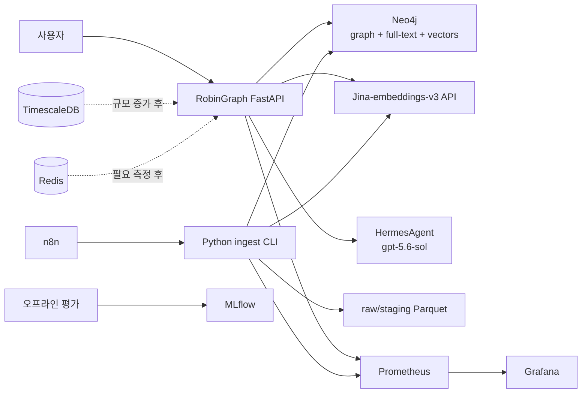

# RobinGraph 보유 인프라 적용안

- 상태: Proposed
- 작성일: 2026-09-03
- 보유 서비스: Neo4j, PostgreSQL, TimescaleDB, Redis, Jina-embeddings-v3 API, HermesAgent(gpt-5.6-sol), n8n, MLflow, Prometheus, Grafana
- 하드웨어: Ugreen NAS 2800(RAM 16GB), Mac mini M4(RAM 32GB)

## 1. 권장 구성

MVP의 요청 경로에는 FastAPI, Neo4j, Jina 임베딩 API, HermesAgent만 둔다. n8n은 배치 실행을 예약하고 Prometheus/Grafana는 상태를 본다. 나머지 서비스는 사용할 문제가 실제로 생길 때 연결한다.

원본과 staging Parquet은 수집 실행 호스트의 영속 볼륨에 저장한다. 현재 목록에는 객체 스토리지가 없으므로 MVP에서 S3/MinIO를 새로 추가하지 않는다. n8n 실행 컨테이너의 임시 디스크를 원본 보관소로 사용하지 않는다.

## 2. 서비스별 역할

| 서비스 | MVP 역할 | 저장하는 것 | 사용하지 않는 범위 |
|---|---|---|---|
| **Neo4j** | 핵심 저장소 | Taxon, 이름, 관찰, 장소, 서식지, 미디어 메타데이터, 문헌 Chunk, Claim/Evidence, vector | 대용량 원본 파일과 장기 metric |
| **Jina-embeddings-v3 API** | 질의와 Chunk 임베딩 | 서버는 모델 제공, vector는 Neo4j에 저장 | 원본 provenance의 소유 저장소 |
| **HermesAgent** | 근거 묶음에서 답변 생성 | 가능하면 영구 저장 없음 | Neo4j 직접 접근, 임의 Cypher 실행, 데이터 수집 |
| **n8n** | 정기 수집·재색인 호출, 실패 알림 | workflow 상태 | 정제·학명 통합·중복 제거 비즈니스 로직 |
| **Prometheus** | API와 ingest metric 수집 | 숫자형 시계열 metric | 원문 질문, 문서 내용, 민감 좌표 |
| **Grafana** | 운영 대시보드와 경보 | 대시보드 정의 | 애플리케이션 데이터의 원장 |
| **MLflow** | 오프라인 실험 추적 | 모델/프롬프트/query plan 버전, 평가 지표, 데이터 릴리스 ID | 실시간 요청 전체 본문과 민감정보 |
| **TimescaleDB** | 초기에는 미사용 | 확장 후 Observation 원장과 시간 집계 | 분류·문헌 관계 그래프 |
| **Redis** | 초기에는 미사용 | 확장 후 짧은 TTL 캐시와 분산 잠금 | 정답·provenance의 영구 원장 |
| **PostgreSQL** | RobinGraph 전용으로는 초기 미사용 | 필요 시 운영 control table | Neo4j 데이터의 무조건적 복제 |

TimescaleDB는 PostgreSQL 기반이며 일반 PostgreSQL 테이블과 hypertable을 함께 사용할 수 있다. 향후 TimescaleDB를 사용하더라도 같은 관찰을 별도의 PostgreSQL 서버에 또 저장할 이유는 없다. 실제 두 인스턴스의 운영 목적과 격리 요구가 있을 때만 나눈다. [Timescale 공식 문서](https://docs.timescale.com/use-timescale/latest/hypertables/)

## 3. 하드웨어 배치

| 장비 | 권장 서비스 | 이유 |
|---|---|---|
| **Mac mini M4 32GB** | FastAPI, Streamlit, Jina 임베딩 API, Neo4j MVP, HermesAgent connector | 임베딩 계산과 그래프 검색에 더 많은 CPU·메모리 대역폭을 제공. Neo4j live store를 로컬 SSD에 둘 수 있음 |
| **Ugreen NAS 2800 16GB** | raw/staging/quarantine 영속 볼륨, Neo4j 백업, n8n, Prometheus, Grafana, MLflow tracking/artifact | 상시 실행·대용량 보관·운영 보조에 적합 |
| **초기 미연결** | TimescaleDB, Redis, RobinGraph 전용 PostgreSQL | 현재 요청 경로에 필요하지 않으며 NAS의 16GB 메모리 경쟁을 줄임 |

Neo4j 데이터 디렉터리는 Mac mini의 로컬 SSD에 두고 정기 백업 결과만 NAS로 복제한다. SMB/NFS 공유 폴더를 live database directory로 직접 마운트하지 않는다. Mac mini를 항상 켜둘 수 없다면 Neo4j를 NAS 로컬 볼륨으로 옮기는 대안을 검토하되, 다른 서비스와 합친 실제 메모리 사용량과 query p95를 먼저 측정한다.

NAS의 raw/staging 경로는 FastAPI 요청 경로에 직접 노출하지 않는다. Mac mini의 ingest 작업은 제한된 서비스 계정으로 해당 경로에 접근하고, 원본 manifest와 해시를 함께 기록한다.

## 4. 요청 처리

1. FastAPI가 질문을 검증하고 이름·지역 후보를 Neo4j 전문 인덱스에서 찾는다.
2. 의미 검색이 필요한 질문만 Jina API로 query embedding을 생성한다.
3. Neo4j에서 vector 후보와 그래프 경로·Claim·EvidenceUnit을 검색한다.
4. 애플리케이션이 라이선스와 민감정보 정책을 적용하고 근거 묶음을 만든다.
5. HermesAgent에는 근거 ID가 붙은 제한된 컨텍스트와 출력 JSON Schema만 전달한다.
6. FastAPI가 HermesAgent 출력의 evidence ID를 검증하고 사용자 응답을 렌더링한다.

HermesAgent는 데이터베이스 자격 증명을 받지 않는다. 도구 호출 기능이 있더라도 GraphRAG 생성 단계에서는 임의 네트워크·DB 도구를 허용하지 않는다.

## 5. 수집 처리

n8n workflow는 다음 작업만 순서대로 호출한다.

1. source별 fetch 허용 여부 확인
2. Python ingest CLI의 fetch 실행
3. normalize/validate/resolve/dedupe 실행
4. Jina API를 이용한 허용 Chunk 임베딩
5. Neo4j idempotent load
6. 품질 gate 통과 시 active release 전환
7. 성공/실패 metric과 알림

각 단계의 실제 변환 규칙은 저장소의 Python 코드와 버전 관리된 설정에 둔다. n8n 노드 안의 긴 JavaScript나 복사된 SQL로 구현하지 않는다.

## 6. TimescaleDB 전환

관찰 데이터는 MVP 상한인 10만 건까지 Neo4j에 둔다. 다음 중 하나가 관찰되면 TimescaleDB 분리 실험을 한다.

- 관찰이 100만 건에 접근한다.
- 종·지역·월별 집계의 p95가 목표를 반복해서 넘는다.
- 원본 관찰 보존 기간과 압축 정책이 필요하다.
- 시간 구간 집계와 연속 집계가 서비스의 핵심이 된다.

분리 후 TimescaleDB가 개별 Observation의 원장이 되고 Neo4j에는 Taxon/Place별 `OccurrenceSummary`, 대표 Evidence, Timescale 조회 키를 둔다. 두 저장소는 불변 `taxon_id`, `place_id`, `source_record_id`를 공유한다.

## 7. Redis 도입 기준

다음 문제가 metric으로 확인된 경우에만 추가한다.

- 동일 질문/동일 릴리스 반복 요청이 많다.
- Jina 또는 HermesAgent 호출 비용과 지연이 병목이다.
- n8n과 수동 ingest의 동시 실행을 막을 분산 잠금이 필요하다.
- rate limit 카운터가 단일 FastAPI 프로세스를 넘어야 한다.

캐시 키에는 정규화 질문, resolved entity ID, active data release, taxonomy release, embedding version, query plan version, HermesAgent model/prompt version을 포함한다. 근거 없는 답변 텍스트만 장기 캐시하지 않는다.

## 8. MLflow 사용 범위

각 평가 run은 다음을 기록한다.

- Jina model ID, output dimension, task 설정, 정규화 방식
- HermesAgent 모델 ID와 생성 파라미터
- query plan과 prompt 버전
- taxonomy/data release
- Recall@10, nDCG@10, citation validity/support, abstention, latency

실험 추적은 Phase 2 검색 평가부터 사용한다. 일반 사용자 질문 원문이나 민감 좌표는 artifact에 넣지 않는다.

## 9. Prometheus/Grafana 최소 지표

| 영역 | 지표 |
|---|---|
| API | 요청 수, 오류율, end-to-end p50/p95, 지원 불가/답변 보류 비율 |
| 검색 | entity 해소 시간, graph/full-text/vector 지연, 후보 수 |
| 모델 API | Jina/HermesAgent 지연·오류·timeout, token usage가 제공되면 입력/출력 토큰 |
| 인용 | citation validation 실패, 근거 없는 claim 차단 수 |
| ingest | 소스별 입력·정상·quarantine·중복 수, 실행 시간, active release |
| DB | Neo4j 연결 오류와 query latency. 서버 metric은 현재 배포 방식이 제공하는 exporter/JMX를 확인 |

## 10. 확인할 연결 정보

구현 전에 비밀값 자체가 아닌 다음 계약을 확인해야 한다.

### Jina API

- base URL과 인증 방식
- 요청/응답 스키마와 batch 최대 크기
- 실제 model ID와 revision
- 출력 차원
- 문서와 질의의 task 설정
- vector 정규화 여부와 거리 함수
- timeout, rate limit, 최대 입력 길이

Jina v3는 검색 질의용 `retrieval.query`와 문서용 `retrieval.passage`를 구분한다. 출력 차원과 정규화 규칙은 양쪽에서 동일한 계약을 사용한다. 모델 카드에는 32~1024 차원 선택과 과거 축소 벡터 정규화 수정 이력이 있으므로 서버 revision도 기록한다. [공식 모델 카드](https://huggingface.co/jinaai/jina-embeddings-v3)

데이터 라이선스와 모델 라이선스는 별도다. Jina v3 공개 가중치의 기본 라이선스는 CC BY-NC 4.0이므로, 보유 API 서버가 별도 상업 이용 권한을 가지고 있는지 서비스 공개 전에 확인한다. 모델 서버를 보유한다는 사실만으로 계약 상태를 가정하지 않는다. [공식 라이선스 안내](https://huggingface.co/jinaai/jina-embeddings-v3)

### HermesAgent

- base URL과 인증 방식
- 생성 모델 ID: `gpt-5.6-sol`
- chat/completion 요청 형식
- JSON Schema 또는 구조화 출력 지원
- streaming, timeout, 최대 context
- token usage와 오류 응답
- 입력 데이터의 로그·보존 정책

OpenAI Docs에 따르면 `gpt-5.6-sol`은 Responses API, streaming, function calling과 structured outputs를 지원한다. HermesAgent가 이 기능과 usage 필드를 그대로 전달하는지 확인한다. 단순 조회는 reasoning `low`, 비교·다단계 질문은 `medium`을 평가 시작점으로 두며 한 설정을 고정하기 전에 MLflow에서 정확도·지연·토큰을 비교한다. [OpenAI 모델 문서](https://developers.openai.com/api/docs/models/gpt-5.6-sol)

직접 OpenAI API의 현재 공식 단가는 입력 $4/백만 토큰, 캐시 입력 $0.40/백만 토큰, 출력 $20/백만 토큰이다. 질문당 입력 4천·출력 600 토큰으로 월 1만 건이면 캐시 적용 전 약 $280이다. HermesAgent의 계약이나 청구 방식이 다를 수 있으므로 운영 대시보드는 실제 usage와 적용 단가를 사용한다. [OpenAI 모델 문서](https://developers.openai.com/api/docs/models/gpt-5.6-sol)

### 데이터베이스와 운영 도구

- 개발용 Neo4j database/namespace와 vector index 지원 버전
- Prometheus scrape 방식과 Grafana datasource
- n8n 자격 증명 참조 방식
- MLflow tracking URI와 artifact 접근 정책

비밀번호, 토큰, 내부 URL은 문서나 Git에 기록하지 않고 환경 변수 이름과 secret reference만 정의한다.
