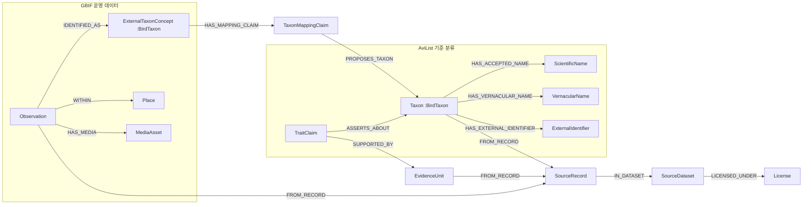

# RobinGraph 그래프 DB 스키마

> 기준일: 2026-09-10  
> 대상 DB: Neo4j  
> 문서 범위: 현재 코드와 n8n 적재 workflow가 실제로 생성하거나 조회하는 스키마

## 1. 핵심 구조

RobinGraph는 모든 데이터를 하나의 거대한 `Taxon` 노드에 합치지 않는다. 현재 DB 안에는 다음 세 데이터 영역이 함께 존재한다.

| 영역 | 식별 방법 | 기준 분류체계 | 용도 |
|---|---|---|---|
| 합성 fixture | 모든 노드에 `:RobinGraph:Fixture` 추가 라벨 | fixture 전용 `Taxon` | API, 검색, 정책 및 회귀 테스트 |
| 기준 종 정보 | `Taxon:BirdTaxon` | AviList v2025 | 분류, 학명·영명, 외부 ID, EltonTraits·AVONET 형질 |
| 운영 관찰 정보 | `ExternalTaxonConcept:BirdTaxon` | GBIF Backbone | GBIF 관찰, 장소, 미디어 |

`Taxon`과 `ExternalTaxonConcept`는 이름이 같더라도 같은 노드로 병합하지 않는다. 두 분류체계 사이의 연결은 `TaxonMappingClaim`을 통해 근거와 상태를 보존한다.



## 2. 분류 및 이름

### `Taxon:BirdTaxon`

AviList를 기준으로 만든 정규 분류 노드다. 종뿐 아니라 목·과·속 등 상위 분류군도 같은 라벨을 사용하고 `rank`로 구분한다.

주요 속성:

| 속성 | 의미 |
|---|---|
| `id` | 전역 식별자. 예: `avilist-taxon:<release>:<sequence>` |
| `source_id`, `source_release` | 원천과 릴리스 |
| `source_taxon_id` | 원천 분류군 ID |
| `rank` | `order`, `family`, `genus`, `species` 등 |
| `scientific_name` | 학명 |
| `authority` | 명명자·연도 |
| `order_name`, `family_name` | 목·과 학명 |
| `family_english_name` | AviList가 제공하는 과 영명 |
| `range_text` | 분포 원문 |
| `extinct_status` | 멸종 상태 원문 |
| `iucn_red_list_category_raw` | IUCN 범주 원문 |
| `birdlife_url`, `birds_of_the_world_url` | 외부 참조 URL |
| `retrieved_at` | 수집 시각 |

분류 트리는 다음 방향으로 저장한다.

```text
(상위 Taxon)-[:PARENT_OF {concept_set_id}]->(하위 Taxon)
```

예를 들어 흰뺨검둥오리(`Anas zonorhyncha`)는 `order → family → genus → species` 경로로 조회할 수 있다.

### `ExternalTaxonConcept:BirdTaxon`

GBIF Backbone의 분류 개념이다. GBIF 관찰 레코드가 사용한 분류를 원형에 가깝게 보존한다.

주요 속성은 `id`, `provider`, `external_key`, `scientific_name`, `canonical_name`, `authorship`, `rank`, `taxonomic_status`, `vernacular_name_raw`, `source_uri`, `retrieved_at`이다. GBIF 계층도 `PARENT_OF {provider: 'GBIF'}`로 연결한다.

### 이름과 외부 식별자

| 노드 | 주요 속성 | 연결 |
|---|---|---|
| `ScientificName` | `id`, `full_name`, `canonical`, `authorship`, `nomenclatural_code` | `(Taxon 또는 ExternalTaxonConcept)-[:HAS_ACCEPTED_NAME]->(ScientificName)` |
| `VernacularName` | `id`, `name`, `language`, `status`, `source_release` | `(Taxon)-[:HAS_VERNACULAR_NAME]->(VernacularName)` |

`status`는 이름의 권위 수준을 구분한다: AviList 자체 영명은 `source-preferred`,
[n8n 한국어 일반명 수집 런북](n8n/korean-vernacular-ingest.md)이 적재한
Wikidata 한국어 이름은 `community-sourced`다. `community-sourced`는 **국립생물자원관(NIBR) 같은 공식 국명이 아니라는** 뜻이다 — Wikidata는 누구나 계속 편집하는
데이터베이스이며, `/v1/taxa/lineage`도 이를 `lineage[].korean_name_status`로 그대로 노출한다([분류 계통 API](taxonomy-lineage-api.md)). NIBR 국명이 승인·적재되면 별도 `status` 값으로 구분한다.

| `VernacularNameCandidate` | 학명 미매칭·모호 매칭·상충하는 한국어 이름의 검토 대기열 | `taxon_name`, `proposed_name`, `reason_code`, `qids`, `resolution_status`, `last_seen_run_id`, `last_seen_at` |
| `ExternalIdentifier` | `id`, `scheme`, `value` | `(Taxon)-[:HAS_EXTERNAL_IDENTIFIER]->(ExternalIdentifier)` |

현재 AviList 적재 자체가 보장하는 일반명은 영명(`language: 'en'`)뿐이다. 한국어
`VernacularName`은 별도의 [n8n 한국어 일반명 수집
런북](n8n/korean-vernacular-ingest.md)(Wikidata CC0, 학명 완전 일치로만 매칭)이
채우며, 이 글을 쓰는 시점에는 그 workflow가 오프라인으로만 검증되고 아직
실제 n8n/Neo4j에서 실행된 적이 없다. 학명 미매칭·모호 매칭·상충하는 한국어
이름은 `VernacularName`으로 쓰지 않고 `VernacularNameCandidate`로 격리한다.
현재 가장 안정적인 검색 키는 여전히 학명(예: `Anas zonorhyncha`)이다.

```text
(SourceRecord)-[:HAS_VERNACULAR_CANDIDATE]->(VernacularNameCandidate)
(IngestionRun)-[:QUARANTINED]->(VernacularNameCandidate)
```

## 3. 형질과 분류 매핑

### `TraitClaim`

EltonTraits 및 AVONET에서 얻은 생태·형태 정보를 단순 속성이 아닌 **주장(claim)** 노드로 저장한다. 이렇게 해야 값마다 원천, 행 위치, 적재 시점과 분류 매핑 근거를 추적할 수 있다.

주요 속성:

| 속성 | 의미 |
|---|---|
| `id` | claim 식별자 |
| `trait_name` | 형질명 |
| `value_num`, `value_text`, `value_boolean`, `value_json` | 자료형별 값. 해당하는 필드만 사용 |
| `unit` | 단위 |
| `raw_value`, `source_field`, `source_note` | 원천 값과 열·주석 |
| `certainty` | 확실성 |
| `source_id`, `source_release` | EltonTraits 또는 AVONET 릴리스 |
| `taxonomy_release` | 연결 대상 AviList 릴리스 |
| `inferred`, `evidence_kind`, `summary_statistic` | AVONET의 추론·근거·요약 통계 메타데이터 |
| `retrieved_at` | 수집 시각 |

핵심 경로:

```text
(TraitClaim)-[:ASSERTS_ABOUT]->(Taxon)
(TraitClaim)-[:SUPPORTED_BY]->(EvidenceUnit)-[:FROM_RECORD]->(SourceRecord)
(SourceRecord)-[:IN_DATASET]->(SourceDataset)-[:LICENSED_UNDER]->(License)
```

### `TaxonMappingClaim`과 `TaxonMappingCandidate`

| 노드 | 역할 | 주요 속성 |
|---|---|---|
| `TaxonMappingClaim` | 출처 분류군과 AviList 분류군 사이의 매핑 주장 | `method`, `source_scientific_name`, `source_taxon_id`, `resolution_status`, `confidence`, `taxonomy_release` |
| `TaxonMappingCandidate` | 자동 확정하지 못한 매핑 검토 대기열 | `source_scientific_name`, `source_taxonomy`, `reason_code`, `profile_json`, `suggested_lookup_uri`, `resolution_status`, `last_seen_run_id`, `last_seen_at` |

연결 방식:

```text
(SourceRecord)-[:HAS_MAPPING_CLAIM]->(TaxonMappingClaim)-[:PROPOSES_TAXON]->(Taxon)
(ExternalTaxonConcept)-[:HAS_MAPPING_CLAIM]->(TaxonMappingClaim)-[:PROPOSES_TAXON]->(Taxon)
(SourceRecord)-[:HAS_MAPPING_CANDIDATE]->(TaxonMappingCandidate)
(IngestionRun)-[:QUARANTINED]->(TaxonMappingCandidate)
```

EltonTraits와 AVONET의 정확한 단일 학명 매칭은 `accepted_automatic`으로 적재된다. GBIF→AviList exact 매핑은 현재 `candidate` 상태이므로, 존재 자체를 검수 완료된 동의어 관계로 해석하면 안 된다.

## 4. 관찰, 장소, 미디어

### `Observation`

GBIF 관찰 레코드의 정규 표현이다.

주요 속성은 `id`, `occurrence_id`, `event_id`, `scientific_name_raw`, `observed_at`, `event_date_precision`, `count`, `basis`, `lat`, `lon`, `coordinate_uncertainty_m`, `geodetic_datum`, `sensitivity`, `source_record_key`, `ingestion_run_id`다.

```text
(Observation)-[:IDENTIFIED_AS]->(ExternalTaxonConcept)
(Observation)-[:WITHIN]->(Place)
(Observation)-[:HAS_MEDIA]->(MediaAsset)
(Observation)-[:FROM_RECORD]->(SourceRecord)
(IngestionRun)-[:INGESTED]->(Observation)
```

fixture에서는 호환 목적의 관계 이름 `OBSERVED_TAXON`을 사용한다.

```text
(Observation:Fixture)-[:OBSERVED_TAXON]->(Taxon:Fixture)
```

### `Place`

`id`, `name`, `country_code`, `place_type`을 가진다. GBIF 적재에서는 한국 행정 영역을 `place_type: 'gbif_admin_area'`로 저장한다.

### `MediaAsset`

`id`, `media_type`, `format`, `landing_uri`, `asset_uri`, `creator`, `publisher`, `attribution`, `license_uri`, `redistribution_allowed`, `retrieved_at`을 가진다. 허용된 라이선스의 미디어만 적재하고 관찰에서 `HAS_MEDIA`로 연결한다.

## 5. 문서 및 하이브리드 검색

이 영역은 현재 합성 fixture 검색 검증에만 사용한다.

| 노드/라벨 | 주요 속성 | 관계 또는 용도 |
|---|---|---|
| `Document:RobinGraph:Fixture` | `id`, `title`, `language`, `retrieved_at`, `embedding_allowed` | `(Document)-[:HAS_CHUNK]->(Chunk)` |
| `Chunk:RobinGraph:Fixture:HybridSearchChunk` | `id`, `text`, `section`, `ordinal`, `content_hash` | 전문 검색 대상 |
| `Chunk:HybridVectorChunk` | `hybrid_vector`, `hybrid_model`, `hybrid_dimensions`, `hybrid_normalized`, `hybrid_content_hash`, `hybrid_indexed_at` | 현재 유효한 벡터가 있는 청크에만 추가되는 라벨 |

검색 인덱스:

| 이름 | 종류 | 대상 |
|---|---|---|
| `robingraphFixtureChunkFulltext` | FULLTEXT | `(:HybridSearchChunk).text`, 기본 analyzer `standard-no-stop-words` |
| `robingraphFixtureChunkVector` | VECTOR | `(:HybridVectorChunk).hybrid_vector`, cosine similarity, 차원은 활성 embedding profile로 생성 시 고정 |

문서와 청크의 양쪽 출처가 모두 `allowed`이고 문서의 `embedding_allowed = true`일 때만 벡터를 기록한다. 원문 해시나 embedding profile이 달라지면 벡터 속성과 `HybridVectorChunk` 라벨을 제거한다.

## 6. 출처, 라이선스, 증거

모든 인용 가능한 데이터는 아래 provenance 체인을 가져야 한다.

```text
(도메인 노드)-[:FROM_RECORD]->(SourceRecord)
(EvidenceUnit)-[:FROM_RECORD]->(SourceRecord)
(SourceRecord)-[:IN_DATASET]->(SourceDataset)
(SourceDataset)-[:LICENSED_UNDER]->(License)
```

| 노드 | 주요 속성 |
|---|---|
| `SourceRecord` | `id`, `external_id`, `record_type`, `raw_uri`, `raw_hash`, `retrieved_at`, 출처별 원본 메타데이터 |
| `SourceDataset` | `id`, `name`, `provider`, `version`, `landing_uri`, `policy_status`, 스냅샷·정책 메타데이터 |
| `License` | `id`, `license_uri`, `name` 또는 `license_name`, `policy_status` |
| `EvidenceUnit` | `id`, `evidence_type`, `locator`, `accessed_at`, `citation` |

중요한 조회 규칙:

- `LICENSED_UNDER` 경로가 없거나 정책 상태가 `allowed`가 아니면 인용·검색 결과에서 제외한다.
- 운영 GBIF 조회는 dataset와 license 양쪽의 `policy_status = 'allowed'`를 요구한다.
- `Observation.sensitivity = 'generalized'`이면 API 응답에서 좌표와 오차 반경을 노출하지 않는다.
- Neo4j Browser에서 직접 Cypher를 실행하면 API의 마스킹 계층을 우회하므로 좌표 조회 시 같은 정책을 쿼리에 직접 적용해야 한다.

## 7. 적재 실행, 활성 릴리스, 격리

| 노드 | 역할 | 주요 속성 |
|---|---|---|
| `TaxonConceptSet` | 하나의 분류체계 릴리스 | `id`, `title`, `version`, `source_uri`, `retrieved_at` |
| `IngestionRun` | 적재 실행 이력 | `id`, `status`, `source_id`, `source_release`, `taxonomy_release`, 시작·종료 시각, 적재 건수 |
| `IngestState` | 성공한 활성 릴리스·커서 | `id`, `active_release`, `active_concept_set_id`, `last_successful_run_id`, `last_successful_at`, `event_date_end` |
| `QuarantineRecord` | GBIF 적재 실패·보류 레코드 | `external_id`, `stage`, `reason_codes`, `source_uri`, `resolution_status`, 최초·최근 관측 실행/시각 |

주요 관계:

```text
(TaxonConceptSet)-[:FROM_DATASET]->(SourceDataset)
(Taxon)-[:IN_CONCEPT_SET]->(TaxonConceptSet)
(ExternalTaxonConcept)-[:IN_CONCEPT_SET]->(TaxonConceptSet)
(IngestionRun)-[:INGESTED]->(적재된 노드)
(IngestionRun)-[:QUARANTINED]->(QuarantineRecord 또는 TaxonMappingCandidate)
```

현재 알려진 `IngestState.id`:

- `reference-taxonomy`: AviList 활성 릴리스
- `reference-traits`: EltonTraits 활성 릴리스
- `reference-avonet`: AVONET 활성 릴리스
- GBIF 운영 workflow의 `pipeline_id`: 관찰 수집 활성 릴리스와 증분 날짜 커서

적재 건수 검증이 모두 성공한 뒤에만 `IngestState`와 증분 커서를 갱신한다.

## 8. 전체 관계 사전

| 시작 노드 | 관계 | 도착 노드 | 의미 |
|---|---|---|---|
| `Taxon` / `ExternalTaxonConcept` | `PARENT_OF` | 동일 종류의 하위 분류군 | 분류 계층 |
| `Taxon` / `ExternalTaxonConcept` | `HAS_ACCEPTED_NAME` | `ScientificName` | 채택 학명 |
| `Taxon` | `HAS_VERNACULAR_NAME` | `VernacularName` | 일반명 |
| `Taxon` | `HAS_EXTERNAL_IDENTIFIER` | `ExternalIdentifier` | 외부 식별자 |
| `Taxon` / `ExternalTaxonConcept` | `IN_CONCEPT_SET` | `TaxonConceptSet` | 소속 분류 릴리스 |
| `TaxonConceptSet` | `FROM_DATASET` | `SourceDataset` | 분류체계 출처 |
| `ExternalTaxonConcept` / `SourceRecord` | `HAS_MAPPING_CLAIM` | `TaxonMappingClaim` | 분류 매핑 주장 |
| `TaxonMappingClaim` | `PROPOSES_TAXON` | `Taxon` | 제안된 AviList 대상 |
| `SourceRecord` | `HAS_MAPPING_CANDIDATE` | `TaxonMappingCandidate` | 미확정 매핑 후보 |
| `TraitClaim` | `ASSERTS_ABOUT` | `Taxon` | 형질의 대상 |
| `TraitClaim` | `SUPPORTED_BY` | `EvidenceUnit` | 형질 근거 |
| `Observation` | `IDENTIFIED_AS` | `ExternalTaxonConcept` | GBIF 동정 결과 |
| fixture `Observation` | `OBSERVED_TAXON` | fixture `Taxon` | fixture 전용 관찰 대상 |
| `Observation` | `WITHIN` | `Place` | 공간 포함 |
| `Observation` | `HAS_MEDIA` | `MediaAsset` | 관찰 미디어 |
| `Document` | `HAS_CHUNK` | `Chunk` | 문서 분할 |
| 도메인 노드 / `EvidenceUnit` / `Chunk` | `FROM_RECORD` | `SourceRecord` | 원천 레코드 |
| fixture `EvidenceUnit` | `FROM_CHUNK` | `Chunk` | 청크 근거 |
| `SourceRecord` | `IN_DATASET` | `SourceDataset` | 원천 데이터셋 |
| `SourceDataset` | `LICENSED_UNDER` | `License` | 라이선스 |
| `IngestionRun` | `INGESTED` | 적재된 노드 | 실행이 적재한 결과 |
| `IngestionRun` | `QUARANTINED` | 보류 노드 | 실행이 격리한 결과 |

## 9. 제약과 일반 인덱스

### 애플리케이션 fixture bootstrap

다음 라벨의 `id`에 uniqueness constraint를 만든다.

`Taxon`, `TaxonConceptSet`, `ScientificName`, `VernacularName`, `Observation`, `Place`, `Document`, `Chunk`, `SourceRecord`, `SourceDataset`, `EvidenceUnit`, `License`

### 기준 종 정보 workflow bootstrap

다음 라벨의 `id`에 uniqueness constraint를 만든다.

`Taxon`, `TaxonConceptSet`, `ScientificName`, `VernacularName`, `ExternalIdentifier`, `SourceRecord`, `SourceDataset`, `License`, `EvidenceUnit`, `TraitClaim`, `TaxonMappingClaim`, `TaxonMappingCandidate`, `IngestionRun`, `IngestState`

### 한국어 일반명 workflow bootstrap

다음 라벨의 `id`에 uniqueness constraint를 만든다([n8n 한국어 일반명 수집 런북](n8n/korean-vernacular-ingest.md)).

`VernacularName`, `VernacularNameCandidate`, `SourceRecord`, `SourceDataset`, `License`, `IngestionRun`, `IngestState`

추가 property index:

```cypher
CREATE INDEX robingraph_reference_taxon_name IF NOT EXISTS
FOR (node:Taxon)
ON (node.source_release, node.rank, node.scientific_name);
```

GBIF 운영 workflow는 현재 자체 DDL bootstrap을 만들지 않는다. `ExternalTaxonConcept`, `MediaAsset`, `QuarantineRecord` 등 운영 전용 라벨에 별도 uniqueness constraint가 필요하면 배포 bootstrap 또는 migration에서 명시적으로 추가해야 한다. `MERGE {id: ...}`는 중복 방지를 의도하지만, constraint가 없는 동시 쓰기까지 구조적으로 보장하지는 않는다.

실제 DB 상태는 다음 명령으로 확인한다.

```cypher
SHOW CONSTRAINTS;
SHOW INDEXES;
```

## 10. Neo4j Browser 조회 예시

### 흰뺨검둥오리 분류체계

반복 길이를 고정하면 잘못된 깊이의 경로나 중간 노드 생략을 막을 수 있다.

```cypher
MATCH path =
  (birdOrder:Taxon:BirdTaxon {rank: 'order'})
  -[:PARENT_OF*3]->
  (species:Taxon:BirdTaxon {
    scientific_name: 'Anas zonorhyncha',
    rank: 'species'
  })
RETURN path;
```

표 형태로 분류명을 명확하게 보려면 다음 쿼리를 권장한다.

```cypher
MATCH (birdOrder:Taxon:BirdTaxon {rank: 'order'})
      -[:PARENT_OF]->(family:Taxon:BirdTaxon {rank: 'family'})
      -[:PARENT_OF]->(genus:Taxon:BirdTaxon {rank: 'genus'})
      -[:PARENT_OF]->(species:Taxon:BirdTaxon {
        scientific_name: 'Anas zonorhyncha',
        rank: 'species'
      })
RETURN
  birdOrder.scientific_name AS `목`,
  family.scientific_name AS `과`,
  genus.scientific_name AS `속`,
  species.scientific_name AS `종`;
```

그래프 노드가 모두 `Ducks, Swans, and Geese`로 보이더라도 데이터가 같은 것은 아닐 수 있다. Neo4j Browser의 caption이 모든 노드에서 `family_english_name`을 표시하기 때문이다. Browser의 Graph Style에서 다음처럼 바꾸면 학명이 표시된다.

```css
node.Taxon {
  caption: '{scientific_name}';
}
```

### 형질과 출처

```cypher
MATCH (claim:TraitClaim)-[:ASSERTS_ABOUT]->
      (taxon:Taxon:BirdTaxon {scientific_name: 'Anas zonorhyncha'})
MATCH (claim)-[:SUPPORTED_BY]->(evidence:EvidenceUnit)
      -[:FROM_RECORD]->(record:SourceRecord)
      -[:IN_DATASET]->(dataset:SourceDataset)
      -[:LICENSED_UNDER]->(license:License)
WHERE dataset.policy_status = 'allowed'
  AND license.policy_status = 'allowed'
RETURN claim.trait_name, claim.value_num, claim.value_text,
       claim.unit, dataset.name, evidence.locator
ORDER BY claim.trait_name;
```

### 활성 릴리스

```cypher
MATCH (state:IngestState)
RETURN state.id, state.active_release, state.active_concept_set_id,
       state.last_successful_run_id, state.last_successful_at
ORDER BY state.id;
```

### 현재 DB의 라벨·관계 개수

```cypher
MATCH (n)
UNWIND labels(n) AS label
RETURN label, count(*) AS nodes
ORDER BY nodes DESC;
```

```cypher
MATCH ()-[r]->()
RETURN type(r) AS relationship, count(*) AS edges
ORDER BY edges DESC;
```

## 11. 구현 소스

- fixture graph와 기본 constraint: [`src/robingraph/graph/neo4j_client.py`](../src/robingraph/graph/neo4j_client.py)
- fixture projection과 정책 필터: [`src/robingraph/graph/fixture_projection.py`](../src/robingraph/graph/fixture_projection.py)
- 전문·벡터 인덱스: [`src/robingraph/retrieval/neo4j_hybrid.py`](../src/robingraph/retrieval/neo4j_hybrid.py)
- fixture Neo4j 조회: [`src/robingraph/retrieval/neo4j_repository.py`](../src/robingraph/retrieval/neo4j_repository.py)
- GBIF 운영 조회: [`src/robingraph/retrieval/operational_neo4j.py`](../src/robingraph/retrieval/operational_neo4j.py)
- GBIF 운영 적재 workflow 생성기: [`scripts/generate_n8n_operational_ingest.py`](../scripts/generate_n8n_operational_ingest.py)
- AviList·EltonTraits 적재 workflow 생성기: [`scripts/generate_n8n_reference_ingest.py`](../scripts/generate_n8n_reference_ingest.py)
- AVONET 적재 workflow 생성기: [`scripts/generate_n8n_avonet_ingest.py`](../scripts/generate_n8n_avonet_ingest.py)

이 문서는 장기 목표 모델이 아니라 **현재 구현 스키마**를 설명한다. `Habitat`, `Publication`, 일반화된 `Claim` 등 설계 문서에만 있는 노드는 실제 적재 코드에 추가되기 전까지 현행 스키마에 포함하지 않는다.
