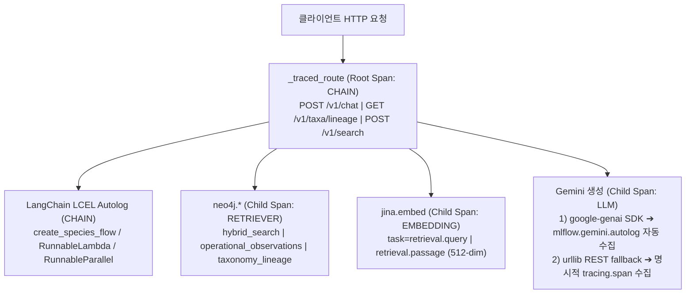

# RobinGraph MLflow 분산 추적(Tracing) 운영 및 검증 가이드

## 1. 개요 및 설계 원칙

RobinGraph는 조류 생태·분류·문헌 정보를 제공하는 증거 기반 GraphRAG 시스템입니다. 본 문서는 Phase 2 검색 및 생성 평가를 위한 MLflow 분산 추적(Tracing) 사양, 공식 호환성 검증, 네이티브 SDK/REST fallback 구조, 환경 설정 및 운영 검증 절차를 기술합니다.

### 핵심 설계 원칙
1. **네이티브 SDK 우선 및 REST Fallback 이중화**:
   - `google-genai` SDK가 설치되고 Gemini autolog가 활성화되면 SDK 호출을 통해 `mlflow.gemini.autolog`가 자동으로 LLM 스팬을 수집합니다.
   - SDK가 없거나 `urlopen`이 주입된 오프라인/테스트 환경에서는 표준 라이브러리 `urllib` REST fallback을 사용하며, 명시적 `tracing.span("gemini.generate_content", tracing.LLM)`으로 토큰 메타데이터를 보존합니다.
   - 수동 스팬과 autolog 간 토큰 이중 기록(double-counting)을 원천 차단합니다.
2. **Fail-Open 복원력과 유계된 지연(Bounded Overhead)**:
   - 추적 서버 통신 실패 시 기동 및 API 요청이 중단되지 않고 추적만 비활성화(fail-open)됩니다.
   - 무지연(zero latency)을 보장할 수 없으며, 추적 활성화 시 기동 단계에서 유계된 네트워크 지연(`MLFLOW_HTTP_REQUEST_TIMEOUT=10s`, `MLFLOW_HTTP_REQUEST_MAX_RETRIES=2`)이 발생합니다.
   - `ROBINGRAPH_MLFLOW_TRACING=false`인 경우 MLflow 모듈을 일체 import하지 않고 모든 헬퍼가 no-op으로 즉시 반환됩니다.
3. **자격 증명 마스킹 (Redaction)**:
   - API 키(`x-goog-api-key`, `ROBINGRAPH_JINA_API_KEY`), 데이터베이스 비밀번호(`NEO4J_PASSWORD`, `ROBINGRAPH_PG_PASSWORD`), 인증 헤더는 스팬에 절대 기록되지 않습니다.
   - 2,000자 초과 문자열 및 50건 초과 컬렉션, 깊이 4 초과 중첩 객체는 자동으로 절삭(`[truncated]`)됩니다.
4. **불변 조건 보존**:
   - Neo4j 읽기 전용 질의 투영과 매개변수화 Cypher 보호.
   - Jina v3 512차원 정규화 벡터 계약 및 `retrieval.query` / `retrieval.passage` 태스크 분리 보존.

---

## 2. 추적 아키텍처 및 스팬 계층 구조

API 요청 인입 시 `_traced_route`가 작업자 스레드 내에서 단일 Root Span을 생성하며, 하위의 LangChain LCEL 파이프라인, Neo4j 질의, Jina 임베딩, Gemini 생성이 트리 구조로 결속됩니다.



---

## 3. 공식 호환성 및 연동 사양

### 3.1 MLflow 서버 사양
- **엔드포인트**: `https://mlflow.dove-nest.com` (HTTPS 전송).
- **서버 버전**: `3.14.0` (공개 호스트네임의 `/version` 엔드포인트에서 확인 완료).
- **인증**: 공개 읽기 엔드포인트는 별도 인증 없이 도달 가능하며, 사설 환경 배포 시 동일 HTTPS 도메인으로 추적을 전송합니다.

### 3.2 패키지 의존성 (`[project.optional-dependencies] tracing`)
- `mlflow-tracing~=3.14.0`: 무거운 ML 학습 프레임워크가 배제된 경량 추적 클라이언트.
- `langchain>=1,<1.4`: 잠금 버전은 1.3.18이며 실제 LCEL 자동 스팬 테스트가 통과했습니다. MLflow 3.14의 공식 버전 검증 범위 상한은 1.3.4이므로, 새 버전으로 갱신할 때 실제 스팬 테스트를 유지해야 합니다.
- `google-genai>=1.21,<2.9`: 네이티브 SDK 추적(`mlflow.gemini.autolog`)을 지원.

### 3.3 Gemini 네이티브 SDK 및 REST Fallback 동작
- `GeminiAnswerer`는 `google.genai` SDK가 설치되어 있으면 `genai.Client`를 생성하여 `_send_sdk`를 호출합니다.
- `tracing.status().gemini_autolog`가 활성화되어 있으면 수동 LLM 스팬을 열지 않고 `NOOP_SPAN`을 전달하여 SDK autolog가 LLM 스팬을 수집하게 합니다. 3.14.0에서는 `Models.generate_content`와 내부 `_generate_content`가 중첩 기록되며, trace 토큰 합계는 바깥 스팬만 집계합니다.
- SDK가 없거나 `urlopen`이 명시된 경우(테스트/오프라인) REST 경로 `_send`가 동작하며, 명시적 `tracing.span("gemini.generate_content", tracing.LLM)` 래퍼가 `usageMetadata`(`promptTokenCount`, `candidatesTokenCount`, `totalTokenCount`)를 `mlflow.chat.tokenUsage`로 기록합니다.

---

## 4. 메타데이터 가용성 및 차단 명세

| 영역 | 스팬 식별자 | 종류 | 수집 메타데이터 (Supported) | 차단/미지원 메타데이터 (Redacted / Gap) |
|---|---|---|---|---|
| **API Route** | `POST /v1/chat`<br>`GET /v1/taxa/lineage`<br>`POST /v1/search` | `CHAIN` | `http.route`, `http.status_code`, 요청 파라미터(질문, 필터, 모드), 응답 요약, `robingraph.selected_intent`, `robingraph.route_method`, `robingraph.disposition` | 클라이언트 쿠키, Authorization 헤더 |
| **LangChain** | LCEL 단계명 | `CHAIN` | 러너블 입출력 딕셔너리, 단계별 실행 시간 | 내부 람다 함수 객체 |
| **Neo4j** | `neo4j.hybrid_search`<br>`neo4j.operational_observations`<br>`neo4j.taxonomy_lineage` | `RETRIEVER` | `retrieval.backend: "neo4j"`, `retrieval.channels`, `retrieval.limit`, `retrieval.top_k`, 질의 텍스트, 반환 청크 ID, 유사도 점수 | `bolt://` 자격증명, 원시 Cypher 쿼리 텍스트(은닉) |
| **Jina** | `jina.embed` | `EMBEDDING` | `embedding.provider: "jina"`, `embedding.model`, `embedding.dimensions: 512`, `embedding.task` (`retrieval.query` / `retrieval.passage`), `input_count`, `input_chars`, `vector_count`, 시도 횟수 | `Authorization: Bearer <key>`, 실제 엔드포인트 URL, 임베딩 토큰 카운트(API 미제공) |
| **Gemini** | `gemini.generate_content` (REST) 또는 SDK autolog | `LLM` | `llm.provider: "google-gemini"`, `llm.model`, `llm.model_version`, `llm.finish_reason`, `llm.block_reason`, `robingraph.operation`, 시도 횟수, 프롬프트 입력, 응답 텍스트, **`mlflow.chat.tokenUsage`** | `x-goog-api-key`, 원시 HTTP 전송 헤더 |

### 4.1 수동 스팬 마스킹(Redaction)과 네이티브 Autolog 정책 차이
- **RobinGraph 수동 스팬 (`tracing.redact`)**: REST fallback 및 내부 컴포넌트(Jina, Neo4j, 라우트)의 입력/출력/속성에 대해 `api_key`, `password`, `secret`, `bearer` 등 민감 키패턴을 감지하여 `"[redacted]"`로 치환하며, 2,000자 초과 텍스트와 50건 초과 컬렉션을 자동으로 절삭합니다.
- **MLflow 네이티브 Autolog (`mlflow.gemini.autolog`)**: Google GenAI SDK 계층(`Models.generate_content`)에서 프롬프트(`contents`)와 모델 응답(`candidates`)을 MLflow의 표준 LLM 파라미터 정책에 따라 수집합니다. HTTP 전송 헤더의 API 키는 스팬 속성에 포함되지 않으며, SDK 예외(`APIError`) 발생 시 상태 코드가 스팬 상태로 기록됩니다.

---

## 5. 환경 설정 (.env / .env.nas)

### 5.1 설정 변수 명세

| 환경 변수 | 기본값 | 설명 |
|---|---|---|
| `ROBINGRAPH_MLFLOW_TRACING` | `false` | 추적 활성화 여부 (`true`, `1`, `yes`, `on`) |
| `MLFLOW_TRACKING_URI` | 없음 | HTTPS 추적 서버 주소 (`https://mlflow.dove-nest.com`) |
| `MLFLOW_EXPERIMENT_NAME` | `robingraph` | 트레이스를 기록할 MLflow 실험명 |
| `MLFLOW_EXPERIMENT_ID` | 없음 | 특정 실험 ID 지정 시 사용 (우선 적용) |
| `MLFLOW_HTTP_REQUEST_TIMEOUT` | `10` | 추적 서버 통신 타임아웃 (초 단위 정수) |
| `MLFLOW_HTTP_REQUEST_MAX_RETRIES` | `2` | 추적 서버 통신 최대 재시도 횟수 |

### 5.2 템플릿 예시
```dotenv
# Optional: MLflow tracing for retrieval/generation flows.
ROBINGRAPH_MLFLOW_TRACING=false
MLFLOW_TRACKING_URI=https://mlflow.dove-nest.com
MLFLOW_EXPERIMENT_NAME=robingraph
# MLFLOW_EXPERIMENT_ID=
# MLFLOW_HTTP_REQUEST_TIMEOUT=10
# MLFLOW_HTTP_REQUEST_MAX_RETRIES=2
```

---

## 6. 운영 주의사항: 프로세스 격리와 상태 확인

> [!WARNING]
> `docker exec robingraph-api-test python -c "from robingraph.tracing import status; print(status())"` 명령은 **실행 중인 서버의 상태를 읽을 수 없습니다**.
> `docker exec`로 실행되는 python 명령은 독립된 별도의 신규 인터프리터 프로세스에서 실행되므로, 메모리 상의 `status()`는 항상 `TracingStatus(enabled=False, reason='not configured')`를 반환합니다.

### 올바른 서버 추적 상태 확인 방법
컨테이너 기동 로그를 확인하여 프로세스 시작 시점의 추적 설정 결과를 점검합니다:

```sh
docker logs robingraph-api-test 2>&1 | grep -i "MLflow tracing"
```
*정상 기동 로그 예시*:
```text
INFO:robingraph.tracing:MLflow tracing enabled (langchain_autolog=True, gemini_autolog=True)
```
*Fail-open 기동 로그 예시*:
```text
WARNING:robingraph.tracing:MLflow tracing disabled: initialization failed (MlflowException)
```

---

## 7. 실행 가능한 TEST 검증 절차 (Runnable Verification Steps)

### 단계 1: 격리 단위 테스트 실행
추적 설정 유효성, fail-open, redaction 필터링, 스팬 Facade 테스트를 실행합니다.

```sh
uv run --locked --extra tracing --extra test python -m unittest tests/test_mlflow_configuration.py
```
*관찰된 결과*: 22개 테스트 전체 통과 (`Ran 22 tests ... OK`).

### 단계 2: 추적 계약 및 연결성 테스트 실행
모의 MLflow 및 실제 SDK 익스포터를 통한 부모-자식 스팬 결속 테스트를 실행합니다.

```sh
uv run --locked --extra tracing --extra test python -m unittest tests/test_mlflow_tracing.py
```
*관찰된 결과*: 18개 테스트 전체 통과 (`Ran 18 tests ... OK`).

### 단계 3: 로컬 모의 Fail-Open 검증
추적 서버가 응답하지 않는 상황에서 API 프로세스가 중단 없이 fail-open되는지 확인합니다.

```sh
ROBINGRAPH_MLFLOW_TRACING=true \
MLFLOW_TRACKING_URI=http://127.0.0.1:9999 \
uv run --locked --extra tracing python -c "
from robingraph.tracing import configure_tracing, status, span, CHAIN
st = configure_tracing()
print('Initial Status:', st)
with span('test.route', CHAIN) as s:
    s.set_inputs({'q': '검증'})
    s.set_outputs({'status': 'ok'})
print('Fail-open verified successfully.')
"
```

### 단계 4: NAS TEST 실환경 배포 검증
코디네이터 또는 운영자가 NAS TEST 환경에서 실서버 연동을 검증하는 절차:

```sh
# 1. NAS 환경 설정 및 TEST 배포
chmod 600 .env.nas.test
ROBINGRAPH_DEPLOY_TARGET=test sh scripts/deploy_nas.sh deploy
ROBINGRAPH_DEPLOY_TARGET=test sh scripts/deploy_nas.sh verify

# 2. 기동 로그에서 MLflow 활성화 확인
docker logs robingraph-api-test 2>&1 | grep -i "MLflow tracing"

# 3. 실서버 추적 엔드투엔드 검증기 실행
# 컨테이너 내부 환경변수를 활용하여 실제 질의 수행 및 MLflow 트레이스 자동 대조:
docker exec -e MLFLOW_TRACKING_URI=https://mlflow.dove-nest.com \
  -e MLFLOW_EXPERIMENT_NAME=robingraph-test \
  robingraph-api-test python scripts/verify_mlflow_trace.py \
  --base-url http://127.0.0.1:8000 \
  --question "물가에 사는 새의 먹이와 서식지에 대한 근거를 알려줘." \
  --intent evidence \
  --require-model
```
*성공 기준*:
- `verify_mlflow_trace.py` 출력에 `"passed": true`, `"connected": true`, `"retrieval": true`, `"model": true`가 확인되고 종료 코드 0 반환.
- `https://mlflow.dove-nest.com` UI 접속 시 `robingraph` 실험 아래 `POST /v1/chat` 트레이스와 자식 스팬(`jina.embed`, `neo4j.hybrid_search`, `Models.generate_content`)이 중첩 표시됨.

---

## 8. 회귀 체크리스트 (Regression Checklist)

- [ ] `pyproject.toml`의 `[project.optional-dependencies] tracing`에 `mlflow-tracing~=3.14.0`, `langchain>=1,<1.4`, `google-genai>=1.21,<2.9`가 명시되어 있는가?
- [ ] `Dockerfile`에서 `uv sync --extra tracing`으로 이미지가 빌드되는가?
- [ ] `.env.nas.test`의 `MLFLOW_TRACKING_URI`가 `https://mlflow.dove-nest.com`으로 설정되어 있는가?
- [ ] 추적 서버 연결 실패 시 API 기동이 블로킹되지 않고 fail-open 경고 로그를 남기며 정상 동작하는가?
- [ ] `scripts/verify_mlflow_trace.py` 검증기가 SDK 엔티티 호환(`trace_id`, `request_id`, `timestamp_ms`, `request_time`)을 준수하는가?
- [ ] Jina 임베딩 512차원 및 `retrieval.query` / `retrieval.passage` 구분이 유지되는가?
- [ ] Neo4j 읽기 전용 질의 보호 및 API 키 Redaction이 보장되는가?

## 9. 2026-10-02 NAS TEST 검증 결과

Claude가 구현하고 agy(Antigravity)가 독립 검토했다. TEST는 기존 NAS checkout의 미커밋 변경을 보존하기 위해 `/home/kimdove/RobinGraph-rg001-20261002`의 소스 체크섬 묶음으로 배포했다. 이미지 태그는 `robingraph-api:test-rg001-20261002`이며 PROD 컨테이너는 교체하지 않았다. NAS 원본 TEST·PROD 환경 파일은 `.rg001-backup-20261002T053111Z` 접미사로 백업했다. TEST 추적은 활성화했고 PROD 설정은 비활성화 상태로 준비했다.

| 확인 | 관찰 결과 |
|---|---|
| 실제 근거 질문 | `물가에 사는 새의 먹이와 서식지에 대한 근거를 알려줘.` → `answer`; 하나의 root와 9개 연결 span |
| 답변 trace | `tr-3fc48d6096760f545b6f18b134ff7602`, 실험 `robingraph-test` / ID `33`, 전체 2,763.8ms |
| 모델·토큰 | SDK 속성 `mlflow.llm.model=gemini-3.5-flash-lite`; trace 합계 입력 1,436 / 출력 131 / 총 1,567. 중첩 SDK span을 중복 합산하지 않음 |
| 입출력·시간 | LangChain, Neo4j 검색, Gemini span 모두 입출력·소요 시간 확인 |
| Jina 작업 구분 | 자동 분류 trace `tr-d32057cceff45afa2e4973181fec8560`에 `retrieval.passage` 3개 입력과 `retrieval.query` 1개 입력, 출력 모두 512차원 |
| 자동 분류 불확실성 | 해당 질문의 자동 경로는 `clarify`. 검색을 강제로 실행하지 않는 기존 정책 유지 |
| 하이브리드 검색 | 5개 전문 검색 결과 반환. TEST 벡터 인덱스가 아직 bootstrap되지 않아 기존 경고와 함께 `fulltext`로 fallback. 인덱스 생성·DB 변경은 이번 작업에서 수행하지 않음 |
| 오류 | 없는 종 계보 조회 → HTTP 404, trace `tr-257c312d1232ce726b6c97f5e4424245`에 `ERROR`와 exception event 기록 |
| 종 조회 | 청둥오리 → `Anas platyrhynchos`, 형질 18개·사진 2개. 활성 AviList `v2025b`, API 계약 검증 `passed: true` |
| 자격증명 | 답변 trace JSON에서 Gemini·Jina 키 및 Neo4j·PostgreSQL 비밀번호의 실제 값 미검출 |

모델 버전·finish reason은 SDK 응답 본문에서 제공될 수 있지만, 네이티브 스팬에 수동 경로의 `llm.model_version`·`llm.finish_reason` 속성이 자동 추가된다고 보장하지 않는다. Jina 서비스의 토큰 사용량, 모델 비용, 벡터 검색 시간은 이번 실제 결과에서 확인되지 않았다. Jina 입력은 원문 대신 작업 종류·건수·문자 수를, 출력은 벡터 개수·차원을 기록한다. 자동 로깅의 원문 길이 정책은 수동 스팬의 절삭 정책과 다르다.

[MLflow TEST Traces](https://mlflow.dove-nest.com/#/experiments/33/traces)의 저장 데이터는 실제 MLflow API로 검증했다. 로컬 GUI 접근이 `cgWindowNotFound`로 실패해 **Traces 화면의 시각 확인은 미완료**다. 해당 화면 확인 후 백로그 RG-001의 최종 완료 체크를 할 수 있다.
