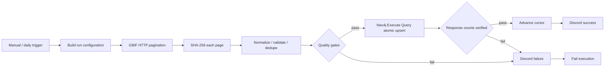

# RobinGraph n8n 네이티브 수집 런북

## workflow 구성

종별 분류·형태·생태 정보 수집은 [실행 가이드](species-information-ingest.md)를 따른다.
RobinGraph의 n8n 수집은 세 workflow로 나뉜다.

| workflow | 범위 | 상태 |
|---|---|---|
| `robingraph-operational-ingest.json` | GBIF 한국 조류 관찰 | 9월 8일 전용 Neo4j 노드 수동 실행 검증 완료, 마지막 기록상 비활성 |
| `robingraph-reference-ingest.json` | AviList 기준 분류와 EltonTraits 형질 | 9월 9일 검증 batch 적재 완료, import artifact는 비활성 |
| `robingraph-avonet-ingest.json` | AVONET 형태 측정치·서식 환경 | 9월 10일 메모리 안전 batch 적재 완료, import artifact는 비활성 |
| `robingraph-korean-vernacular-ingest.json` | Wikidata(CC0) 기반 한국어 일반명 | 9월 11일 오프라인 검증 완료, 실제 n8n/Neo4j 실행은 아직 없음, import artifact는 비활성 |

분류·형질 workflow의 데이터 계약, 배치 적재, 품질 gate와 배포 방법은 [분류·형질 기준정보 수집 런북](reference-ingest.md)을 따른다. 한국어 일반명 수집은 [n8n 한국어 일반명 수집 런북](korean-vernacular-ingest.md)을 따른다. 아래 내용은 GBIF 관찰 workflow 전용이다.

## GBIF workflow 현재 상태

최종 산출물은 `n8n/robingraph-operational-ingest.json`이다. 이 워크플로우는 SSH나 외부 RobinGraph CLI를 호출하지 않는다. n8n 기본 노드가 GBIF REST API를 직접 호출하고 데이터를 검증한 뒤 `n8n-nodes-neo4j.neo4j` 전용 노드로 적재한다.

NAS 워크플로우 이름은 `RobinGraph — native GBIF ingest to Neo4j`이다. 2026-09-07 기준 전용 노드 전환본을 배포했으며, 검증 실행 전까지 비활성 상태로 유지한다.

## 워크플로우가 직접 하는 일



수집 범위는 다음과 같다.

| 항목 | 값 |
|---|---|
| Source | GBIF Occurrence Search API |
| Country | `KR` |
| Taxon | Aves, GBIF key `212` |
| 상태 | 좌표가 있고 `PRESENT`인 occurrence |
| 라이선스 | CC0 1.0, CC BY 4.0 |
| 최초 기간 | 최근 30일 |
| 다음 기간 | 직전 검증 성공일 이후, 시작일 포함 |
| 페이지 | 300건, 최대 20페이지, 요청 간 200ms |
| 최대 실행량 | 6,000 occurrence |

GBIF가 제공하는 관찰, 조류 분류정보, 공개 장소, source/license provenance와 허용된 미디어 메타데이터를 적재한다. 이미지 파일 자체는 내려받지 않는다. 관찰마다 GBIF 분류 키를 중복 제거한 `ExternalTaxonConcept:BirdTaxon`을 만들고 학명, canonical name, 저자, 분류 상태, 원본 URL을 저장한다. 상위 분류는 `kingdom → phylum → class → order → family → genus → species` 순서의 `PARENT_OF` 관계로 연결한다. 승인된 AviList crosswalk가 없으므로 이 노드를 정식 내부 `Taxon`으로 승격하지 않는다.

Occurrence 응답의 `vernacularName`에는 언어와 적용 지역이 명확하지 않을 수 있어 `vernacular_name_raw`로만 보존한다. 한국어 표준명은 NIBR 이용조건과 AviList 교차연결을 승인한 뒤 언어가 `ko`인 별도 `VernacularName` 노드로 적재한다.

페이지 한도에 도달했는데 `endOfRecords=true`가 아니면 부분 결과를 적재하지 않고 실패시킨다. 날짜 범위를 줄이거나 페이지 상한을 검토한 뒤 다시 실행한다.

## import 후 필수 설정

### 1. Neo4j 전용 노드

n8n에 `n8n-nodes-neo4j` community package가 설치되어 있어야 한다. `Atomic upsert to Neo4j`는 `graphDb / executeQuery`, typeVersion 1을 사용한다.

### 2. Neo4j Credential

사용자가 제공한 `Neo4j` (`DvmTD1qB0Kb7TRml`) credential을 연결했다. 연결 URI와 데이터베이스는 이 credential에서 관리한다.

전용 노드는 별도 parameter 입력을 지원하지 않아 고정 Cypher 템플릿의 값을 검증·이스케이프한 리터럴로 전달한다. 외부 문자열을 쿼리 구문으로 직접 연결하지 않는다. 단일 쿼리로 적재하고 반환 count와 active release를 검증한다.

### 3. Discord Credential

NAS에서는 기존 Discord Bot Credential `Nesty API 키`와 NestControl의 `전서구` 채널을 `Notify success`, `Notify failure` 노드에 연결한다. 토큰은 n8n Credential store에만 저장한다.

## 처리 및 안전 규칙

- GBIF API 요청 단계에서 CC0와 CC BY 4.0만 요청하고, 변환 단계에서도 라이선스를 다시 확인한다.
- 공개 API가 반환한 좌표만 사용한다. 원좌표나 비공개 좌표 필드는 만들지 않는다.
- 좌표 오류, 필수 ID·날짜·분류 누락, 음수 수량은 quarantine 메타데이터로 분리한다.
- GBIF page JSON은 정규화 전에 Crypto 노드로 SHA-256을 계산한다. Neo4j에는 source URI와 page hash만 저장한다.
- occurrence는 GBIF ID로 실행 내 중복 제거하고 Neo4j에서는 `MERGE`한다.
- Cypher 문자열은 고정되어 있고 외부 값은 전용 직렬화기로 이스케이프한 Cypher 리터럴로 전달한다.
- 조류 분류·관찰·미디어·quarantine·active release 갱신은 하나의 Neo4j implicit transaction에서 실행한다.
- 전용 노드의 반환 count와 active release를 입력값과 대조한다.
- 검증 성공 뒤에만 n8n의 증분 cursor를 갱신한다.
- 품질 gate 또는 Neo4j 검증 실패는 Discord 알림 후 `Stop And Error`로 끝나 실행 이력도 실패가 된다.
- source JSON의 workflow `concurrency`는 1이다. NAS Public API 배포에서는 이 UI 전용 필드가 제외되므로 운영 Publish 전에 UI에서 1로 설정됐는지 확인한다.

## 검증 순서

1. workflow를 import하고 비활성 상태를 유지한다.
2. Neo4j community node가 설치되어 있는지 확인한다.
3. Neo4j와 Discord Credential을 연결한다.
4. Manual Trigger로 실행한다.
5. `Fetch GBIF Korea Aves pages`에서 `statusCode=200`과 `body.results`를 확인한다.
6. `Normalize, validate and deduplicate GBIF`의 `ready_to_load`, count, `failure_reason`을 확인한다.
7. Neo4j 응답 검증 노드에서 `load_ok=true`와 taxon/taxon link/observation/media/quarantine 입력·출력 count 일치를 확인한다.
8. Discord 성공 알림과 Neo4j의 `IngestionRun`, `IngestState`, `BirdTaxon`, `Observation`을 확인한다.
9. 합성 오류 레코드와 잘린 pagination을 주입해 실패 알림 및 cursor 미갱신을 확인한다.
10. 검증이 끝난 뒤에만 Publish와 Schedule Trigger 활성화를 검토한다.

## 현재 전용 노드 전환본의 검증 상태

- 생성 스크립트 Python 문법 검사 통과
- 모든 Code 노드와 Cypher expression의 JavaScript 문법 검사 통과
- Cypher 리터럴 직렬화와 적재 결과 검증 단위 테스트 통과
- 워크플로우 구조, pagination, SHA-256, SSH 부재, 전용 Neo4j 노드, 실패 차단 경로와 secret 부재 검사 통과
- 동일 Cypher의 opt-in Neo4j 통합 테스트는 유지한다.
- NAS 워크플로우 `Mw9tbGM9vyzu6X1F`에 15개 노드로 배포했고 inactive 상태를 유지했다.
- 전용 노드 전환 뒤의 실제 Manual Trigger 적재 검증은 아직 수행하지 않았다.

## 이전 HTTP 적재본의 검증 이력

- 2026-09-07 기존 workflow `Mw9tbGM9vyzu6X1F`를 사용자 상태 디렉터리에 백업하고 15-node 네이티브 workflow로 교체했다. SSH node는 0개이며 배포 뒤 inactive 상태를 유지했다.
- NAS Docker network의 `http://neo4j:7474/db/neo4j/query/v2`에서 기존 `Neo4j` credential로 `RETURN 1`을 실행해 HTTP 202 성공 응답을 확인했다.
- 실제 trigger execution `17238`에서 GBIF source 19건, observation 19건, media 11건, quarantine 0건과 `load_ok=true`를 확인했다. cursor 갱신과 Discord `전서구` 성공 알림까지 모든 노드가 성공했다.
- 테스트 직후 workflow를 inactive로 되돌리고 schedule을 `0 2 * * *`로 복원했다. 이 실행들은 현재 전용 노드 전환본의 실행 증거로 사용하지 않는다.

프로젝트 루트의 Git 제외 `.env`에 `ROBINGRAPH_N8N_API_URL`, `ROBINGRAPH_N8N_API_KEY`, `ROBINGRAPH_N8N_WORKFLOW_ID`를 둔다. 다음 명령은 Credential과 inactive 상태를 확인하고 배포 계획만 출력한다.

```bash
python3 scripts/deploy_n8n_operational_ingest.py
```

`--apply`를 붙이면 inactive workflow를 백업한 뒤 교체한다. 백업은 `~/.local/state/robingraph/n8n-backups/`에 권한 `0600`으로 저장한다.

```bash
python3 scripts/deploy_n8n_operational_ingest.py --apply
```

NAS 배포는 기존 `Neo4j` credential, `Nesty API 키` Discord Bot credential과 NestControl의 `전서구` 채널을 연결한다. Public API가 UI 전용 `concurrency` 필드를 허용하지 않아 API payload에서는 이 필드를 제외한다.

## 조류 정보 확인 쿼리

```cypher
MATCH (bird:BirdTaxon)
WHERE bird.rank IN ['species', 'subspecies']
OPTIONAL MATCH (bird)-[:HAS_ACCEPTED_NAME]->(name:ScientificName)
OPTIONAL MATCH (observation:Observation)-[:IDENTIFIED_AS]->(bird)
RETURN bird.external_key AS gbif_taxon_key,
       name.full_name AS scientific_name,
       name.authorship AS authorship,
       bird.taxonomic_status AS taxonomic_status,
       bird.vernacular_name_raw AS source_common_name,
       bird.source_uri AS gbif_url,
       count(DISTINCT observation) AS observation_count
ORDER BY observation_count DESC, scientific_name;
```

분류 계층을 확인하려면 다음 쿼리를 사용한다.

```cypher
MATCH path=(ancestor:BirdTaxon)-[:PARENT_OF*1..6]->(bird:BirdTaxon)
WHERE bird.rank IN ['species', 'subspecies']
RETURN path
LIMIT 100;
```

## 산출물

| 파일 | 용도 |
|---|---|
| `n8n/robingraph-operational-ingest.json` | n8n 네이티브 최종 import 파일 |
| `scripts/generate_n8n_operational_ingest.py` | 최종 JSON 재생성 스크립트 |
| `scripts/deploy_n8n_operational_ingest.py` | n8n Public API 점검·백업·배포 스크립트 |
| `n8n/robingraph-reference-ingest.json` | AviList·EltonTraits 기준정보 import 파일 |
| `scripts/generate_n8n_reference_ingest.py` | collection point에서 기준정보 workflow 재생성 |
| `scripts/deploy_n8n_reference_ingest.py` | 기준정보·AVONET·한국어 일반명 workflow 원격 점검·생성·백업·배포 |
| `n8n/robingraph-korean-vernacular-ingest.json` | Wikidata(CC0) 한국어 일반명 import 파일 |
| `scripts/generate_n8n_korean_vernacular_ingest.py` | collection point에서 한국어 일반명 workflow 재생성 |
| `scripts/load_n8n_avonet.py` | AVONET 선택 시트 스트리밍 검증과 임시 인증 batch 적재 |
| `docs/n8n/reference-ingest.md` | 기준정보 첫 실행과 운영 런북 |
| `tests/test_n8n_workflows.py` | import shape와 안전 경로 정적 검사 |
| `docs/n8n/final-operational-ingest.md` | 후보 재평가와 통합 설계 판단 |
| `n8n/candidates/claude-operational-ingest.json` | Claude 후보 원본, SSH/CLI 중심이라 배포하지 않음 |
| `n8n/candidates/terra-operational-ingest.json` | Terra 후보 원본, SSH/CLI 중심이라 배포하지 않음 |

GBIF API 계약은 [GBIF Occurrence API](https://techdocs.gbif.org/en/openapi/v1/occurrence)를 따른다. Neo4j 전용 노드의 입력과 반환 형식은 [community node 소스](https://github.com/Kurea/n8n-nodes-neo4j/blob/main/src/nodes/Neo4j/Neo4j.node.ts)를 기준으로 확인했다.
