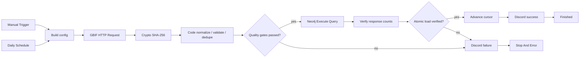
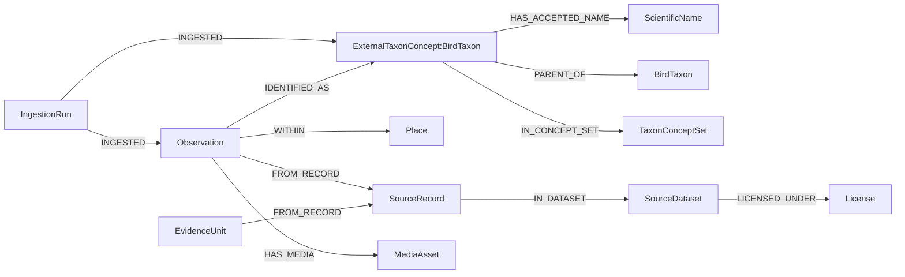

# n8n 운영 수집 후보 재평가와 네이티브 통합본

## 수정 이유

초기 Claude 후보와 GPT-5.6 Terra 후보는 운영 통제와 데이터 안전을 자세히 설계했지만, 실제 작업을 존재하지 않는 `robingraph ingest ...` CLI에 맡겼다. 사용자가 요구한 것은 n8n 안에서 수행되는 데이터 수집이다. 따라서 SSH/CLI 방식은 최종 요구사항을 충족하지 못하며 배포 대상에서 제외한다.

최종본은 n8n 안에서 GBIF API 호출, pagination, SHA-256, 정규화, 검증, 중복 제거, Neo4j 적재 검증과 Discord 알림을 수행하도록 다시 만들었다. 수집과 변환은 기본 노드로 처리하고 Neo4j 적재에는 설치된 community node를 사용한다.

## 후보 점수

| 평가 항목 | 배점 | Claude 후보 | Terra 후보 |
|---|---:|---:|---:|
| n8n 안에서 실제 데이터 수집 | 30 | 0 | 0 |
| 데이터 정책·provenance | 20 | 12 | 17 |
| 실패 차단과 검증 | 20 | 15 | 16 |
| 운영 안전과 관측성 | 15 | 12 | 12 |
| import·설정 가능성 | 15 | 8 | 8 |
| **합계** | **100** | **47** | **53** |

두 후보 모두 n8n 시각적 흐름과 운영 계약을 갖췄지만, 실제 source endpoint와 adapter가 없고 미구현 CLI에 의존하는 결함 때문에 점수를 낮췄다.

### Claude 후보에서 유지한 점

- `concurrency=1`로 같은 workflow의 중복 실행을 제한한다.
- 성공과 실패가 편집기에서 바로 보이는 IF 분기를 둔다.
- 성공 데이터를 장기 실행 이력에 과도하게 보존하지 않는다.

### Terra 후보에서 유지한 점

- immutable raw hash, quarantine, idempotent upsert와 active release 개념을 유지한다.
- HTTP 성공 코드만으로 적재 성공을 판단하지 않고 반환 count를 검증한다.
- 검증된 동일 실행만 active release와 증분 cursor를 갱신한다.
- secret은 workflow body가 아니라 Credential store에 둔다.

## 네이티브 통합본

통합본은 다음 15개 노드로 구성된다.

SSH 노드는 없다. 외부 통신은 GBIF public API, Neo4j와 Discord에 한정한다.

## 데이터 범위와 변환

GBIF Occurrence Search API에서 `country=KR`, `taxon_key=212`, `has_coordinate=true`, `occurrence_status=present`를 사용한다. 라이선스 query parameter는 `CC0_1_0`과 `CC_BY_4_0` 두 개로 제한한다. 최초 실행은 최근 30일이고, 다음 활성 실행부터 마지막 검증 성공일을 시작일로 재사용한다. 시작일이 포함되므로 하루가 겹칠 수 있지만 GBIF ID 기반 dedupe와 Neo4j `MERGE`가 재실행을 안전하게 처리한다.

각 occurrence와 occurrence에서 중복 제거한 조류 분류정보는 다음 그래프 구조로 적재된다.

GBIF taxon key를 내부 canonical `Taxon.id`로 사용하지 않는다. AviList v2025b와의 승인된 crosswalk가 준비되기 전까지 `ExternalTaxonConcept:BirdTaxon`으로 보존한다. 각 조류 분류에는 학명, canonical name, 저자, rank, 분류 상태, GBIF 원본 URL을 저장하고 목·과·속·종 계층을 `PARENT_OF`로 연결한다. 언어가 확인되지 않은 occurrence의 일반명은 `vernacular_name_raw`로만 보존한다. 미디어는 허용 라이선스의 URL과 attribution metadata만 저장하고 파일은 다운로드하지 않는다.

## 품질 gate

다음 조건 중 하나라도 발생하면 Neo4j write를 호출하지 않는다.

- GBIF page request의 비정상 응답 또는 `results` 누락
- source window에 occurrence가 0건
- 검증 통과 occurrence가 0건
- quarantine 비율이 25% 초과
- pagination 20페이지 상한에서 `endOfRecords`가 false

레코드 단위 오류는 GBIF ID, source URI와 reason code만 quarantine에 남긴다. private coordinate나 전체 raw record를 quarantine에 복사하지 않는다.

## 원본 무결성과 제한

Crypto 노드가 각 GBIF response page의 JSON을 SHA-256으로 해시하고 각 SourceRecord에 page hash를 기록한다. 현재 통합본은 NAS 영속 볼륨 경로가 확정되지 않아 response body 자체를 파일로 장기 보존하지 않는다. 완전한 immutable raw archive가 필요하면 n8n 컨테이너에 RobinGraph 전용 read/write volume을 마운트한 뒤 `Convert to File → Crypto → Read/Write Files from Disk` 단계로 확장해야 한다.

실행 DB에 대량 원본을 남기지 않도록 성공 실행 데이터 저장은 `none`이다. 수집 증거는 GBIF occurrence URI, page hash, retrieved time과 source updated time으로 남긴다.

## Neo4j 적재 계약

`n8n-nodes-neo4j.neo4j` v1 community node의 `graphDb / executeQuery`를 사용한다. 연결 정보와 인증은 기존 `Neo4j` credential에서 주입한다.

이 노드는 query parameter 입력을 제공하지 않으므로 외부 값은 타입을 제한한 직렬화기로 Cypher 리터럴로 변환한다. 문자열의 역슬래시, 작은따옴표와 제어 문자를 이스케이프하고 map key를 식별자 형식으로 제한한다. 고정 Cypher 템플릿의 placeholder만 치환하며 입력값을 쿼리 구조로 사용하지 않는다. 조류 분류와 계층, 관찰, 장소, source/license provenance, media, quarantine, IngestionRun과 IngestState를 하나의 Cypher statement에서 `MERGE`한다.

Execute Query 반환 row에서 다음 값을 검증한다.

- loaded taxon/taxon link count가 입력 count와 같음
- loaded observation/media/quarantine count가 입력 count와 같음
- 반환 active release가 현재 source release와 같음

이 조건을 모두 통과한 뒤에만 n8n static workflow data의 `last_successful_event_date`를 갱신한다.

## 필요한 Credential

| Credential 이름 | 종류 | 연결 노드 |
|---|---|---|
| `Neo4j` | `neo4jApi` | `Atomic upsert to Neo4j` |
| `Nesty API 키` | Discord Bot | 두 `Notify ...` 노드 |

GBIF public API에는 Credential이 필요 없다.

## 검증 결과와 이력

- GBIF 수집에는 NAS n8n과 호환되는 HTTP Request 4.4를 사용한다. Neo4j 적재는 `n8n-nodes-neo4j.neo4j` v1을 사용한다.
- 생성된 JSON은 공식 `docker.n8n.io/n8nio/n8n:stable import:workflow` 시험을 통과했다.
- 모든 Code node와 Cypher expression은 JavaScript parser 검사를 통과했다.
- GBIF 실 API의 30일 표본을 실행해 source 19건, 정규화 19건, 허용 media 11건, quarantine 0건을 확인했다.
- 이전 HTTP 적재본에서는 n8n stable의 Manual Trigger로 GBIF HTTP, page SHA-256, 정규화와 quality gate가 실제 실행되는 것을 확인했다.
- GitHub Actions의 Neo4j Community 2026.07.1에서 동일한 Cypher를 합성 관찰 1건으로 실행해 observation 1, media 0, quarantine 0과 active release 반환을 확인했다.
- 저장소 테스트는 SSH 노드 0개, pagination 상한과 종료 조건, SHA-256, Neo4j community node, Cypher 리터럴 이스케이프, cursor guard, Discord 실패 후 `Stop And Error`, secret literal 부재를 검사한다.
- NAS Public API로 기존 workflow ID를 유지하면서 전용 노드 전환본을 배포했다.
- 실제 NAS execution `17238`은 이전 HTTP 적재본에서 성공했다. 전용 노드 전환 뒤의 실제 적재 실행은 아직 수행하지 않았다.

테스트 뒤 workflow는 inactive 상태이고 schedule은 매일 02:00 KST로 복원했다. 운영 활성화 여부는 별도로 결정한다.
