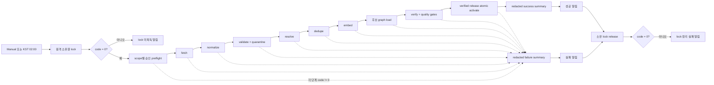

# RobinGraph n8n 운영 수집 워크플로우 평가와 통합본

상태: **NAS import 및 제한 실행 검증 완료 / 비활성**

통합 워크플로우: `n8n/robingraph-operational-ingest.json`

재생성 스크립트: `scripts/generate_n8n_operational_ingest.py`

이 통합본은 NAS의 n8n이 Mac mini의 Python ingest CLI를 SSH로 순서대로 호출하는 운영 제어면이다. 데이터 변환, 정책 판정, 재시도, manifest 작성, Neo4j/Jina 접근은 Python에 둔다. 원본·staging·quarantine은 NAS 영속 볼륨에 저장하며 n8n 실행 컨테이너에는 저장하지 않는다.

현재 `src/robingraph/cli.py`에는 아래 `robingraph ingest` 명령이 없고 실제 source/release와 taxonomy·license ADR도 승인되지 않았다. 따라서 파일은 `active: false`이며 지금 실행하면 의도적으로 lock 또는 preflight에서 멈춰야 한다. 운영 수집이 가능하다는 뜻의 산출물이 아니라, 필요한 CLI와 승인 자료가 준비됐을 때 import해 사용할 실행 계약이다.

## 평가 기준과 점수

| 평가 항목 | 배점 | Claude | GPT-5.6 Terra |
|---|---:|---:|---:|
| 정책 안전성·fail-closed | 30 | 28 | 29 |
| 실행 단계 완전성 | 25 | 14 | 14 |
| 실패 복구·관측성 | 20 | 9 | 9 |
| n8n 유지보수성 | 15 | 11 | 12 |
| 배포·보안 적합성 | 10 | 8 | 8 |
| **합계** | **100** | **70** | **72** |

두 후보 모두 단계 구성과 운영 문서는 충실하지만 그대로 운영할 수준의 점수는 아니다. 가장 큰 공통 결함은 n8n SSH 노드의 동작을 잘못 가정한 것이다. 공식 SSH 노드 구현은 원격 명령의 `code`, `stdout`, `stderr`를 결과 객체로 반환하며, 원격 종료 코드가 0이 아니어도 그 자체로 노드 오류를 던지지 않는다. 따라서 두 후보의 `continueErrorOutput` 두 번째 분기는 일반적인 CLI 실패에서 실행되지 않고 다음 성공 단계가 진행될 수 있다. [n8n SSH 노드 공식 구현](https://github.com/n8n-io/n8n/blob/master/packages/nodes-base/nodes/Ssh/Ssh.node.ts#L356-L372)

두 후보의 SSH `command` 값에는 `{{$execution.id}}`가 있지만 n8n expression 값임을 나타내는 선행 `=`가 없다. 이 상태에서는 실행 ID가 원격 명령에 동적으로 들어간다는 보장이 없다. 또한 lock 획득 실패도 공통 실패 경로로 합쳐져 자신이 얻지 못한 lock의 release를 시도한다.

### Claude 후보에서 채택한 점

- workflow `concurrency: 1`과 원격 소유권 lock을 함께 사용해 같은 workflow의 중복 실행을 먼저 줄인다.
- 품질 gate의 true/false를 n8n IF 노드로 보이게 하여 activation 조건을 실행 화면에서 확인할 수 있다. 통합본은 이 아이디어를 확장해 모든 주요 SSH 단계에 종료 코드 IF를 둔다. IF 노드는 조건에 따라 두 경로로 분기하는 공식 core node다. [n8n IF 노드 문서](https://docs.n8n.io/integrations/builtin/core-nodes/n8n-nodes-base.if/)
- Manual Trigger와 KST 02:00 Schedule Trigger, source scope별 preflight, 성공·실패 요약을 모두 포함한다.

### Terra 후보에서 채택한 점

- 승인 manifest, immutable raw hash, quarantine, idempotent load, verified candidate와 atomic activation의 CLI 계약이 구체적이다.
- SMTP 알림을 수집 SSH와 분리해 SSH 대상 장애 때도 n8n이 운영자에게 알릴 수 있다.
- 성공 실행 본문을 n8n에 장기 보존하지 않고 redacted summary만 알림에 쓰는 운영 방향이 명확하다.
- n8n에는 예약·호출·알림만 두고 Python에 정책과 변환 규칙을 유지한다.

## 통합본 실행 경로

통합본은 다음 문제를 직접 보완한다.

- 모든 mutating SSH 단계 뒤에 `Number($json.code ?? -1) == 0` IF를 둔다. SSH transport 오류도 `continueRegularOutput`으로 IF에 전달되며 `code`가 없으므로 실패 분기로 간다.
- 모든 동적 SSH 명령은 `=`로 시작하고 `n8n-{{ $execution.id }}` run ID를 사용한다.
- lock 획득 실패는 별도 알림으로 끝나며 release를 호출하지 않는다.
- lock을 획득한 뒤 실패하면 redacted summary와 알림 후 owner 검증 release를 호출한다. release 실패도 종료 코드를 검사해 별도로 알린다.
- `verify`가 0으로 끝난 뒤에만 `activate`를 호출하며, `activate`는 같은 run의 verified manifest와 gate 결과를 다시 확인해야 한다.
- n8n Code 노드와 `raw_stdout` 보존을 제거했다. gate와 정책의 실제 판단은 버전 관리되는 Python에 남는다.

## 필요한 Python CLI 계약

다음 명령은 아직 구현 대상이다. 모든 명령은 `--run-id`로 같은 manifest를 갱신하고, 성공이면 종료 코드 0, 차단 또는 실패이면 0 이외의 코드를 반환해야 한다. stdout은 한 줄 redacted JSON만 허용하며 secret, 원문, 정밀 좌표를 포함하면 안 된다.

| 명령 | 책임과 성공 조건 |
|---|---|
| `ingest lock acquire/release` | 원자적 lock, owner run ID 확인, 감사 가능한 stale lock 처리 |
| `ingest preflight` | scope별 `enabled`, `allowed`, approved immutable release, approval manifest, adapter/schema 버전 확인 |
| `ingest fetch` | 승인 release만 수집하고 원본 URI, SHA-256, retrieval time을 immutable manifest에 기록 |
| `ingest normalize` | canonical UTF-8 Parquet과 provenance 생성 |
| `ingest validate` | 행 오류 quarantine, blocked 오류가 있으면 실패 |
| `ingest resolve` | taxonomy release에 대해 accepted/ambiguous/unmatched/rejected와 rule version 기록 |
| `ingest dedupe` | 원본 삭제 없이 duplicate group과 representative 기록 |
| `ingest embed` | license와 embedding 허용이 확인된 청크만 Jina에 전송 |
| `ingest load` | 결정적 외부 키로 candidate release에 idempotent upsert, active pointer 유지 |
| `ingest verify` | raw hash, blocked=0, license/source 완전성, 참조 무결성, 해소율, embedding 실패율, 재실행 동등성 평가 |
| `ingest activate` | 같은 run의 verified manifest를 재검증한 뒤 active release pointer를 atomic swap |
| `ingest summarize` | source별 counts, duration, candidate/active release, blocked reason의 redacted JSON 출력 |

## n8n import와 배포 설정

1. `n8n/robingraph-operational-ingest.json`을 import하고 **비활성 상태를 유지**한다.
2. 모든 SSH 노드에 `Mac mini RobinGraph ingest SSH` private-key credential을 매핑한다. SSH 계정은 전용 `robingraph-ingest` 사용자로 제한하고 sudo와 일반 관리 권한을 주지 않는다.
3. Email Send 노드에 `RobinGraph Operations SMTP` credential을 매핑한다.
4. n8n에는 `ROBINGRAPH_ALERT_FROM`, `ROBINGRAPH_ALERT_TO`만 둔다. private key, SMTP 비밀값은 credential store에 둔다.
5. Mac mini의 비대화식 SSH 환경에 다음 변수를 제공한다: `ROBINGRAPH_APP_DIR`, `ROBINGRAPH_SOURCE_REGISTRY`, `ROBINGRAPH_APPROVAL_MANIFEST`, `ROBINGRAPH_RAW_ROOT`, `ROBINGRAPH_STAGING_ROOT`, `ROBINGRAPH_QUARANTINE_ROOT`, `ROBINGRAPH_INGEST_LOCK_DIR`, `ROBINGRAPH_INGEST_LOCK_STALE_SECONDS`, taxonomy/embedding/quality gate 설정과 Neo4j/Jina/source secret reference.
6. n8n SSH 노드는 원격 명령 실행 권한을 가지므로 private network, 최소 workflow 편집 권한, 전용 SSH 계정으로 제한하고 n8n security audit을 운영 점검에 포함한다. [n8n security audit](https://docs.n8n.io/hosting/securing/security-audit/)

## 검증 결과

`tests/test_n8n_workflows.py`가 다음을 자동 확인한다.

- 후보 2개와 통합본 1개의 JSON 파싱, 비활성 상태, 고유 node ID/name, 존재하는 connection target
- 통합본 주요 SSH 단계마다 직후 종료 코드 IF가 있는지
- verify 성공 IF만 activation에 들어가는지
- lock 미획득 경로가 release를 호출하지 않는지
- lock release 실패 알림 경로가 있는지
- workflow concurrency, Code 노드 부재, credential/secret literal 부재

공식 `docker.n8n.io/n8nio/n8n:stable` 이미지의 n8n **2.37.10**에서 임시 SQLite DB를 사용해 후보 2개와 통합본을 각각 `import:workflow`로 가져오는 시험도 모두 통과했다. 첫 시험에서 최신 importer가 요구하는 workflow 최상위 `id` 누락을 발견해 세 파일에 고유 ID를 추가한 뒤 다시 검증했다. 저장소 전체 테스트는 112개 중 92개가 통과했고, live Neo4j opt-in 테스트 20개는 기존 설정대로 skip됐다.

2026-09-05 `workflow.dove-nest.com`의 Personal 프로젝트에 통합본을 import했다. 37개 node와 연결이 편집기에 표시됐고 workflow 목록이 16개에서 17개로 증가해 서버 저장도 확인했다. Publish와 Schedule Trigger는 활성화하지 않았다.

같은 NAS n8n에서 Manual Trigger를 실행했다. 실행 엔진과 실패 분기는 정상 작동했으며 455ms에 종료됐다. 첫 SSH node에서 `Node does not have any credentials set` 오류가 발생했고, SSH와 SMTP Credential이 등록되어 있지 않아 원격 명령과 운영 데이터 변경은 없었다. 실패를 `continueRegularOutput`으로 처리하므로 실행 이력은 `Success`로 보일 수 있지만 이는 수집 성공을 의미하지 않는다. 운영 전에는 실패 실행을 명시적인 실패 상태로 끝내는 보완도 필요하다.

Python ingest CLI와 승인 source가 아직 없으므로 원격 단계의 end-to-end 실행은 수행할 수 없다. 설정값과 검증 순서는 [운영 수집 런북](README.md)에 정리했다. 운영 전 staging n8n에서 다음 두 시나리오가 필요하다.

1. **차단 시험**: CLI 미구현 또는 미승인 manifest 상태에서 실행하고 fetch와 activation이 한 번도 호출되지 않는지 확인한다.
2. **합성 성공 시험**: 승인된 synthetic source로 모든 단계, 성공 알림, lock release를 확인한 뒤 gate 실패를 주입해 activation이 호출되지 않고 실패 알림과 lock release가 실행되는지 확인한다.
