# n8n 한국어 일반명(Korean vernacular name) 수집 런북

> **오프라인 구현·테스트 완료 / 라이브 검증 대기.** 2026-09-11에 별도 worktree(`EvoDmiK/finish-korean-vernacular`)에서 이 체크포인트를 마무리했다: 생성기 `NameError` 수정, 알림의 Discord-선택-사항화, 오프라인 테스트 계약 수정까지 반영해 전체 오프라인 스위트가 통과한다. 실제 n8n import/실행과 운영 Neo4j 적재는 여전히 검증되지 않았다 — 자세한 내용은 [현재 작업 상태와 남은 검증](WORK_STATUS_2026-09-11.md) 참고.

## 배경

`GET /v1/taxa/lineage?name=`는 대상 `Taxon`에 직접 연결된 한국어 `VernacularName`이
있어야 성공한다. 지금까지 AviList 적재는 영명(`language: 'en'`)만 보장했으므로
`청둥오리`(Mallard, *Anas platyrhynchos*) 같은 실제 종명으로는 항상 404였다
(자세한 배경은 [분류 계통 API](../taxonomy-lineage-api.md) 참고). 이 workflow는
그 간극을 메우는 **별도** 적재 경로다. 기존 [분류·형질 기준정보 수집
런북](reference-ingest.md)이 만든 `reference-taxonomy` `IngestState`와 활성
`TaxonConceptSet`을 절대 바꾸지 않고, 오직 그 안의 기존 `Taxon:BirdTaxon`에
한국어 `VernacularName`만 붙인다.

## 소스와 라이선스 근거

- **소스**: Wikidata 구조화 데이터(query.wikidata.org SPARQL endpoint).
- **라이선스**: CC0. 2026-09-11에 <https://www.wikidata.org/wiki/Wikidata:Licensing>를
  직접 조회해 "All structured data in the main, property and lexeme
  namespaces is made available under the Creative Commons CC0 License" 문구를
  확인했다.
- **실제 매칭 확인**: 같은 날 아래 SPARQL 질의를 `query.wikidata.org`에 직접
  실행해 `Q25348 → taxonName "Anas platyrhynchos" → itemLabel(ko) "청둥오리"`가
  결과에 포함됨을 확인했다(`LIMIT 10` 예비 질의로 종 10개의 실제 국명도 함께
  확인: `Meleagris gallopavo → 들칠면조`, `Struthio camelus → 타조` 등).

  ```sparql
  SELECT ?item ?taxonName ?itemLabel WHERE {
    ?item wdt:P105 wd:Q7432 .      # taxon rank = species
    ?item wdt:P171* wd:Q5113 .     # parent taxon* = Aves
    ?item wdt:P225 ?taxonName .    # taxon name (scientific name)
    ?item rdfs:label ?itemLabel .
    FILTER(LANG(?itemLabel) = "ko")
  }
  ```

- **왜 NIBR이 아닌가**: 2026-09-11에 NIBR의 실제 국가생물종목록 데이터셋
  (`https://www.data.go.kr/data/15048041/fileData.do`, XLSX, 61,230종, 조류
  국명·학명 포함)의 라이선스를 직접 확인했다 — **공공누리 제3유형**(출처표시,
  변경금지)이다. ADR-0003의 기본 허용 목록은 CC0/CC BY/공공누리 **1유형**뿐이라
  제3유형은 별도 예외 ADR 없이는 적재할 수 없다. 사용자가 그 예외를 지금
  만들지 않기로 결정했으므로(2026-09-11), `config/collection-points.json`의
  `korea-nibr-species`는 계속 `enabled: false`, `license_policy_status:
  "review_required"`로 남는다. 자세한 결정 근거는
  [ADR-0005](../decisions/0005-korean-vernacular-name-source.md) 참고.
  Wikidata는 라이선스가 이미 확정된(CC0) 별개의 승인 소스로 등록했다
  (`korean-vernacular-wikidata-species-labels`, `config/collection-points.json`).
- **"공식 국명"이 아니다**: 이 workflow가 적재하는 이름은 `VernacularName.status
  = 'community-sourced'`로 표시되고 `/v1/taxa/lineage` 응답의
  `lineage[].korean_name_status`로 그대로 노출된다(참고:
  [분류 계통 API](../taxonomy-lineage-api.md)). Wikidata는 누구나 계속
  편집하는 데이터베이스이며 국립생물자원관 같은 국가 공식 국명 목록이
  아니다 — 오탈자, 구어체 표기, 개인 편집자의 실수가 섞일 수 있다.
- **가변 데이터**: Wikidata는 커뮤니티가 계속 편집하는 데이터베이스라
  AviList/EltonTraits처럼 고정 SHA-256을 미리 박아둘 수 없다. 대신 매 실행마다
  받은 SPARQL 응답 본문을 SHA-256으로 해시해 `SourceRecord.raw_hash`에
  보존한다(`source_release`는 `mutable-as-of-<날짜>` 형태).

## 처리 흐름

```mermaid
flowchart LR
  T[Manual / monthly trigger] --> C[Build config from approved collection point]
  C --> F[Fetch Wikidata SPARQL results]
  F --> H[SHA-256 the raw response]
  H --> N[Normalize: dedupe + detect conflicting ko labels]
  N --> R[Resolve active concept set and match Taxon by scientific_name]
  R --> A[Assemble quality gates]
  A -->|pass| S[Start ingestion run]
  A -->|fail| Fail[Discord and fail]
  S --> B[Batch MERGE VernacularName + VernacularNameCandidate]
  B --> V[Verify batch counts]
  V --> Fin[Finalize korean-vernacular-names IngestState]
  Fin --> D[Discord success]
```



## 매칭과 모호성 처리

- 대상은 **현재 활성** `reference-taxonomy` `IngestState.active_concept_set_id`
  안의 `Taxon:BirdTaxon`뿐이다. 활성 concept set이 없으면(아직 AviList 기준정보를
  적재하지 않았으면) 실패로 처리하고 아무것도 쓰지 않는다.
- 매칭은 학명(`scientific_name`) 완전 일치다. 한 학명에 매칭되는 `Taxon`이
  0개면 `reason_code: 'no_matching_avilist_taxon'`, 2개 이상이면
  `'ambiguous_avilist_taxon_match'`인 `VernacularNameCandidate`로 남기고 쓰지
  않는다.
- 같은 학명에 서로 다른 한국어 이름이 두 개 이상 연결된 경우(Wikidata
  항목 간 불일치)에는 **어느 쪽도 임의로 선택하지 않고** 둘 다
  `reason_code: 'conflicting_korean_labels'` 후보로 남긴다.
- `VernacularName`은 `id: <taxon_id>:vernacular:ko:wikidata`로 `MERGE`한다.
  결정론적 ID이므로 같은 입력으로 다시 실행해도 새 노드가 생기지 않고
  속성만 갱신된다(idempotent).
- `korea-nibr-species`처럼 `enabled: false`이거나
  `license_policy_status`가 `allowed`가 아닌 collection point로는 이 workflow를
  생성할 수 없다 —
  `scripts/generate_n8n_korean_vernacular_ingest.py`의
  `require_collection_point_approved()`가 그 자리에서 `RuntimeError`를
  던진다(오프라인 테스트로 검증: `tests/test_n8n_workflows.py`의
  `test_korean_vernacular_license_gate_approves_wikidata_and_denies_unreviewed_nibr`).
- SPARQL endpoint가 200이 아닌 상태를 반환하거나, 응답 본문이 `head.vars`/
  `results.bindings`를 가진 온전한 SPARQL 결과 문서가 아니면(잘린 응답, HTML
  오류 페이지 등) "후보 0개"로 조용히 넘어가지 않고 별도
  `fetch_ok: false` 신호로 명시적으로 실패 처리한다(`Normalize Korean
  vernacular candidates`, `Assemble Korean vernacular quality gates` 노드).
  부분적으로만 받은 snapshot을 완전한 결과인 것처럼 다루지 않는다.
- 읽기 API(`taxonomy_lineage_neo4j.py`)는 한국어 이름을 대상 조회·계통 투영
  양쪽에서 `VernacularName -[:FROM_RECORD]-> SourceRecord -[:IN_DATASET]->
  SourceDataset {policy_status: 'allowed'}` 연결이 끊기지 않은 경우에만
  반환한다. 승인된 적재 경로를 거치지 않은 한국어 이름은 감춰지는 게
  아니라 애초에 조회에 잡히지 않는다(적재된 적 없는 이름과 구분되지 않음).
  자세한 내용은 [분류 계통 API](../taxonomy-lineage-api.md)의 "데이터 경계와
  실패 처리" 절.
- 적재한 `VernacularName`은 `status: 'community-sourced'`,
  `source_scientific_name_claim`(Wikidata가 실제로 주장한 학명 문자열),
  `source_qids`(매칭에 쓰인 Wikidata Q-ID들)를 함께 저장해 감사 추적이
  가능하게 한다. `/v1/taxa/lineage`는 `status`를 `lineage[].korean_name_status`로
  그대로 노출해 "공식 국명이 아님"을 API 응답 자체에서 알 수 있게 한다.

## 생성과 로컬 검증

```sh
uv run --locked python scripts/generate_n8n_korean_vernacular_ingest.py
uv run --locked python scripts/deploy_n8n_reference_ingest.py --workflow korean-vernacular
uv run --locked --extra test python -m unittest tests.test_n8n_workflows -v
uv run --locked --extra test python -m unittest tests.test_taxonomy_lineage_neo4j -v
```

두 번째 명령은 기본적으로 원격에 연결하지 않고 import artifact만 확인한다
(`ready-local: nodes=30, active=False`).

## NAS 연결과 배포

Git에서 제외되는 프로젝트 루트 `.env`에 다음 값을 둔다(기존
`ROBINGRAPH_N8N_API_URL`, `ROBINGRAPH_N8N_API_KEY`,
`ROBINGRAPH_N8N_NEO4J_CREDENTIAL`, `ROBINGRAPH_N8N_DISCORD_CREDENTIAL`은
[분류·형질 기준정보 수집 런북](reference-ingest.md)의 값을 그대로 재사용한다).

```dotenv
# 처음 생성할 때는 생략하고, 생성 결과의 ID를 이후에 저장한다.
ROBINGRAPH_N8N_KOREAN_VERNACULAR_WORKFLOW_ID=...
```

원격 credential과 기존 workflow 상태를 읽기 전용으로 확인한다.

```sh
uv run --locked python scripts/deploy_n8n_reference_ingest.py --workflow korean-vernacular --remote
```

`--apply`는 workflow ID가 없으면 새 inactive workflow를 만들고, ID가 있으면
기존 workflow가 inactive인지 확인한 뒤 백업하고 갱신한다.

```sh
uv run --locked python scripts/deploy_n8n_reference_ingest.py --workflow korean-vernacular --apply
```

필수 전제는 [분류·형질 기준정보 수집 런북](reference-ingest.md)과 같은
`n8n-nodes-neo4j` community node와 `Neo4j` credential이다. **Discord Bot
credential은 이 workflow에서 선택 사항이다** — `reference` workflow와 달리
`scripts/deploy_n8n_reference_ingest.py`가 `korean-vernacular`를
`DISCORD_REQUIRED`에서 제외해두었으므로, `--remote`/`--apply` 모두 Discord
credential 이름을 찾지 못해도 예외 없이 계속 진행한다. Discord를 설정하지
않으면 `Notify Korean vernacular success`/`failure` 노드가 credential 없는
템플릿 상태로 남고, 실제 실행 시 그 노드만 `onError: continueRegularOutput`으로
조용히 실패할 뿐 나머지 workflow(적재·활성화)는 영향을 받지 않는다.
`Fetch Wikidata Korean bird labels`와 `Resolve active concept set and match
candidates` 노드가 실행되려면 `reference-taxonomy` `IngestState`가 이미
활성 상태여야 하므로, 반드시 기준정보 workflow를 먼저 성공적으로 실행한
NAS/Neo4j에서만 이 workflow를 실행한다.

## 첫 실행 검증 (스모크 테스트)

1. workflow가 inactive인지 확인한다.
2. 모든 Neo4j 노드와 Discord 노드의 credential을 확인한다.
3. Manual Trigger로 실행한다.
4. `Normalize Korean vernacular candidates`의 `source_binding_count`,
   `distinct_taxon_name_count`가 0보다 큰지 확인한다(0이면 SPARQL 응답 파싱
   실패로 간주해 실행이 실패해야 한다).
5. `Assemble Korean vernacular quality gates`의 `write_row_count`,
   `candidate_count`를 확인한다.
6. Neo4j에서 아래 질의로 실제 적재를 확인한다.

   ```cypher
   MATCH (v:VernacularName {language: 'ko'})<-[:HAS_VERNACULAR_NAME]-(t:Taxon:BirdTaxon)
   WHERE v.source_release STARTS WITH 'mutable-as-of'
   RETURN t.scientific_name, v.name, v.status
   ORDER BY t.scientific_name
   LIMIT 25;
   ```

7. API로 실제 조회를 확인한다(배포된 API가 이 Neo4j를 가리켜야 한다).

   ```sh
   curl "https://<NAS-API-HOST>/v1/taxa/lineage?name=%EC%B2%AD%EB%91%A5%EC%98%A4%EB%A6%AC"
   ```

   (`청둥오리`의 URL 인코딩. 이 workflow가 아직 NAS/Neo4j에서 실제로 실행되지
   않았다면 이 호출은 여전히 404를 반환한다 — 아래 "현재 검증 상태" 참고.)
8. `IngestState {id: 'korean-vernacular-names'}`의 `active_release`,
   `loaded_vernacular_names`, `loaded_candidates`를 확인하고,
   `IngestState {id: 'reference-taxonomy'}`가 이 실행으로 바뀌지 않았음을
   확인한다.
9. Discord credential을 설정했다면 성공 알림을 확인한다(선택 사항 — 설정하지
   않았다면 이 단계는 건너뛰고 나머지 count/API 확인 결과만으로 판단한다).
   그 뒤에만 월간 schedule 활성화를 검토한다.

## 현재 검증 상태 (정직하게 보고)

- **로컬로 검증한 것**: workflow import shape, 노드 간 연결, 모든 Code/Cypher
  노드의 JavaScript 문법(`node --check`, code 7개 + Neo4j 12개 = 19개 노드;
  나머지 2개 Discord 알림 노드는 JS가 아닌 n8n 표현식이라 별도 검사 대상이
  아니다), 정규화·매칭 분류 로직(`classifyWikidataRows`, `classifyMatches`,
  `assembleGates`)을 실제 `node` 프로세스에서 중복/충돌/동명이인(homonym)/
  미매칭/모호 매칭/malformed binding/활성 concept set 없음/HTTP 요청 실패·
  비정상 응답 케이스로 직접 실행해 검증, content-addressed
  `wikidata_dataset_id`가 같은 hash에서는 멱등, 다른 hash에서는 달라지는지
  검증, `FINALIZE_STATEMENT`의 낙관적 동시성 가드가 뒤늦은 실행의 활성화를
  거부하는지 검증, license gate 함수를 프로젝트의 실제
  `config/collection-points.json`(Wikidata 승인, NIBR 미승인, ADR-0005 확정
  후에도 동일)에 대해 실행해 검증, 그리고 읽기 경로
  (`taxonomy_lineage_neo4j.py`)가 이 workflow의 쓰기 포맷과 정확히 맞물려
  `청둥오리 → Anas platyrhynchos`(+ `korean_name_status:
  "community-sourced"`)를 반환하는지, 승인되지 않은 라이선스 체인의 이름은
  애초에 조회되지 않는지, 활성 `wikidata_dataset_id`가 바뀌면 이전 스냅샷의
  이름이 더 이상 조회되지 않는지(퇴역 경계)를 Mock Neo4j 드라이버로 오프라인
  계약 테스트. Discord 알림은 credential 없이도 배포/실행이 막히지 않는지
  검증(`test_korean_vernacular_deployment_succeeds_without_a_discord_credential`).
  전체 오프라인 스위트(`tests/` 전체, 이 workflow 전용 테스트만이 아님)는
  **220개 통과, 0개 실패/오류, 22개 조건부 live skip**(모두
  `ROBINGRAPH_NEO4J_INTEGRATION_TESTS=1` 같은 명시적 opt-in이 있어야 실행).
  `scripts/generate_n8n_korean_vernacular_ingest.py`를 재실행해도
  `n8n/robingraph-korean-vernacular-ingest.json`이 바이트 단위로 동일(SHA-256
  동일)함을 확인했다.
- **아직 검증하지 않은 것**: 이 workflow를 실제 n8n에 import하고 Manual
  Trigger로 실행한 적이 없다. Wikidata SPARQL endpoint를 향한 실제 HTTP
  호출, 실제 Neo4j에 대한 batch MERGE, 그리고 `/v1/taxa/lineage?name=청둥오리`의
  실제 200 응답은 모두 **아직 라이브로 확인되지 않았다.** 위 오프라인
  테스트는 이 workflow가 배포되면 "그렇게 동작하도록 설계됐다"는 근거이지
  "실제로 그렇게 동작했다"는 증거가 아니다.
- 다음 사람이 할 일: 기준정보 workflow가 활성 `reference-taxonomy`를 가진
  NAS/Neo4j에서 이 workflow를 import하고, 위 "첫 실행 검증" 절차를 그대로
  실행해 실제 count와 `/v1/taxa/lineage?name=청둥오리` 200 응답을 확인한 뒤
  이 절을 실행 증거로 갱신한다.

## 구현 위치

- 생성 스크립트: `scripts/generate_n8n_korean_vernacular_ingest.py`
- import 산출물: `n8n/robingraph-korean-vernacular-ingest.json`
- 배포 스크립트: `scripts/deploy_n8n_reference_ingest.py --workflow korean-vernacular`
- 수집 포인트: `config/collection-points.json`의
  `korean-vernacular-wikidata-species-labels`, `config/source-registry.json`의
  `wikidata-taxon-labels`
- 읽기 경로 라이선스 체인: `src/robingraph/retrieval/taxonomy_lineage_neo4j.py`
  (`_LINEAGE_QUERY`, `_LINEAGE_BY_KOREAN_NAME_QUERY`), 도메인 계약:
  `src/robingraph/retrieval/taxonomy_lineage.py`
  (`LineageTaxon.korean_name_status`), API 계약: `src/robingraph/api/app.py`
  (`LineageTaxonResponse.korean_name_status`)
- NAS 배포 연동: `compose.nas.yml`, `.env.nas.ingest.example`,
  `scripts/deploy_nas.sh`(`deploy-workflows` action)
- 결정 근거: [ADR-0005](../decisions/0005-korean-vernacular-name-source.md)
- workflow 정적 검사: `tests/test_n8n_workflows.py`
  (`test_korean_vernacular_*`)
- 읽기 경로 계약 테스트: `tests/test_taxonomy_lineage_neo4j.py`
  (`test_korean_name_resolves_a_freshly_ingested_mallard_from_the_wikidata_pipeline`,
  `test_korean_name_lookup_returns_none_for_a_species_not_yet_ingested`,
  `test_korean_name_target_and_ancestor_projection_require_an_allowed_license_chain`)
- NAS 배포 연동 테스트: `tests/test_nas_deployment.py`
  (`test_deploy_workflows_action_includes_korean_vernacular`,
  `test_ingest_example_and_compose_pass_through_korean_vernacular_workflow_id`)
