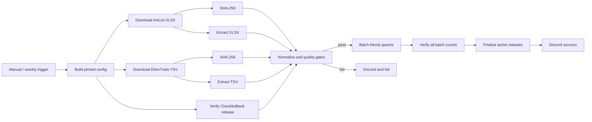

# n8n 분류·형질 기준정보 수집 런북

## 현재 상태

`n8n/robingraph-reference-ingest.json`은 AviList v2025b, EltonTraits 1.0, 고정된 Catalogue of Life/ChecklistBank 릴리스를 n8n에서 직접 처리하는 별도 workflow다. 기존 GBIF 관찰 workflow는 변경하지 않는다.

workflow는 import 가능한 inactive 상태로 생성됐으며, NAS API 자격정보가 현재 작업공간에 없어 아직 원격 생성·수동 실행 검증은 하지 않았다. 검증 전에는 schedule을 활성화하지 않는다.

## 처리 흐름



## 고정 입력과 품질 기준

| 입력 | 고정값 | 품질 기준 |
|---|---|---|
| AviList | v2025b Extended XLSX | SHA-256 일치, 분류 레코드 33,684개, species 학명 중복 0 |
| EltonTraits | Figshare file 5631081 | SHA-256 일치, 원본 9,995행, 유효 9,993행 |
| ChecklistBank | dataset 316115 | release version `2026-08-20`, DOI `10.48580/dgywk`, `origin=release` 일치 |
| EltonTraits → AviList | 정확한 species 학명 | 고유 exact match 비율 70% 이상 |

현재 snapshot에서 EltonTraits 유효 9,993행 중 7,752개(77.6%)가 AviList species에 정확히 하나만 대응한다. 여기서 46,512개의 `TraitClaim`을 만들고, 대응하지 않는 2,241개는 `TaxonMappingCandidate`로 보존한다.

ChecklistBank는 이 전체 적재에서 고정 릴리스 메타데이터를 확인하고 미대응 학명의 검토 URL을 만드는 데만 사용한다. 2,241개 학명을 API로 자동 질의하거나 fuzzy 결과로 병합하지 않는다. 동의어 crosswalk는 별도 검토 workflow에서 `TaxonMappingClaim`으로 승인해야 한다.

## 그래프 적재 계약

- AviList 각 행은 release-scoped `Taxon:BirdTaxon`, `ScientificName`, 선택적 영어 `VernacularName`, `SourceRecord`로 적재한다.
- AviList의 order → family → genus → species → subspecies 순서를 `PARENT_OF`로 보존한다.
- Avibase ID와 Cornell species code는 `ExternalIdentifier`로 분리한다.
- EltonTraits 값은 `body_mass`, `nocturnal`, `pelagic_specialist`, `diet_category`, `diet_distribution`, `foraging_strata_distribution`의 개별 `TraitClaim`으로 저장한다.
- 각 trait claim은 `EvidenceUnit`과 원본 `SourceRecord`에 연결한다.
- 기존 GBIF `ExternalTaxonConcept`와 AviList `Taxon`의 학명·rank exact match는 병합 대신 `TaxonMappingClaim` 후보로 연결한다.
- taxonomy는 1,000행, trait claim은 2,000개, mapping candidate는 1,000개 단위로 `MERGE`한다. 중간 실패 시 일부 idempotent 노드가 남을 수 있지만 active release는 모든 batch count를 검증한 뒤에만 갱신한다.
- source snapshot hash, 릴리스, 라이선스, 원본 URI를 `SourceDataset`, `SourceRecord`, `License`, `IngestionRun`에 보존한다.

## 생성과 로컬 검증

collection point의 URL·릴리스·해시를 바꾸면 JSON을 다시 생성한다.

```sh
python3 scripts/generate_n8n_reference_ingest.py
python3 scripts/deploy_n8n_reference_ingest.py
python3 -m unittest tests.test_n8n_workflows -v
```

두 번째 명령은 기본적으로 원격에 연결하지 않고 import artifact만 확인한다.

## NAS 연결과 배포

Git에서 제외되는 프로젝트 루트 `.env`에 다음 값을 둔다.

```dotenv
ROBINGRAPH_N8N_API_URL=https://n8n.example.com/api/v1
ROBINGRAPH_N8N_API_KEY=...
# 처음 생성할 때는 생략하고, 생성 결과의 ID를 이후에 저장한다.
ROBINGRAPH_N8N_REFERENCE_WORKFLOW_ID=...
ROBINGRAPH_N8N_NEO4J_CREDENTIAL=Neo4j
ROBINGRAPH_N8N_DISCORD_CREDENTIAL=Nesty API 키
```

원격 credential과 기존 workflow 상태를 읽기 전용으로 확인한다.

```sh
python3 scripts/deploy_n8n_reference_ingest.py --remote
```

`--apply`는 workflow ID가 없으면 새 inactive workflow를 만들고, ID가 있으면 기존 workflow가 inactive인지 확인한 뒤 백업하고 갱신한다.

```sh
python3 scripts/deploy_n8n_reference_ingest.py --apply
```

필수 전제는 n8n의 `n8n-nodes-neo4j` community node, `Neo4j` credential, Discord Bot credential이다. Public API 배포 뒤 UI에서 concurrency가 1인지 다시 확인한다.

## 첫 실행 검증

1. workflow가 inactive인지 확인한다.
2. 모든 Neo4j 노드와 Discord 노드의 credential을 확인한다.
3. Manual Trigger로 실행한다.
4. 세 source hash/release gate, 레코드 수, exact match 비율을 확인한다.
5. taxonomy batch 총계 33,684, 링크 33,638이 일치하는지 확인한다.
6. trait claim 46,512개와 mapping candidate 2,241개의 입력·Neo4j 반환 수가 일치하는지 확인한다.
7. `IngestState`의 taxonomy/trait active release가 마지막 finalize 노드 뒤에만 바뀌는지 확인한다.
8. Discord 성공 알림과 Neo4j 샘플 질의를 확인한 뒤에만 주간 schedule 활성화를 검토한다.
