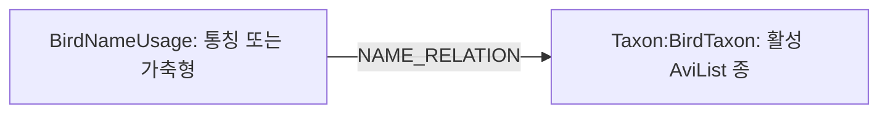

# 통칭·가축형 관계 탐색 (RG-501)

설명창에서 **통칭·가축형 관계 알아보기**를 펼치면 출처가 있는 이름과 종의 관계를 확인한다. `닭`, `비둘기`, `까마귀`, `집오리`처럼 등록된 이름을 질문하면 후보·관계 설명을 먼저 제공한다. 통칭이 한 종으로 연결되면 그 종의 설명·카드 버튼을 바로 준비한다. 여러 후보 또는 가축형은 대상을 선택한 뒤 자료를 표시한다. 가축형의 사진·체중·보전 등급으로 대체하지 않는다.

## 확대 검토 범위

통칭·별칭·가축형·닭 품종 33개 이름 엔티티를 37개 종에 연결하는 47개 관계와 70개 검색어를 검토했다. 거위·칠면조·메추리·뿔닭·카나리아·십자매, 닭 품종, 학·백조·백로·앵무새·뱁새·종달새·장끼·까투리 등을 포함한다. 전체 조류 또는 모든 가축 품종의 목록은 아니다. 가축형에 자동으로 아종 지위를 부여하지 않으며 여러 종을 뜻하는 이름은 후보를 나눠 표시한다.

관계 자료는 [name_relations.json](../src/robingraph/retrieval/name_relations.json), 전체 매핑·출처·보류 목록은 [확대 조사 목록](name-relations-coverage.md), 최초 예시의 근거는 [초기 연구 기록](name-relations-research.md)에 있다. 외부 원문·사진을 재배포하거나 외부 저작권을 재허가하지 않는다.

## 데이터 구조



- 노드: 이름, `common_name`/`domestic_form`, 검색어, dataset/release 식별자.
- 관계: `common_usage`/`domesticated_from`, 활성 concept-set 및 PostgreSQL source-record 식별자.
- PostgreSQL: `reviewed-name-relations` 파이프라인의 승인된 manifest, 변경 불가능한 source release/record, 검토 출처·요약, 활성 상태. raw object URI는 `urn:sha256:<내용 해시>`이며 원문은 release metadata와 record payload에서 확인한다.
- Neo4j에는 제어 상태·source record 노드를 추가하지 않는다. 정규 한국어 이름, 분류 트리, GBIF 개념, 형질을 수정하지 않는다.
- 부분 적재, 검토 자료와 그래프의 불일치, 누락된 후보, 변경된 분류판은 조회를 거부한다. 일반 학명 조회는 기존 경로로 처리한다.

## API

`GET /v1/taxa/name-relations?name=닭`은 `query_name`, `summary`, `is_search_term`, 분류판·개념집합과 `relations`를 반환한다. 각 관계에는 종류·설명·대상 taxon·출처가 들어간다. 학명으로 조회하면 해당 종에 연결된 이름을 역방향으로 탐색한다.

`POST /v1/chat`의 등록 이름 질문은 `result.kind=name_relations`로 그래프 관계를 반환한다. 통칭의 고유 대상이 한 종이면 `disposition=answer`, 여러 후보 또는 가축형이면 `clarify`이다. 명시적인 관찰·근거 질문은 이름 검색으로 바꾸지 않는다. 직접 `/v1/taxa/profile`·`/v1/taxa/lineage`는 기존 단일 종 계약을 유지하며 가축형을 야생종으로 자동 치환하지 않는다.

등록되지 않은 종의 관계 목록은 빈 목록이다. 관계 기능 또는 활성 스냅샷이 없으면 관계 endpoint는 503이다. 이름 조회 중 관계 검증이 실패하면 후보를 임의로 선택하지 않고 답변을 유보한다.

## 적재와 운영

API를 시작해도 DB에 쓰지 않는다. 적용할 환경의 PostgreSQL·Neo4j 설정이 들어 있는 별도 터미널 또는 컨테이너에서 실행한다.

```sh
# 기본은 검증만 수행: 승인된 활성 AviList에서 모든 대상이 정확히 1개여야 함
python scripts/load_name_relations.py
# 검토 후 명시적으로 적용
python scripts/load_name_relations.py --apply
```

`--manifest PATH`로 다른 검토 파일을 지정할 수 있다. 해시와 활성 분류판을 함께 릴리스 식별자에 넣는다. PostgreSQL 기록 → Neo4j 트랜잭션 → 낙관적 버전 검사 후 활성화 순서다. 동일 릴리스 재실행은 적재를 반복하지 않으며, 실패한 새 투영은 활성화하지 않는다. 분류판 변경 후에는 새 분류판에서 검증·적재해야 한다.

TEST부터 적용한다. 기존 활성 TEST 분류 자료를 사용하고 PROD 데이터 준비는 RG-102의 별도 작업으로 유지한다.

## 검증

```sh
uv run --locked --extra test python -m unittest discover -s tests -p 'test_name_relations.py'
node --test tests/frontend/*.test.js
```

실제 DB 통합 테스트는 NAS와 분리된 DB/스키마에 환경 변수를 설정하고 `ROBINGRAPH_NAME_RELATIONS_INTEGRATION_TESTS=1`로 `tests/test_name_relations_integration.py`를 실행한다. PostgreSQL database와 schema 이름에는 `test`가 들어가야 한다. 테스트 전용 분류·관계를 생성·삭제하므로 운영 환경에서 실행하지 않는다.

현재 구현·로컬 DB 검증과 NAS TEST의 적재·실환경 검증 완료는 별도로 기록한다.
