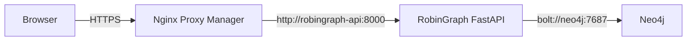

# RobinGraph NAS 배포 런북

## 배포 목표

RobinGraph FastAPI를 기존 Django 컨테이너와 분리된 `robingraph-api` 컨테이너로 실행한다. 호스트 포트를 공개하지 않고 NAS의 Nginx Proxy Manager(NPM), Neo4j와 `robingraph-edge` 외부 Docker 네트워크에서 통신한다.



기존 Django 컨테이너의 포트, 이미지, 볼륨과 네트워크 설정은 변경하지 않는다.

## 포함된 배포 파일

| 파일 | 역할 |
|---|---|
| `Dockerfile` | Python 3.12.13과 잠긴 uv 환경으로 비루트 API 이미지 생성 |
| `compose.nas.yml` | API 컨테이너, healthcheck, 재시작·로그·보안 설정 |
| `.env.nas.example` | NAS 전용 비밀값과 실행 모드 템플릿 |
| `.dockerignore` | 비밀값, 개발 캐시와 불필요한 build context 제외 |

## 1. NAS checkout 준비

NAS의 RobinGraph 저장소 루트에서 `dev` 브랜치를 받은 뒤 환경 파일을 만든다.

```sh
git fetch origin
git switch dev
git pull --ff-only origin dev
cp .env.nas.example .env.nas
chmod 600 .env.nas
```

`.env.nas`는 Git에 추가하지 않는다. 첫 프록시 검증은 `ROBINGRAPH_API_MODE=serve-fixture`로 진행한다.

## 2. 공용 Docker 네트워크 준비

네트워크와 컨테이너 이름을 먼저 확인한다.

```sh
docker network ls
docker ps --format 'table {{.Names}}\t{{.Networks}}'
```

공용 네트워크가 없다면 한 번만 생성한다.

```sh
docker network create robingraph-edge
```

NPM 컨테이너를 `robingraph-edge`에 연결한다. 실제 NPM 컨테이너 이름으로 바꿔 실행한다.

```sh
docker network connect robingraph-edge <NPM_CONTAINER_NAME>
```

실제 Neo4j 모드를 사용할 때는 Neo4j 컨테이너도 같은 네트워크에 연결한다.

```sh
docker network connect robingraph-edge neo4j
```

이미 연결된 컨테이너에 같은 명령을 다시 실행하면 오류가 나므로 `docker inspect <컨테이너> --format '{{json .NetworkSettings.Networks}}'`로 먼저 확인한다. NPM이나 Neo4j를 Compose로 관리한다면 수동 연결 대신 각 Compose 파일에 `robingraph-edge` 외부 네트워크를 선언해야 컨테이너 재생성 뒤에도 연결이 유지된다.

## 3. 이미지 빌드와 첫 실행

```sh
docker compose --env-file .env.nas -f compose.nas.yml config
docker compose --env-file .env.nas -f compose.nas.yml build --pull
docker compose --env-file .env.nas -f compose.nas.yml up -d
docker compose --env-file .env.nas -f compose.nas.yml ps
```

`robingraph-api`가 `healthy`가 되면 컨테이너 내부 상태를 확인한다.

```sh
docker exec robingraph-api python -c "import urllib.request; print(urllib.request.urlopen('http://127.0.0.1:8000/health').read().decode())"
```

첫 실행의 응답은 `mode: fixture`여야 한다.

## 4. Nginx Proxy Manager 설정

`Proxy Hosts → Add Proxy Host`에서 다음 값을 사용한다.

| 항목 | 값 |
|---|---|
| Domain Names | `aviary.dove-nest.com` |
| Scheme | `http` |
| Forward Hostname / IP | `robingraph-api` |
| Forward Port | `8000` |
| Block Common Exploits | 활성화 |
| Websockets Support | 활성화 가능 |
| Cache Assets | 비활성화 |

SSL 탭에서는 기존 Dove Nest 서비스와 같은 인증서 방식을 사용하고 `Force SSL`, `HTTP/2 Support`를 활성화한다. 테스트 Swagger가 공개 검색이나 무단 호출에 노출되지 않도록 NPM Access List 또는 Cloudflare Access를 연결한다.

배포 확인 주소:

- `https://aviary.dove-nest.com/health`
- `https://aviary.dove-nest.com/docs`
- `https://aviary.dove-nest.com/openapi.json`

## 5. 실제 Neo4j 모드 전환

`.env.nas`에 Neo4j 연결 정보를 채우고 다음 값을 변경한다.

```dotenv
ROBINGRAPH_API_MODE=serve-neo4j
NEO4J_URI=bolt://neo4j:7687
NEO4J_USERNAME=neo4j
NEO4J_PASSWORD=<secret>
NEO4J_DATABASE=neo4j
```

설정을 반영한다.

```sh
docker compose --env-file .env.nas -f compose.nas.yml up -d --force-recreate
docker compose --env-file .env.nas -f compose.nas.yml logs --tail=100 api
```

`/health`의 `mode`가 `neo4j`인지 확인한다. 현재 `serve-neo4j` 답변 경로는 `:RobinGraph:Fixture` 그래프를 조회한다. n8n이 적재한 GBIF `BirdTaxon`과 `Observation`은 아직 이 API의 검색 대상으로 연결되지 않았으므로, 실제 GBIF 검색 API가 완성되기 전에는 fixture 모드를 외부 연결과 API contract 검증 용도로만 사용한다.

## 6. 갱신과 운영 명령

```sh
git pull --ff-only origin dev
docker compose --env-file .env.nas -f compose.nas.yml up -d --build
docker compose --env-file .env.nas -f compose.nas.yml logs -f --tail=100 api
```

컨테이너를 중지하되 이미지는 유지하려면 다음 명령을 사용한다.

```sh
docker compose --env-file .env.nas -f compose.nas.yml down
```

문제가 생기면 이전 Git 커밋을 별도 checkout한 뒤 같은 Compose 명령으로 다시 빌드한다. Neo4j 데이터나 기존 Django 컨테이너는 이 Compose 프로젝트가 소유하지 않으므로 `down`의 영향을 받지 않는다.
