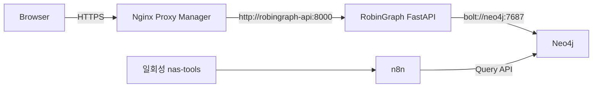

# RobinGraph NAS 배포 런북

## 배포 목표

RobinGraph FastAPI를 기존 Django 컨테이너와 분리된 `robingraph-api` 컨테이너로 실행한다. 호스트 포트를 공개하지 않고 NAS의 Nginx Proxy Manager(NPM), Neo4j와 `robingraph-edge` 외부 Docker 네트워크에서 통신한다.



기존 Django, Neo4j, n8n, NPM 컨테이너의 이미지와 볼륨은 변경하지 않는다.

## 포함된 배포 파일

| 파일 | 역할 |
|---|---|
| `Dockerfile` | Python 3.12.13과 잠긴 uv 환경으로 비루트 API·도구 이미지 생성 |
| `compose.nas.yml` | API 컨테이너와 일회성 `nas-tools` 프로필, healthcheck·로그·보안 설정 |
| `.env.nas.example` | API 전용 환경 변수 템플릿 |
| `.env.nas.ingest.example` | n8n 배포·적재 도구 전용 secret 템플릿 |
| `scripts/deploy_nas.sh` | preflight, build, deploy, update, verify, status, logs, stop, rollback, dry-run, workflow 배포와 AVONET 적재 명령. action 인자를 생략하면 아무 명령도 실행하지 않고 즉시 실패한다(§3) |
| `.dockerignore` | 비밀값, 개발 캐시와 불필요한 build context 제외 |
| `scripts/verify_api_deployment.py` | 배포 후 공개 도메인의 OpenAPI·응답 계약을 이 checkout과 대조하는 읽기 전용 검증기(§8) |
| `scripts/package_nas_release.sh` | git 커밋에서 결정적이고 비밀 없는 이전용 묶음(tar.gz)과 체크섬 manifest를 생성하는 오프라인 스크립트(§9) |

## 1. NAS checkout 준비

NAS의 RobinGraph 저장소 루트에서 배포할 브랜치를 받은 뒤 환경 파일을 만든다.

```sh
git fetch origin
git switch dev
git pull --ff-only origin dev
cp .env.nas.example .env.nas
cp .env.nas.ingest.example .env.nas.ingest
chmod 600 .env.nas .env.nas.ingest
```

`.env.nas`와 `.env.nas.ingest`는 Git에 추가하지 않는다. API 파일에는 Neo4j/Jina
값만 두고, n8n API key와 일회성 적재 자격정보는 ingest 파일에만 둔다. 첫 프록시
검증은 `ROBINGRAPH_API_MODE=serve-fixture`로 진행한다.

## 2. 공용 Docker 네트워크 준비

네트워크와 컨테이너 이름을 먼저 확인한다.

```sh
docker network ls
docker ps --format 'table {{.Names}}\t{{.Networks}}'
```

공용 네트워크가 없다면 한 번만 생성한다.

```sh
docker network create robingraph-edge
```

NPM 컨테이너를 `robingraph-edge`에 연결한다. 실제 NPM 컨테이너 이름으로 바꿔 실행한다.

```sh
docker network connect robingraph-edge <NPM_CONTAINER_NAME>
```

실제 Neo4j 모드를 사용할 때는 Neo4j가 사용하는 네트워크 namespace도 같은
네트워크에 연결돼 있어야 한다. 먼저 Neo4j의 네트워크 모드를 확인한다.

```sh
docker inspect neo4j --format 'network_mode={{.HostConfig.NetworkMode}}'
```

일반 bridge 모드라면 Neo4j 컨테이너를 직접 연결한다.

```sh
docker network connect robingraph-edge neo4j
```

Neo4j가 Tailscale sidecar의 namespace를 공유하면 출력은
`container:<container-id>` 형태이고, `docker ps`의 Neo4j `NETWORKS` 열은
비어 있을 수 있다. 이때 Neo4j에 네트워크를 직접 추가하면 `container sharing
network namespace with another container or host cannot be connected to any other
network` 오류가 발생한다. namespace 소유자인 sidecar를 연결하고 `neo4j` DNS
별칭을 부여한다.

```sh
docker network connect --alias neo4j robingraph-edge tailscale-neo4j
```

이 구성에서 n8n이 `http://neo4j:7474`를 사용할 수 있는 것은 n8n과
`tailscale-neo4j`가 모두 `homelab_default`에 있고 그 네트워크에서 `neo4j`
서비스 이름 또는 별칭을 해석하기 때문이다. `robingraph-api`와 `nas-tools`는
`robingraph-edge`에 있으므로 위와 같이 같은 별칭과 경로를 별도로 만들어야
`bolt://neo4j:7687`과 `http://neo4j:7474`를 사용할 수 있다.

연결 후 API 컨테이너에서 DNS와 TCP를 함께 확인한다.

```sh
docker exec robingraph-api python -c "import socket; print(socket.gethostbyname('neo4j')); socket.create_connection(('neo4j', 7687), 3); print('Neo4j TCP OK')"
```

이미 연결된 컨테이너에 같은 명령을 다시 실행하면 오류가 난다. 다음 명령으로
먼저 확인한다.

```sh
docker inspect tailscale-neo4j --format '{{json .NetworkSettings.Networks}}'
```

수동 연결은 sidecar 컨테이너를 재생성하면 사라진다. 운영 Compose에는
`tailscale-neo4j` 서비스가 `robingraph-edge` 외부 네트워크와 `neo4j` 별칭을
소유하도록 선언한다. 기존 네트워크 선언은 유지한다.

```yaml
services:
  tailscale-neo4j:
    networks:
      homelab_default:
      proxy_manager:
      robingraph-edge:
        aliases:
          - neo4j

networks:
  robingraph-edge:
    external: true
    name: robingraph-edge
```

NPM과 n8n도 같은 이유로 수동 연결 대신 각 운영 Compose에 `robingraph-edge` 외부
네트워크를 선언해야 컨테이너 재생성 뒤에도 연결이 유지된다. n8n의 실제 DNS 이름이
`n8n`이 아니면 `.env.nas.ingest`의 `ROBINGRAPH_N8N_API_URL`을 맞춘다.

## 3. 이미지 빌드와 첫 실행

자동 preflight와 배포 스크립트를 사용한다.

```sh
sh scripts/deploy_nas.sh preflight
sh scripts/deploy_nas.sh build
sh scripts/deploy_nas.sh deploy
sh scripts/deploy_nas.sh verify
sh scripts/deploy_nas.sh status
```

`scripts/deploy_nas.sh`는 action 인자 없이 실행하면(예: `sh scripts/deploy_nas.sh`
단독 실행) 어떤 명령도, Docker 호출 한 번도 실행하지 않고 usage 메시지와 함께
즉시 non-zero로 종료한다 — 인자가 없다고 `deploy` 등 특정 action으로 기본
동작하지 않는다. 모든 action은 `preflight`와 같은 fail-closed 점검(외부 network
존재, 환경 파일 존재, `serve-neo4j`일 때 필수 값 존재)을 먼저 통과해야 실제
명령을 실행한다. 점검에 실패하면 non-zero로 종료하고 아무 컨테이너도 건드리지
않는다. `build`는 이미지만 고정 lockfile로 다시 빌드하고 실행 중인 컨테이너는
바꾸지 않는다. `deploy`와 `update`는 동일하게 같은 build를 수행한 뒤 API
컨테이너를 교체한다 — 이름만 다르다: `update`는 `git pull` 뒤의 의도적인
재배포임을 명시적으로 드러내기 위한 별도 action이다. 최대 120초 동안 Docker
healthcheck를 기다리며 실패하면 최근 로그를 출력하고 non-zero로 종료한다.
`dry-run`은 동일한 fail-closed 점검과 `docker compose ... config`만 실행해
무엇이 바뀔지 미리 보여줄 뿐, `build`·`up`·`down` 중 어느 것도 호출하지 않는다.

```sh
sh scripts/deploy_nas.sh dry-run
```

같은 작업을 수동으로 실행하려면 다음 명령을 쓴다.

```sh
docker compose --env-file .env.nas -f compose.nas.yml config
docker compose --env-file .env.nas -f compose.nas.yml build --pull api
docker compose --env-file .env.nas -f compose.nas.yml up -d api
docker compose --env-file .env.nas -f compose.nas.yml ps
```

`robingraph-api`가 `healthy`가 되면 컨테이너 내부 상태를 확인한다. 첫 fixture 실행의
응답은 `mode: fixture`여야 한다.

```sh
docker exec robingraph-api python -c "import urllib.request; print(urllib.request.urlopen('http://127.0.0.1:8000/health').read().decode())"
```

## 4. Nginx Proxy Manager 설정

`Proxy Hosts → Add Proxy Host`에서 다음 값을 사용한다.

| 항목 | 값 |
|---|---|
| Domain Names | `aviary.dove-nest.com` |
| Scheme | `http` |
| Forward Hostname / IP | `robingraph-api` |
| Forward Port | `8000` |
| Block Common Exploits | 활성화 |
| Websockets Support | 활성화 가능 |
| Cache Assets | 비활성화 |

SSL 탭에서는 기존 Dove Nest 서비스와 같은 인증서 방식을 사용하고 `Force SSL`,
`HTTP/2 Support`를 활성화한다. 테스트 Swagger가 공개 검색이나 무단 호출에
노출되지 않도록 NPM Access List 또는 Cloudflare Access를 연결한다.

배포 확인 주소:

- `https://aviary.dove-nest.com/` 또는 `/chat` (한국어 테스트 UI)
- `https://aviary.dove-nest.com/health`
- `https://aviary.dove-nest.com/docs`
- `https://aviary.dove-nest.com/openapi.json`

채팅 UI는 API와 같은 origin에서 제공되며 브라우저에 자격 증명을 넣지 않는다.
다만 이 첫 버전에는 계정·인증이 없으므로 외부 공개 여부는 별도 제품 결정이다.
공개하지 않을 환경에서는 위의 Access List/Cloudflare Access 경계를 유지한다.

## 5. 실제 Neo4j 모드와 임베딩 연결

`.env.nas`에 Neo4j 연결 정보를 채우고 다음 값을 변경한다.

```dotenv
ROBINGRAPH_API_MODE=serve-neo4j
NEO4J_URI=bolt://neo4j:7687
NEO4J_USERNAME=neo4j
NEO4J_PASSWORD=<secret>
NEO4J_DATABASE=neo4j
```

설정을 반영한다.

```sh
sh scripts/deploy_nas.sh deploy
sh scripts/deploy_nas.sh verify
```

`/health`의 `mode`가 `neo4j`인지 확인한다. `serve-neo4j`의 `/v1/answers`와
`/v1/search`는 계속 `:RobinGraph:Fixture` 그래프를 사용하지만,
`GET /v1/observations`는 n8n이 적재한 실제 GBIF `BirdTaxon`과 `Observation`을
조회한다. fixture 모드에서는 운영 관찰 endpoint가 HTTP 503을 반환한다.

```sh
curl "https://aviary.dove-nest.com/v1/observations?place=Seoul&observed_from=2026-09-01&limit=25"
```

운영 endpoint는 taxon key(`taxon_key`), 학명·원본 일반명(`scientific_name`),
장소명(`place`), 시작·종료일(`observed_from`, `observed_to`), `limit`(최대 100),
`offset`을 지원한다. provenance와 허용 라이선스 체인이 온전한 GBIF 레코드만
반환하며, 일반화된 관찰의 좌표는 API 응답에서 숨긴다.

임베딩 서버는 HTTPS endpoint로 호출한다. `.env.nas`에 BirdsNest 호환 프로필과
secret을 설정한다. API 키의 실제 값은 Git이나 명령 출력에 남기지 않는다.

```dotenv
ROBINGRAPH_JINA_ENDPOINT=https://embed.dove-nest.com/v1/embeddings
ROBINGRAPH_JINA_API_FORMAT=birdsnest
ROBINGRAPH_JINA_MODEL=jinaai/jina-embeddings-v3
ROBINGRAPH_JINA_DIMENSIONS=512
ROBINGRAPH_JINA_NORMALIZED=true
ROBINGRAPH_JINA_API_KEY=<secret>
```

API 컨테이너에서 임베딩 서버의 DNS, TLS, HTTP 도달성을 확인한다.

```sh
docker exec robingraph-api python -c "import urllib.request; print(urllib.request.urlopen('https://embed.dove-nest.com/healthz', timeout=10).read().decode())"
```

임베딩 인덱싱은 명시적인 쓰기 작업이므로 아래 CLI로만 실행한다. 검색은 같은
CLI 또는 Swagger의 `POST /v1/search`에서 실행할 수 있다. `/v1/answers`의
그래프 답변 경로에는 임베딩 검색이 자동으로 섞이지 않는다.

```sh
docker exec robingraph-api robingraph index-neo4j-fixture --embeddings
docker exec robingraph-api robingraph search-neo4j --question "물가에 사는 새에 대한 기록" --hybrid --limit 5
```

Swagger에서는 다음 요청으로 같은 하이브리드 검색을 실행한다.

```json
{
  "question": "물가에 사는 새에 대한 기록",
  "mode": "hybrid",
  "limit": 5
}
```

`mode: fulltext`는 Jina를 호출하지 않는다. `mode: hybrid`에서 임베딩 서버가
일시적으로 실패하면 전문 검색 결과와 경고를 반환한다. Neo4j/임베딩 설정이
유효하지 않거나 Neo4j를 사용할 수 없으면 HTTP 503을 반환한다. 검색 endpoint는
외부 모델 호출을 유발할 수 있으므로 공개 NPM에는 Access List 또는 Cloudflare
Access를 반드시 적용한다.

실제 GBIF 관찰은 `/v1/observations`에서 구조화 검색할 수 있다. GBIF 데이터를
임베딩 검색 대상으로도 제공하려면 검색용 문서 청크로 투영하는 적재 과정을
별도로 구현해야 한다. 현재 `/v1/search`는 fixture 문헌 청크만 검색한다.

## 6. n8n workflow 배포와 AVONET 적재

`.env.nas.ingest`에 n8n API와 credential 이름을 설정한다. `nas-tools`는
`tools` profile을 명시할 때만 실행되고 n8n secret은 상시 API 컨테이너에 전달되지
않는다. 아래 명령은 네 workflow를 inactive 상태로 생성하거나 갱신한다.

```sh
sh scripts/deploy_nas.sh deploy-workflows
```

처음 생성된 workflow ID는 출력에서 확인해 `.env.nas.ingest`의 해당
`ROBINGRAPH_N8N_*_WORKFLOW_ID`에 기록한다. 기존 workflow가 active면 배포기는
덮어쓰지 않는다. 갱신 전 백업은 `robingraph-state` Docker volume에 보존된다.
배포 명령은 현재 checkout의 `scripts/`와 `n8n/`을 사용하는 `nas-tools` 이미지를
먼저 다시 빌드하므로, 이전 이미지에 남은 오래된 workflow 정의가 올라가지 않는다.

한국어 일반명 workflow만 별도로 올릴 때는 전체 묶음 대신 다음 전용 경로를 쓴다.
사전 점검은 n8n API, Neo4j credential과 기존 workflow의 inactive 상태를 읽기
전용으로 확인한다. Discord credential은 이 workflow에 한해 선택 사항이다.

```sh
sh scripts/deploy_nas.sh preflight-korean-vernacular
sh scripts/deploy_nas.sh deploy-korean-vernacular
```

첫 배포에서 출력된 ID를 `.env.nas.ingest`에 기록한다.

```dotenv
ROBINGRAPH_N8N_KOREAN_VERNACULAR_WORKFLOW_ID=<created-workflow-id>
```

그 다음 원격 workflow가 실제로 존재하며 계속 inactive인지 다시 확인한다.

```sh
sh scripts/deploy_nas.sh verify-korean-vernacular
```

이 세 명령은 workflow 정의만 생성·갱신하며 실행하거나 활성화하지 않는다. 실제
Wikidata 조회와 Neo4j 쓰기는 n8n UI의 Manual Trigger에서 첫 실행 체크리스트를
따라 별도로 수행한다. 자세한 품질 gate와 Cypher 검증은
[한국어 일반명 수집 런북](n8n/korean-vernacular-ingest.md)을 따른다.

AVONET은 먼저 다운로드·선택 worksheet 검증만 수행한다.

```sh
sh scripts/deploy_nas.sh validate-avonet
```

11,009종과 원본 형질값 143,004개가 확인된 뒤에만 실제 적재를 명시한다.

```sh
sh scripts/deploy_nas.sh ingest-avonet
```

원본은 `robingraph-ingest-cache` volume에 보존된다. 적재는 100종 단위의 임시 인증
n8n gateway를 사용한다. 9,879종 매핑, claim 128,331개, 후보 1,130개가 모두
일치해야 active release를 갱신하며 임시 workflow와 credential은 성공·실패 모두
삭제한다. Neo4j 또는 n8n의 Docker DNS가 기본값과 다르면
`ROBINGRAPH_NEO4J_HTTP_URL`과 `ROBINGRAPH_N8N_API_URL`을 수정한다.

## 7. 갱신과 운영 명령

```sh
git pull --ff-only origin dev
sh scripts/deploy_nas.sh update
sh scripts/deploy_nas.sh logs
```

`update`는 `deploy`와 동일하게 이미지를 다시 빌드하고 API 컨테이너를 교체한다
— `git pull` 직후의 의도적인 재배포에는 `update`를, 최초 배포나 설정만 바뀐
일반적인 재적용에는 `deploy`를 쓴다. 둘 다 명시적으로 실행해야 하며(§3의
무인자 실패 참고), 어느 쪽도 다른 action의 부수 효과로 자동 실행되지 않는다.

API 컨테이너를 중지하되 컨테이너·이미지·volume은 그대로 두어 되돌릴 수 있게
하려면 `stop` action을 사용한다. 이 action은 `docker compose ... stop api`만
실행하며 `down`이나 volume 삭제는 절대 호출하지 않는다.

```sh
sh scripts/deploy_nas.sh stop
```

다시 시작하려면 `deploy`를 다시 실행하거나(이미지가 최신이면 재빌드 없이도
`docker compose --env-file .env.nas -f compose.nas.yml start api`로 충분하다).
컨테이너 자체를 제거하되 이미지와 도구 volume은 유지하려면 다음 명령을 수동으로
사용한다.

```sh
docker compose --env-file .env.nas -f compose.nas.yml down
```

문제가 생기면 `rollback` action으로 되돌린다. 이 action은 로컬에 이미 존재하는
이전 불변 이미지 태그를 명시적으로 요구하며, 그 태그가 `docker image inspect`로
로컬에서 확인되지 않으면 아무것도 바꾸지 않고 즉시 실패한다. `rollback`은
`build`를 절대 호출하지 않고(항상 이미 존재하는 이미지만 사용), `down`이나
volume 삭제도 호출하지 않는다 — `up -d`로 지정한 이미지를 가리키도록 API
컨테이너만 교체한 뒤 `deploy`/`update`와 같은 healthcheck 대기로 정상 기동을
확인한다.

```sh
sh scripts/deploy_nas.sh rollback robingraph-api:<이전-불변-태그>
```

되돌릴 태그가 로컬에 없다면 먼저 그 커밋을 별도 checkout해 `sh scripts/deploy_nas.sh
build`로 다시 만들고 원하는 불변 태그를 붙인 뒤 위 명령을 실행한다. Neo4j 데이터와
기존 Django/n8n 컨테이너는 이 Compose 프로젝트가 소유하지 않으므로 `rollback`이나
`down`의 영향을 받지 않는다. 실패한 AVONET batch는 검증된 active release 포인터를
교체하지 않는다.

## 8. 배포 후 공개 계약 검증

`verify` action은 컨테이너 안에서 loopback으로 `/health`만 확인한다 — 프로세스가
떠 있다는 확인일 뿐, Nginx Proxy Manager 뒤 공개 도메인이 **이 checkout이
선언한 API 계약**을 실제로 서비스하는지는 확인하지 않는다. 이미지 재빌드를
건너뛰거나 오래된 캐시 레이어가 재사용되면, HTTP는 계속 200을 반환하면서도
필드가 빠진 구버전 응답을 그대로 내보낼 수 있다. `scripts/verify_api_deployment.py`는
이 간극을 메우는 읽기 전용 스크립트로, 자격 증명이 필요 없는 공개
`GET` endpoint만 호출하고 `.env*` 파일을 전혀 읽지 않는다.

```sh
uv run --locked python scripts/verify_api_deployment.py
```

기본 대상은 `https://aviary.dove-nest.com`이다. 다른 환경을 검증하려면
`--base-url`(또는 `ROBINGRAPH_PUBLIC_API_URL` 환경변수)을 바꾼다. 확인 대상
이름은 `--lineage-name`으로 바꿀 수 있고(기본값 `청둥오리`), 그 이름이
실제로 해석돼야 하는 학명과 상태는 각각 `--expected-scientific-name`(기본
`Anas platyrhynchos`), `--expected-korean-name-status`(기본
`community-sourced`)로 바꿀 수 있다 — 다른 canary 이름으로 검증하고
싶을 때만 셋을 함께 바꾼다.

```sh
uv run --locked python scripts/verify_api_deployment.py --base-url https://staging.example.com --json
```

검증기가 실제로 확인하는 것(모두 실패해도 원격을 바꾸지 않는 읽기 전용 GET):

1. **도달성**: `GET /health`, `GET /openapi.json`,
   `GET /v1/taxa/lineage?name=<이름>` 세 endpoint가 모두 `200`과 유효한
   JSON을 반환하는지.
2. **형태(malformed 200 거부)**: `200`이면서 JSON 배열·`null`·문자열처럼
   객체가 아닌 본문은 "통과"로 치지 않는다 — 셋 다 유효한 JSON이지만
   계약을 전혀 지키지 않은 응답이므로 명시적으로 실패 처리한다.
3. **스키마 필드·타입 parity**: 배포된 `/openapi.json`의
   `LineageTaxonResponse` 스키마가 **이 checkout이 `create_app().openapi()`로
   실제 선언하는 스키마**와 같은 필드 이름을 갖는지*뿐 아니라* 같은 타입을
   선언하는지도 비교한다(예: `korean_name_status`가 이름은 있어도 타입이
   `string`이 아니면 drift로 잡는다) — 필드 이름만 보고 "계약이 같다"고
   과장하지 않는다.
4. **실응답 필드 parity**: 실제 `/v1/taxa/lineage` 응답의 `lineage[]`
   각 항목도 같은 필드 집합을 갖는지 — 선언된 스키마와 실제 직렬화된
   응답이 다를 수 있으므로(구버전 Pydantic 모델은 필드 자체가 없다) 둘 다
   확인하고, `lineage` 배열이 비어 있으면(형태는 맞지만 아무것도 못 찾은
   경우) 이것도 실패로 잡는다.
5. **값 수준 canary 검증(형태가 맞아도 데이터가 틀리면 실패)**: 이름만
   맞는 필드가 있는 것으로는 부족하다 — `health.status == "ok"`,
   `health.mode == "neo4j"`, `lineage.matched_by == "korean_name"`,
   해석된 종의 `scientific_name`이 `--expected-scientific-name`(기본
   `Anas platyrhynchos`)과 같은지, 그 종의 `korean_name_status`가
   `--expected-korean-name-status`(기본 `community-sourced`)와 정확히
   같은지(비어있거나 `null`이면 실패)까지 확인한다. 배포가 계약 모양은
   맞지만 오래된 Neo4j 스냅샷이나 잘못된 매칭을 서비스하는 경우를 잡기
   위한 것이다.
6. `health.taxonomy_release`(fixture corpus 프로세스 릴리스)와
   `lineage.taxonomy_release`(활성 AviList `reference-taxonomy` 릴리스)를
   **서로 비교하지 않고** 각각 라벨을 붙여 나란히 보고한다. 이 둘은 서로
   다른 데이터 영역이라 값이 달라도 정상이다 — 하나가 다른 하나의 "최신
   여부"를 판정하는 근거가 아니다.

종료 코드: `0`은 세 endpoint 모두 정상이고 형태·스키마·canary 어디에도
drift가 없을 때, `1`은 endpoint는 응답하지만 스키마·응답 필드·타입 또는
canary 값이 이 checkout과 어긋날 때(재배포 또는 데이터 재확인 필요), `2`는
endpoint 중 하나라도 도달 불가·타임아웃·비-200·JSON 파싱 실패일 때다.
오류 메시지는 항상 정제된 형태만 출력한다 — 원본 응답 본문이나 예외 내부
문자열은 그대로 노출하지 않는다.

드리프트가 나오면(예: `korean_name_status` 필드 누락) 원인은 대개 오래된
이미지이지 코드 버그가 아니다. 최신 `dev`를 반영해 재빌드·재배포한 뒤 다시
실행한다.

```sh
git pull --ff-only origin dev
sh scripts/deploy_nas.sh deploy
sh scripts/deploy_nas.sh verify
uv run --locked python scripts/verify_api_deployment.py
```

주의: Python 표준 라이브러리 `urllib`의 기본 `User-Agent`(`Python-urllib/x.y`)는
이 도메인의 NPM/WAF 설정에서 `403`으로 차단된다(같은 GET이 `curl`이나 브라우저
UA로는 통과함, 2026-09-12 확인). 그래서 이 스크립트는 직접 만든 client 코드로
`curl`을 대체할 때는 `User-Agent`를 명시적으로 지정해야 한다 — 스크립트 자체는
이미 `User-Agent: RobinGraph-Deployment-Verifier/1.0`을 보낸다.

### 알려진 접근 blocker (2026-09-12)

이 문서의 §1·§7 rebuild/redeploy 명령은 NAS에 실제로 로그인해야 실행할 수
있다. 2026-09-12 기준 다음이 확인됐다 — 아래 어느 것도 이 세션에서 원격
상태를 바꾸지 않았다.

- 기존 SSH 별칭(`~/.ssh/config`의 `Host NAS`, LAN IP `192.168.219.99` 포트
  `99`)으로 읽기 전용 접속을 시도했으나 **`Connection refused`**를 받았다 —
  이 경로로는 현재 NAS에 로그인할 수 없다.
  운영자는 로그인 전에 포트/방화벽 상태를 먼저 확인해야 한다.
  방화벽/포트 상태는 이 세션에서 원격으로 진단하지 않았다(범위 밖).
- Tailscale에 `dove-storage`, `dove-portainer`, `dove-graph`,
  `dove-hermes-dashboard`, `dove-mini` 등 dove-nest 관련 노드가 연결돼 있다
  (`tailscale status`로 설정만 확인, 실제 접속은 시도하지 않음). 재배포는
  이 경로나 NAS 콘솔 직접 접근으로 사람이 수행해야 한다.
- `.env.nas`/`.env.nas.ingest`는 이 checkout에 없다(값은 열어보지 않고
  파일 부재만 확인). 위 명령을 실행하려면 §1의 템플릿에서 새로 만들어야
  한다.
- 결론: **이 런북의 재빌드·재배포 명령은 이 워커/코디네이터 환경에서
  직접 실행할 수 없다** — 확인된 Tailscale 경로나 NAS 콘솔에 접근 권한이
  있는 운영자가 직접 실행해야 한다. 자세한 조사 기록은
  [2026-09-12 작업 기록](work-log/2026-09-12.md) 참고.

## 9. `git pull` 없이 NAS로 옮길 배포 묶음 만들기

NAS가 이 Git 원격에 직접 접근할 수 없을 때(방화벽, 오프라인 구간, USB로만
옮기는 경우 등) `scripts/package_nas_release.sh`로 특정 커밋의 결정적이고
비밀 없는 이전용 묶음을 미리 만들 수 있다. 이 스크립트는 Docker나 네트워크를
전혀 사용하지 않고, 아무것도 배포하거나 push하지 않는다 — 파일만 쓴다.

```sh
sh scripts/package_nas_release.sh --ref <commit-ish> --output-dir <NAS_밖의_경로>
```

`--ref`를 생략하면 `HEAD`, `--output-dir`를 생략하면 `mktemp -d`로 만든
임시 디렉터리를 쓴다. **출력 디렉터리는 반드시 이 worktree 밖이어야 한다** —
worktree 안의 경로를 주면 스크립트가 즉시 실패한다(작업 중인 checkout에
결과물이 섞여 실수로 커밋되는 것을 막기 위함).

내용은 항상 지정한 커밋의 git object database에서만 가져온다 — 현재 작업
디렉터리에 남아 있는 미커밋 변경, 특히 값이 채워진 `.env.nas`나
`.env.nas.ingest`가 실수로 worktree에 있더라도 그 파일들은 애초에 git에
추적되지 않으므로 묶음에 절대 포함되지 않는다.

아카이브는 전체 저장소의 whole-tree `git archive`가 아니라, 오프라인으로
풀고 Docker 이미지를 빌드·실행하고 이 문서가 설명하는 NAS 도구를 운영하는 데
필요한 **런타임/배포 전용 allowlist**로 범위를 고정한다 — `Dockerfile`,
`compose.nas.yml`, `pyproject.toml`/`uv.lock`/`README.md`/`.python-version`,
`src/`, `data/eval/v1/`, `config/`, 4개의 운영 n8n workflow 정의
(`n8n/robingraph-*.json`), `.env.nas*.example`, `.dockerignore`, 그리고
§7까지 다룬 NAS 운영 도구 스크립트(`scripts/deploy_nas.sh`,
`scripts/package_nas_release.sh`, `scripts/verify_api_deployment.py`,
`scripts/deploy_n8n_operational_ingest.py`,
`scripts/deploy_n8n_reference_ingest.py`,
`scripts/manage_n8n_korean_vernacular.py`, `scripts/load_n8n_avonet.py`)와
운영 런북(`docs/nas-deployment.md`, `docs/n8n/korean-vernacular-ingest.md`)만
포함한다. `tests/`, `.codex/` agent 파일, `.github/` CI 메타데이터,
`docs/work-log/`, n8n 초안 candidate, 개발 전용 generator 스크립트, 그 밖의
설계·의사결정 문서는 커밋에 있더라도 절대 포함되지 않는다. 그래도 방어적으로,
스크립트는 묶여 나갈 최종 파일 목록을 다시 확인해 `*.example`이 아닌 `.env`류,
`credential`·`secret`이 포함된 이름, `*.pem`/`*.key`가 하나라도 있으면 묶음을
만들지 않고 즉시 실패한다. 이 allowlist에 있어야 할 파일이 해당 커밋에 없으면
(예: 파일 이름 변경) 아카이브를 만들지 않고 즉시 실패한다.

실행하면 다음을 만든다.

- `robingraph-nas-release-<commit>.tar.gz`: allowlist에 속한 커밋 시점 git
  blob만으로 만든 결정적 tar를 `gzip -n`과 동일하게(원본 파일명·시각
  미기록) 압축한 이전용 아카이브. 아카이브 루트 바로 아래에는
  **`MANIFEST.txt`가 함께 들어 있다** — 소스 커밋과 포함된 모든 파일의
  경로별 SHA-256을 담고 있어, 아카이브가 원본 checkout이나 이 manifest
  없이 단독으로 전달돼도(USB 등) 그 자리에서 압축을 풀고 완전히
  오프라인으로 각 파일의 SHA-256을 재계산해 내용이 손상되지 않았는지
  검증할 수 있다.
- `robingraph-nas-release-<commit>.manifest.txt`: 위 내장 `MANIFEST.txt`와
  같은 소스 커밋·파일별 SHA-256 목록에 더해, 아카이브 자체의 파일명과
  SHA-256을 추가로 담은 외부 manifest. 전송 전에 아카이브를 통째로 검증할
  때 사용한다(아래).

같은 커밋으로 깨끗한(서로 다른) 출력 디렉터리 두 곳에 두 번 실행하면 두
아카이브와 두 manifest가 바이트 단위로 완전히 같다 — 파일명도, 내용도,
SHA-256도 같다. 이 성질은 tar 구성(파일 목록, 각 항목의 mtime·소유권·mode)이
전적으로 해당 커밋의 git blob 내용과 커밋 시각에서 결정되고, 실행 시점의
실제 시각이나 호출 순서에 의존하는 값이 전혀 섞이지 않기 때문에 성립한다.

NAS에서 받은 뒤에는 아카이브의 SHA-256을 다시 계산해 manifest의
`archive_sha256` 값과 직접 비교해 전송 중 손상이 없었는지 확인한다.

```sh
sha256sum robingraph-nas-release-<commit>.tar.gz
# manifest의 archive_sha256 줄과 값이 같은지 확인
tar xzf robingraph-nas-release-<commit>.tar.gz
```

외부 `*.manifest.txt`를 잃어버렸거나(USB로 아카이브만 전달된 경우 등) 처음부터
아카이브만 받았다면, 압축을 푼 뒤 내장된 `MANIFEST.txt`만으로도 완전히
오프라인으로 같은 검증을 할 수 있다.

```sh
tar xzf robingraph-nas-release-<commit>.tar.gz
cd robingraph-nas-release-<commit>
sha256sum --check <(sed '1,/^---$/d' MANIFEST.txt)
```

(`MANIFEST.txt`의 `---` 아래는 이미 `<sha256>  <경로>` 형식이므로 `sha256sum
--check`가 그대로 읽는다. macOS 등 `shasum`만 있는 환경에서는
`shasum -a 256 --check <(sed '1,/^---$/d' MANIFEST.txt)`를 쓴다.)

풀어낸 디렉터리는 §1~§7에서 쓰는 런타임/배포 파일만 있는 축소된 checkout이므로,
그 안에서 §1의 `.env.nas`·`.env.nas.ingest` 준비 단계부터 이어서 진행하면
된다(테스트, `.codex`, 설계 문서 등 개발 전용 자료는 애초에 들어 있지 않다).
이 스크립트는 배포 자체를 수행하지 않는다 — 항상 §2 이후 단계를 운영자가 직접, 또는
`scripts/deploy_nas.sh`로 명시적으로 실행해야 한다.
