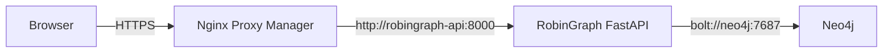

# RobinGraph NAS 배포 런북

## 배포 목표

RobinGraph FastAPI를 기존 Django 컨테이너와 분리된 `robingraph-api` 컨테이너로 실행한다. 호스트 포트를 공개하지 않고 NAS의 Nginx Proxy Manager(NPM), Neo4j와 `robingraph-edge` 외부 Docker 네트워크에서 통신한다.



기존 Django 컨테이너의 포트, 이미지, 볼륨과 네트워크 설정은 변경하지 않는다.

## 포함된 배포 파일

| 파일 | 역할 |
|---|---|
| `Dockerfile` | Python 3.12.13과 잠긴 uv 환경으로 비루트 API 이미지 생성 |
| `compose.nas.yml` | API 컨테이너, healthcheck, 재시작·로그·보안 설정 |
| `.env.nas.example` | NAS 전용 비밀값과 실행 모드 템플릿 |
| `.dockerignore` | 비밀값, 개발 캐시와 불필요한 build context 제외 |

## 1. NAS checkout 준비

NAS의 RobinGraph 저장소 루트에서 `dev` 브랜치를 받은 뒤 환경 파일을 만든다.

```sh
git fetch origin
git switch dev
git pull --ff-only origin dev
cp .env.nas.example .env.nas
chmod 600 .env.nas
```

`.env.nas`는 Git에 추가하지 않는다. 첫 프록시 검증은 `ROBINGRAPH_API_MODE=serve-fixture`로 진행한다.

## 2. 공용 Docker 네트워크 준비

네트워크와 컨테이너 이름을 먼저 확인한다.

```sh
docker network ls
docker ps --format 'table {{.Names}}\t{{.Networks}}'
```

공용 네트워크가 없다면 한 번만 생성한다.

```sh
docker network create robingraph-edge
```

NPM 컨테이너를 `robingraph-edge`에 연결한다. 실제 NPM 컨테이너 이름으로 바꿔 실행한다.

```sh
docker network connect robingraph-edge <NPM_CONTAINER_NAME>
```

실제 Neo4j 모드를 사용할 때는 Neo4j가 사용하는 네트워크 namespace도 같은
네트워크에 연결돼 있어야 한다. 먼저 Neo4j의 네트워크 모드를 확인한다.

```sh
docker inspect neo4j --format 'network_mode={{.HostConfig.NetworkMode}}'
```

일반 bridge 모드라면 Neo4j 컨테이너를 직접 연결한다.

```sh
docker network connect robingraph-edge neo4j
```

Neo4j가 Tailscale sidecar의 namespace를 공유하면 출력은
`container:<container-id>` 형태이고, `docker ps`의 Neo4j `NETWORKS` 열은
비어 있을 수 있다. 이때 Neo4j에 네트워크를 직접 추가하면 `container sharing
network namespace with another container or host cannot be connected to any other
network` 오류가 발생한다. namespace 소유자인 sidecar를 연결하고 `neo4j` DNS
별칭을 부여한다.

```sh
docker network connect --alias neo4j robingraph-edge tailscale-neo4j
```

이 구성에서 n8n이 `http://neo4j:7474`를 사용할 수 있는 것은 n8n과
`tailscale-neo4j`가 모두 `homelab_default`에 있고 그 네트워크에서 `neo4j`
서비스 이름 또는 별칭을 해석하기 때문이다. `robingraph-api`는
`robingraph-edge`에만 있으므로
위와 같이 같은 별칭과 경로를 별도로 만들어야 `bolt://neo4j:7687`을 사용할 수
있다. 연결 후 API 컨테이너에서 DNS와 TCP를 함께 확인한다.

```sh
docker exec robingraph-api python -c "import socket; print(socket.gethostbyname('neo4j')); socket.create_connection(('neo4j', 7687), 3); print('Neo4j TCP OK')"
```

이미 연결된 컨테이너에 같은 명령을 다시 실행하면 오류가 난다. 다음 명령으로
먼저 확인한다.

```sh
docker inspect tailscale-neo4j --format '{{json .NetworkSettings.Networks}}'
```

수동 연결은 sidecar 컨테이너를 재생성하면 사라진다. 운영 Compose에는
`tailscale-neo4j` 서비스가 `robingraph-edge` 외부 네트워크와 `neo4j` 별칭을
소유하도록 선언한다. 기존 네트워크 선언은 유지한다.

```yaml
services:
  tailscale-neo4j:
    networks:
      homelab_default:
      proxy_manager:
      robingraph-edge:
        aliases:
          - neo4j

networks:
  robingraph-edge:
    external: true
    name: robingraph-edge
```

NPM도 같은 이유로 수동 연결 대신 Compose에 `robingraph-edge` 외부 네트워크를
선언해야 컨테이너 재생성 뒤에도 연결이 유지된다.

## 3. 이미지 빌드와 첫 실행

```sh
docker compose --env-file .env.nas -f compose.nas.yml config
docker compose --env-file .env.nas -f compose.nas.yml build --pull
docker compose --env-file .env.nas -f compose.nas.yml up -d
docker compose --env-file .env.nas -f compose.nas.yml ps
```

`robingraph-api`가 `healthy`가 되면 컨테이너 내부 상태를 확인한다.

```sh
docker exec robingraph-api python -c "import urllib.request; print(urllib.request.urlopen('http://127.0.0.1:8000/health').read().decode())"
```

첫 실행의 응답은 `mode: fixture`여야 한다.

## 4. Nginx Proxy Manager 설정

`Proxy Hosts → Add Proxy Host`에서 다음 값을 사용한다.

| 항목 | 값 |
|---|---|
| Domain Names | `aviary.dove-nest.com` |
| Scheme | `http` |
| Forward Hostname / IP | `robingraph-api` |
| Forward Port | `8000` |
| Block Common Exploits | 활성화 |
| Websockets Support | 활성화 가능 |
| Cache Assets | 비활성화 |

SSL 탭에서는 기존 Dove Nest 서비스와 같은 인증서 방식을 사용하고 `Force SSL`, `HTTP/2 Support`를 활성화한다. 테스트 Swagger가 공개 검색이나 무단 호출에 노출되지 않도록 NPM Access List 또는 Cloudflare Access를 연결한다.

배포 확인 주소:

- `https://aviary.dove-nest.com/health`
- `https://aviary.dove-nest.com/docs`
- `https://aviary.dove-nest.com/openapi.json`

## 5. 실제 Neo4j 모드와 임베딩 연결

`.env.nas`에 Neo4j 연결 정보를 채우고 다음 값을 변경한다.

```dotenv
ROBINGRAPH_API_MODE=serve-neo4j
NEO4J_URI=bolt://neo4j:7687
NEO4J_USERNAME=neo4j
NEO4J_PASSWORD=<secret>
NEO4J_DATABASE=neo4j
```

설정을 반영한다.

```sh
docker compose --env-file .env.nas -f compose.nas.yml up -d --force-recreate
docker compose --env-file .env.nas -f compose.nas.yml logs --tail=100 api
```

`/health`의 `mode`가 `neo4j`인지 확인한다. `serve-neo4j`의 `/v1/answers`와
`/v1/search`는 계속 `:RobinGraph:Fixture` 그래프를 사용하지만,
`GET /v1/observations`는 n8n이 적재한 실제 GBIF `BirdTaxon`과 `Observation`을
조회한다. fixture 모드에서는 운영 관찰 endpoint가 HTTP 503을 반환한다.

```sh
curl "https://aviary.dove-nest.com/v1/observations?place=Seoul&observed_from=2026-09-01&limit=25"
```

운영 endpoint는 taxon key(`taxon_key`), 학명·원본 일반명(`scientific_name`),
장소명(`place`), 시작·종료일(`observed_from`, `observed_to`), `limit`(최대 100),
`offset`을 지원한다. provenance와 허용 라이선스 체인이 온전한 GBIF 레코드만
반환하며, 일반화된 관찰의 좌표는 API 응답에서 숨긴다.

임베딩 서버는 `robingraph-edge`의 Docker DNS를 사용하는 컨테이너가 아니라
HTTPS endpoint로 호출한다. `.env.nas`에 BirdsNest 호환 프로필과 secret을
설정한다. API 키의 실제 값은 Git이나 명령 출력에 남기지 않는다.

```dotenv
ROBINGRAPH_JINA_ENDPOINT=https://embed.dove-nest.com/v1/embeddings
ROBINGRAPH_JINA_API_FORMAT=birdsnest
ROBINGRAPH_JINA_MODEL=jinaai/jina-embeddings-v3
ROBINGRAPH_JINA_DIMENSIONS=512
ROBINGRAPH_JINA_NORMALIZED=true
ROBINGRAPH_JINA_API_KEY=<secret>
```

API 컨테이너에서 임베딩 서버의 DNS, TLS, HTTP 도달성을 확인한다.

```sh
docker exec robingraph-api python -c "import urllib.request; print(urllib.request.urlopen('https://embed.dove-nest.com/healthz', timeout=10).read().decode())"
```

임베딩 인덱싱은 명시적인 쓰기 작업이므로 아래 CLI로만 실행한다. 검색은 같은
CLI 또는 Swagger의 `POST /v1/search`에서 실행할 수 있다. `/v1/answers`의
그래프 답변 경로에는 임베딩 검색이 자동으로 섞이지 않는다.

```sh
docker exec robingraph-api robingraph index-neo4j-fixture --embeddings
docker exec robingraph-api robingraph search-neo4j --question "물가에 사는 새에 대한 기록" --hybrid --limit 5
```

Swagger에서는 다음 요청으로 같은 하이브리드 검색을 실행한다.

```json
{
  "question": "물가에 사는 새에 대한 기록",
  "mode": "hybrid",
  "limit": 5
}
```

`mode: fulltext`는 Jina를 호출하지 않는다. `mode: hybrid`에서 임베딩 서버가
일시적으로 실패하면 전문 검색 결과와 경고를 반환한다. Neo4j/임베딩 설정이
유효하지 않거나 Neo4j를 사용할 수 없으면 HTTP 503을 반환한다. 검색 endpoint는
외부 모델 호출을 유발할 수 있으므로 공개 NPM에는 Access List 또는 Cloudflare
Access를 반드시 적용한다.

실제 GBIF 관찰은 `/v1/observations`에서 구조화 검색할 수 있다. GBIF 데이터를
임베딩 검색 대상으로도 제공하려면 검색용 문서 청크로 투영하는 적재 과정을
별도로 구현해야 한다. 현재 `/v1/search`는 fixture 문헌 청크만 검색한다.

## 6. 갱신과 운영 명령

```sh
git pull --ff-only origin dev
docker compose --env-file .env.nas -f compose.nas.yml up -d --build
docker compose --env-file .env.nas -f compose.nas.yml logs -f --tail=100 api
```

컨테이너를 중지하되 이미지는 유지하려면 다음 명령을 사용한다.

```sh
docker compose --env-file .env.nas -f compose.nas.yml down
```

문제가 생기면 이전 Git 커밋을 별도 checkout한 뒤 같은 Compose 명령으로 다시 빌드한다. Neo4j 데이터나 기존 Django 컨테이너는 이 Compose 프로젝트가 소유하지 않으므로 `down`의 영향을 받지 않는다.
