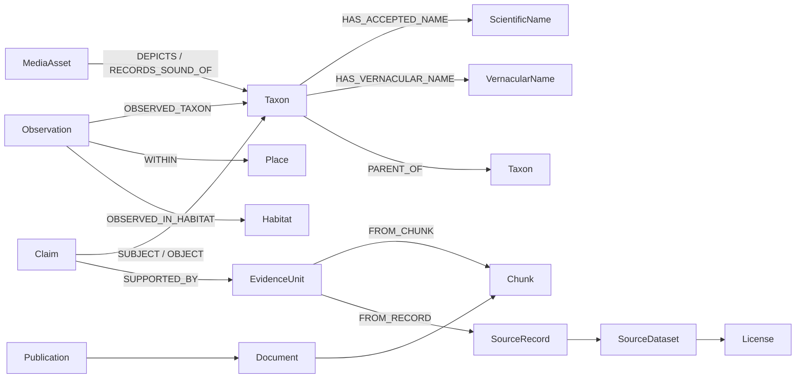
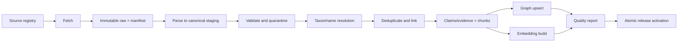
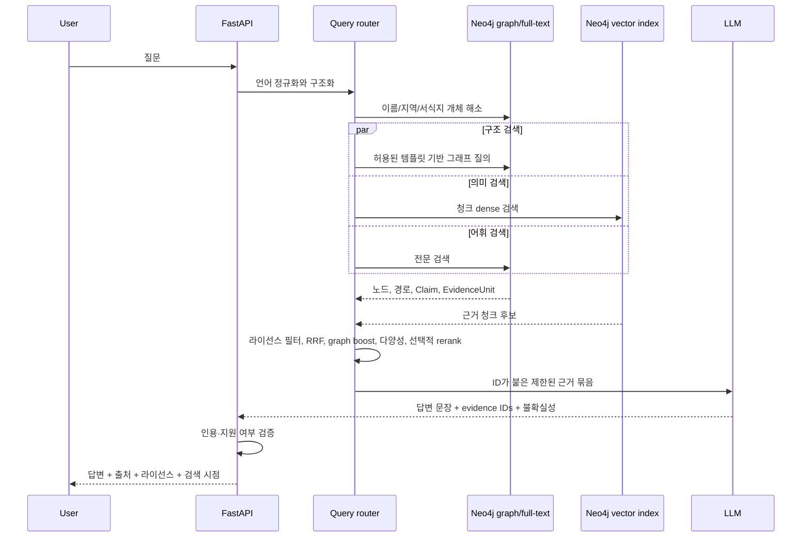

# RobinGraph 시스템 설계

- 상태: Proposed
- 작성일: 2026-09-03
- 대상: 1인 개발자가 로컬에서 시작하는 조류 정보 GraphRAG 서비스
- 범위: 시스템 구조와 구현 전략. 외부 데이터셋 선정과 법률적 라이선스 판단은 별도 조사 결과를 입력으로 받는다.

## 1. 결론과 설계 원칙

보유 인프라를 반영한 MVP는 **Neo4j + Python/FastAPI + Jina-embeddings-v3 API + HermesAgent + Streamlit** 조합을 권장한다. Neo4j 한 인스턴스에서 속성 그래프, 전문 인덱스, 벡터 인덱스를 함께 사용하면 Graph DB와 Vector DB를 따로 동기화할 필요가 없다. 데이터 수집과 정제는 Python, Polars, DuckDB, Parquet으로 처리하고 n8n은 이 작업을 호출·예약만 한다. Prometheus와 Grafana는 API와 수집 파이프라인을 관측한다. 외부 모델과 저장소는 작은 인터페이스 뒤에 둔다.

Neo4j Community는 단일 인스턴스 개발과 소규모 서비스에 적합하지만 고가용성·온라인 백업·세밀한 권한 관리가 필요한 시점에는 한계가 있다. 관찰 기록이 수백만 건으로 늘어나면 관찰 원본과 공간 집계는 PostgreSQL/PostGIS 또는 Parquet/DuckDB에 두고, Neo4j에는 분류·문헌·서식지·집계 결과와 근거 연결만 유지하는 구조로 옮긴다.

설계 원칙은 다음과 같다.

1. **학명 문자열과 분류 개념을 분리한다.** 같은 학명이 서로 다른 분류 개념을 뜻하거나 분류 개정으로 지위가 바뀔 수 있다.
2. **답변보다 근거를 먼저 만든다.** 검색 결과는 출처 단위인 `EvidenceUnit`을 포함해야 하며, 근거 없는 사실은 답변에서 제외한다.
3. **LLM이 임의의 데이터베이스 질의를 만들지 않게 한다.** 질문 분류와 개체 추출 결과를 검증한 뒤 미리 정의한 검색 계획을 선택한다.
4. **원본은 불변으로 보관한다.** 정제 규칙이 바뀌면 같은 원본에서 결과를 재현할 수 있어야 한다.
5. **라이선스 정책을 검색 전에 적용한다.** 답변 생성 후 출처를 지우는 방식은 금지 조건을 위반하거나 근거가 사라질 수 있다.
6. **이미지와 음성은 MVP에서 파일 자체보다 메타데이터와 설명을 검색한다.** 멀티모달 유사도 검색과 자동 종 판별은 별도 단계로 둔다.

## 2. 핵심 사용 사례와 질문 유형

### 2.1 우선 사용 사례

| 우선순위 | 사용 사례 | 예시 | 주 검색 방식 |
|---|---|---|---|
| P0 | 종 기본 정보 조회 | “큰유리새의 학명과 분류는?” | 이름 해소 + 그래프 탐색 |
| P0 | 이름·동의어 해소 | “`Cyanoptila cyanomelana`의 이전 학명이나 다른 이름은?” | 정확 일치 + 전문 검색 + 분류 그래프 |
| P0 | 지역·시기별 관찰 조회 | “서울에서 4월에 관찰되는 딱따구리는?” | 그래프 필터 + 시간·지역 집계 |
| P0 | 서식지·생태 근거 조회 | “갈대밭에서 볼 수 있는 여름철새는?” | 그래프 제약 + 문서 벡터 검색 |
| P0 | 출처가 있는 설명 | “후투티의 이동성과 먹이를 근거와 함께 설명해줘.” | 문헌 청크 검색 + 사실 근거 확장 |
| P1 | 종 비교 | “흰뺨검둥오리와 청둥오리를 비교해줘.” | 두 개체의 동일 속성·근거 병렬 검색 |
| P1 | 다단계 관계 질문 | “제주 곶자왈에서 기록된 멸종위기 맹금류는?” | 개체 해소 + 2~3홉 그래프 탐색 |
| P1 | 미디어 찾기 | “붉은머리오목눈이 울음소리 자료를 보여줘.” | 종-미디어 관계 + 라이선스 필터 |
| P1 | 문헌 탐색 | “팔색조의 번식지 변화에 관한 연구는?” | 서지 필터 + 청크 벡터 검색 |
| P2 | 설명 기반 후보 탐색 | “한국의 습지에서 겨울에 보이는 긴 부리의 새 후보는?” | 속성·관찰·서식지 결합 후보 검색 |

MVP가 답해야 하는 질문은 P0와 일부 P1이다. P2는 후보 탐색으로만 표현하고 종 동정을 확정하지 않는다. 이미지·음성 파일을 직접 입력받아 종을 판별하는 기능, 미래 출현 예측, 개체수 추정, 보전 정책 판단은 MVP 범위 밖이다.

### 2.2 질문 라우팅 유형

| 유형 | 필요한 구조화 결과 | 처리 방식 |
|---|---|---|
| `ENTITY_LOOKUP` | 이름, 언어, 원하는 속성 | 이름 해소 후 1홉 조회 |
| `TAXONOMY_PATH` | 대상 분류군, 관계, 깊이 | 상·하위 분류 및 동의어 경로 탐색 |
| `SPATIOTEMPORAL` | 지역, 기간/계절, 분류 조건 | 지역 계층과 관찰 필터·집계 |
| `HABITAT_FILTER` | 서식지, 계절, 지역, 분류 조건 | 그래프 후보 생성 후 문헌 근거 검색 |
| `EVIDENCE_QA` | 대상, 주장 주제, 시점 | 관련 문헌/데이터 청크 검색 및 재순위화 |
| `COMPARE` | 2~4개 대상, 비교 축 | 동일 스키마의 속성과 근거를 병렬 조회 |
| `MEDIA_FIND` | 대상, 미디어 종류, 사용 조건 | 미디어 메타데이터 및 라이선스 검색 |
| `UNSUPPORTED` | 지원하지 않는 요구와 이유 | 가능한 범위를 설명하고 답변 보류 |

## 3. 논리 데이터 모델

### 3.1 모델링에서 구분해야 할 개념

- `Taxon`: 특정 분류 기준판에서 정의된 분류 개념이다. 종은 `rank = species`인 Taxon이며 필요하면 `Species` 보조 라벨을 붙인다.
- `ScientificName`: 철자, 저자명, 명명 연도 등 이름 자체다. 현재 인정명, 동의어, 오용명을 모두 표현한다.
- `TaxonConceptSet`: 어느 기관·목록의 어느 버전인지 나타내는 분류 기준판이다.
- `Observation`: 출처가 제공한 관찰 또는 발생 기록이다. 원본 레코드를 보존하며 사실과 추정을 구분한다.
- `Place`: 행정구역, 보호구역, 격자 등 공간 단위다. 좌표점은 Observation 속성으로 시작하고 필요할 때 별도 지점 노드로 승격한다.
- `Habitat`: 통제 어휘로 관리하는 서식지 개념이다.
- `MediaAsset`: 이미지·음성·영상의 메타데이터다. 원본 파일 복제 여부는 라이선스 정책이 결정한다.
- `Publication`, `Document`, `Chunk`: 서지 정보, 수집한 문서 판본, 검색 가능한 텍스트 단위다.
- `Claim`, `EvidenceUnit`: 서비스가 사용 가능한 사실과 그 사실을 지지하는 정확한 출처 범위다.

### 3.2 핵심 노드

모든 노드는 내부 불변 ID인 `id`, 생성·수정 시각, `ingestion_run_id`를 공통으로 가진다. 외부 키는 내부 ID로 사용하지 않는다.

| 노드 | 주요 속성 | 제약·설명 |
|---|---|---|
| `Taxon` | `rank`, `status`, `canonical_label`, `valid_from`, `valid_to` | `id` 유일. 기준판 안의 개념이며 학명 문자열과 분리 |
| `TaxonConceptSet` | `title`, `version`, `issued_at`, `source_uri` | 선택한 분류 백본의 릴리스 단위 |
| `ScientificName` | `canonical`, `authorship`, `year`, `full_name`, `normalized_key`, `nomenclatural_code` | 원문과 정규화 값을 모두 보존 |
| `VernacularName` | `name`, `normalized_name`, `language`, `region`, `status` | 한국어명·영어명 등. 언어와 적용 지역 필수 |
| `Observation` | `observed_at`, `event_date_precision`, `count`, `basis`, `lat`, `lon`, `coordinate_uncertainty_m`, `sensitivity`, `source_record_key` | 미상 값과 0을 구분. 민감종 좌표는 공개본을 별도로 저장 |
| `Place` | `name`, `place_type`, `country_code`, `admin_level`, `geometry_ref`, `centroid` | 포함 관계로 행정·생태 공간 계층 구성 |
| `Habitat` | `preferred_label`, `code`, `description`, `vocabulary` | 자유 텍스트를 바로 합치지 않고 통제 어휘에 매핑 |
| `MediaAsset` | `media_type`, `url`, `mime_type`, `duration_s`, `width`, `height`, `sha256`, `perceptual_hash`, `captured_at`, `sensitivity` | `Image`/`Audio` 보조 라벨 가능. 접근 URL과 보관 파일 구분 |
| `Publication` | `title`, `doi`, `year`, `authors`, `publisher`, `citation_text` | DOI 정규화. 한 논문의 여러 파일은 Document로 분리 |
| `Document` | `title`, `document_type`, `language`, `content_hash`, `version`, `retrieved_at` | 웹페이지·PDF·데이터 설명서의 특정 판본 |
| `Chunk` | `text`, `section`, `ordinal`, `char_start`, `char_end`, `token_count`, `embedding_model`, `embedding_version` | 벡터·전문 검색 대상. 문서·절 정보 유지 |
| `Claim` | `predicate`, `value_json`, `qualifiers_json`, `confidence`, `review_status`, `valid_from`, `valid_to` | 주어-목적어가 노드이면 관계로 연결하고 리터럴이면 `value_json` 사용 |
| `EvidenceUnit` | `evidence_type`, `locator`, `quote_hash`, `extracted_text`, `accessed_at` | 페이지·표·행·문단·레코드 ID처럼 재확인 가능한 최소 근거 |
| `SourceDataset` | `name`, `provider`, `version`, `release_date`, `landing_uri` | 데이터셋 또는 API 릴리스 |
| `SourceRecord` | `external_id`, `record_type`, `raw_uri`, `raw_hash`, `retrieved_at` | 원본 한 레코드. 같은 외부 ID의 버전은 덮어쓰지 않음 |
| `License` | `spdx_id`, `name`, `uri`, `attribution_text`, `commercial_use`, `derivatives`, `redistribution`, `embedding_allowed`, `policy_status` | 판단이 불확실하면 `unknown`으로 두고 제공 범위에서 제외 |
| `IngestionRun` | `pipeline_version`, `started_at`, `finished_at`, `status`, `manifest_hash` | 재현성과 오류 추적 단위 |

### 3.3 핵심 관계

| 관계 | 시작 → 끝 | 의미와 주요 속성 |
|---|---|---|
| `IN_CONCEPT_SET` | Taxon → TaxonConceptSet | 해당 기준판의 분류 개념 |
| `PARENT_OF` | Taxon → Taxon | 상위에서 하위 분류군으로 연결. `source_claim_id` 포함 |
| `HAS_ACCEPTED_NAME` | Taxon → ScientificName | 해당 기준판의 인정명 |
| `HAS_NAME_USAGE` | Taxon → ScientificName | `usage_status`: synonym, alternate, misapplied 등 |
| `HAS_VERNACULAR_NAME` | Taxon → VernacularName | 지역·언어·출처에 따라 여러 값 허용 |
| `OBSERVED_TAXON` | Observation → Taxon | 원자료 동정과 통합 동정을 구분 |
| `RECORDED_AS_NAME` | Observation → ScientificName | 원본에 실제 기록된 이름 보존 |
| `WITHIN` | Observation → Place | 공간 조인으로 생성, 정밀도와 계산 버전 기록 |
| `CONTAINS` | Place → Place | 행정구역·보호구역·격자 계층 |
| `USES_HABITAT` | Taxon → Habitat | 계절, 생애 단계, 활동, 지역 한정자 포함 |
| `OBSERVED_IN_HABITAT` | Observation → Habitat | 추정값이면 추정 방법 기록 |
| `DEPICTS` / `RECORDS_SOUND_OF` | MediaAsset → Taxon | 확정도, 동정자, 동정 방법 포함 |
| `CAPTURED_AT` | MediaAsset → Place | 민감 좌표 공개 정책 적용 |
| `CITES` | Publication → Publication | 서지 인용 관계 |
| `HAS_DOCUMENT` | Publication/SourceDataset → Document | 서지 레코드와 실제 접근 판본 연결 |
| `HAS_CHUNK` | Document → Chunk | 문서 내 순서를 `ordinal`로 보존 |
| `SUBJECT` / `OBJECT` | Claim → 임의 도메인 노드 | 구조화된 주장 대상 |
| `SUPPORTED_BY` / `CONTRADICTED_BY` | Claim → EvidenceUnit | 지지·반박 근거와 추출 방식·신뢰도 |
| `FROM_CHUNK` / `FROM_RECORD` | EvidenceUnit → Chunk/SourceRecord | 실제 출처 위치 |
| `IN_DATASET` | SourceRecord → SourceDataset | 원본 데이터셋 릴리스 연결 |
| `LICENSED_UNDER` | Document/MediaAsset/SourceDataset/SourceRecord → License | 가장 구체적인 객체의 라이선스가 우선 |
| `POSSIBLE_DUPLICATE_OF` | Observation/MediaAsset/Publication → 동일 유형 | 삭제 전 후보 관계. 점수와 규칙 버전 포함 |



### 3.4 사실 그래프와 근거 그래프

빠른 검색을 위한 `PARENT_OF`, `USES_HABITAT` 같은 도메인 관계와 감사 가능한 `Claim`을 함께 둔다. Claim이 진실의 원본이고 도메인 관계는 검색용 투영이다. 투영 관계에는 `claim_ids`, `projection_version`을 기록한다. Observation처럼 원본 레코드 자체가 사실 단위인 경우에는 별도 Claim을 무조건 만들지 않고 SourceRecord와 직접 연결해 노드 폭증을 막는다.

상충하는 출처는 하나로 덮어쓰지 않는다. 서로 다른 Claim을 유지하고 적용 지역·계절·성별·생애 단계·유효 기간 등의 한정자를 비교한다. 실제로 충돌하면 `CONTRADICTED_BY`와 검토 상태를 남기며, 답변은 불확실성을 드러낸다.

## 4. 기술 스택 후보와 권장안

### 4.1 Graph DB

| 후보 | 장점 | 단점 | 적합 시점 | 판단 |
|---|---|---|---|---|
| **Neo4j Community** | 성숙한 Cypher, Python 드라이버, 전문·벡터 인덱스, 시각화 도구, 자료가 많음 | GPL 계열 조건 검토 필요, 단일 인스턴스, 고가용성·온라인 백업·일부 보안 기능은 Enterprise 영역 | 로컬 MVP와 소규모 단일 서버 | **권장** |
| PostgreSQL + Apache AGE + pgvector | 관계형·그래프·벡터를 한 곳에서 다룸, AGE는 Apache 2.0, pgvector는 허용적인 라이선스, PostGIS 확장 용이 | AGE 지원 PostgreSQL 버전 확인 필요, Cypher가 SQL 함수 안에 들어가 다소 복잡, 생태계와 운영 사례가 작음 | 공간 질의와 대규모 관찰 팩트가 중심일 때 | 1순위 대안 |
| Neo4j + Qdrant | 그래프 기능과 강한 벡터/하이브리드 검색을 각각 최적화 | 두 저장소의 ID·삭제·재색인 동기화, 백업·모니터링 증가 | 청크가 수백만 건이고 검색 품질·처리량이 병목일 때 | 성장 단계 대안 |

Neo4j Community는 단일 인스턴스에서 Cypher, 전문 및 벡터 인덱스를 제공한다. 공식 문서도 Community를 DIY·소규모 작업 그룹에 맞는 단일 인스턴스 에디션으로 설명한다. PostgreSQL 대안에서는 Apache AGE가 PostgreSQL 위에서 openCypher와 SQL 혼합 질의를 제공하고, pgvector가 HNSW·IVFFlat과 정확 검색을 제공한다. Qdrant는 다단계 하이브리드 질의와 RRF를 자체 지원하지만 MVP에서는 별도 서비스의 부담이 더 크다.

### 4.2 Vector DB와 검색 인덱스

| 항목 | MVP 선택 | 대안 | 전환 조건 |
|---|---|---|---|
| Dense vector | Neo4j vector index | pgvector, Qdrant | 청크 100만 이상 또는 검색 지연·필터 recall 문제가 확인될 때 |
| Lexical search | Neo4j full-text index | PostgreSQL FTS, Qdrant sparse/BM25 | 희귀 학명·지역명의 정확 일치 품질이 부족할 때 |
| Fusion | 애플리케이션 계층의 가중 RRF | Qdrant Query API | 검색 조합이 복잡하거나 요청량이 커질 때 |
| Reranker | MVP 후반에 BGE reranker를 선택적으로 적용 | 호스팅 rerank API | gold set에서 reranking이 nDCG@10을 의미 있게 개선할 때 |

벡터에는 모든 노드를 넣지 않는다. 우선 `Chunk`, 종 설명용 합성 문서, 서식지 설명만 임베딩한다. 학명·일반명은 정확/전문 검색이 우선이며 벡터는 오타와 자연어 별칭의 보조 수단이다.

### 4.3 LLM과 임베딩 모델

| 역할 | 권장 | 선택 이유 | 대안과 트레이드오프 |
|---|---|---|---|
| 생성/에이전트 API | **HermesAgent** | 이미 운영 중인 서비스를 재사용하고 GraphRAG 백엔드가 모델 세부사항에서 분리됨 | 구조화 출력이나 한국어 근거 답변 품질이 부족하면 Ollama 또는 호스팅 LLM adapter 추가 |
| 생성 모델 | **HermesAgent → gpt-5.6-sol** | 구조화 출력과 function calling을 지원하며 복합 GraphRAG 답변에 충분한 모델 | 비용·지연이 병목이면 단순 질문에 더 작은 모델을 별도 평가 |
| 임베딩 | **기존 Jina-embeddings-v3 API** | 새 모델 서버 없이 다국어 임베딩 인프라를 재사용 | BGE-M3, multilingual-e5. 같은 gold set에서 교체 효과를 검증 |
| 재순위화 | **BAAI/bge-reranker-v2-m3**, 필요할 때만 | 다국어 cross-encoder로 상위 후보의 순서를 개선 | 초기에는 생략해 지연과 복잡도를 줄임 |

모델명은 영구 결정이 아니다. `LLMProvider`, `EmbeddingProvider`, `Reranker` 경계를 두고 HermesAgent의 `gpt-5.6-sol` 모델 ID·reasoning 설정과 Jina API의 모델 ID·출력 차원·task 설정·정규화 방식·프롬프트 버전을 기록한다. Jina 서버의 실제 출력 차원은 설정을 확인한 후 Neo4j vector index에 고정한다. 임베딩 모델이나 차원을 바꾸면 기존 벡터와 섞지 않고 새 인덱스를 만든 뒤 오프라인 평가를 통과한 후 전환한다.

### 4.4 백엔드와 개발 도구

| 영역 | 권장 기술 | 이유 | 대안 |
|---|---|---|---|
| 언어/패키지 | Python 3.12+, `uv` | ETL, 임베딩, API 생태계를 한 언어로 통일하고 재현 가능한 잠금 파일 사용 | Poetry, pip-tools |
| API | FastAPI + Pydantic | 타입 검증, 비동기 API, OpenAPI 문서 생성 | Litestar, Flask |
| 그래프 접근 | 공식 Neo4j Python Driver | 얇고 예측 가능한 질의 계층 | LangChain/LlamaIndex는 빠르지만 추상화와 버전 변화가 큼 |
| ETL | Polars + DuckDB + PyArrow/Parquet | 대용량 표 처리, 중간 산출물 검사, 재실행이 쉬움 | pandas는 소규모에 편하지만 메모리 효율이 낮음 |
| CLI/스케줄 | Typer CLI + n8n | 정제 로직은 테스트 가능한 Python에 두고 n8n은 예약·호출·실패 알림 담당 | DAG가 복잡해지면 Prefect 또는 Dagster |
| UI | Streamlit | 검색 결과·그래프·근거를 빠르게 검증 | 제품 UI가 필요해지면 React/Next.js |
| 로컬 실행 | 기존 서비스 endpoint + 필요한 앱만 Docker Compose | 이미 운영 중인 DB와 모델 서버를 중복 실행하지 않음 | 완전 격리 개발이 필요하면 테스트용 Neo4j만 별도 실행 |
| 관찰 공간 처리 | 좌표 속성 + 사전 계산한 Place 관계 | MVP 질문에 충분하고 구성 요소가 적음 | 복잡한 반경/다각형 질의가 필요하면 PostGIS |
| 관측/로그 | Prometheus + Grafana + 구조화 JSON 로그 | 보유 도구로 지연·오류·검색 품질을 관측 | 분산 추적이 필요해지면 OpenTelemetry |

PostgreSQL, TimescaleDB, Redis는 MVP 필수 경로에 넣지 않는다. 관찰 데이터가 커지면 TimescaleDB를 관찰 원장의 소유 저장소로 사용하고, Redis는 측정된 캐시·분산 잠금 수요가 생길 때 추가한다. MLflow는 런타임 의존성이 아니라 검색·프롬프트·모델 평가 기록에 사용한다. 자세한 역할은 `deployment-profile.md`에 정의한다.

LangChain이나 LlamaIndex는 MVP 핵심 의존성으로 두지 않는다. 질문 계획, 검색 결과, 인용 계약이 작고 명확하므로 직접 구현하는 편이 디버깅과 버전 관리에 유리하다.

## 5. 외부 데이터 수집·정제·통합 파이프라인

### 5.1 처리 단계



1. **Source registry**: 데이터셋 이름, 어댑터 버전, 접근 URL/API, 라이선스 스냅샷, 갱신 주기, 증분 키, 예상 스키마를 등록한다.
2. **Fetch**: 조건부 HTTP 요청, 재시도, 속도 제한을 적용한다. 응답 바이트는 수정하지 않는다.
3. **Raw landing**: 날짜·릴리스별 경로에 원본, SHA-256, 크기, 응답 헤더, 수집 시각, 어댑터 버전을 manifest로 저장한다.
4. **Canonical staging**: 출처별 필드를 내부 staging 스키마로 변환해 Parquet으로 쓴다. 원본 필드와 원본 레코드 ID를 남긴다.
5. **Validation/quarantine**: 필수 필드, 날짜, 좌표 범위, 열거형, 참조 무결성, 라이선스 정책을 검사한다. 잘못된 행은 삭제하지 않고 이유 코드와 함께 격리한다.
6. **Taxon resolution**: 고정한 분류 기준판에 외부 이름과 키를 매핑한다. 자동 승인과 수동 검토 후보를 분리한다.
7. **Deduplication**: 안정적 외부 ID와 해시를 우선하고, 확률적 후보는 `POSSIBLE_DUPLICATE_OF`로 남긴다.
8. **Evidence/chunk build**: 문서 구조를 보존해 청크를 만들고 페이지·절·행 locator를 함께 생성한다.
9. **Idempotent load**: 결정적 매핑 키로 upsert한다. 한 ingestion run 전체가 검증될 때만 활성 릴리스 포인터를 바꾼다.
10. **Quality report**: 입력/출력/격리 행 수, 분류 매핑률, 중복 후보 수, 출처·라이선스 완전성, 임베딩 실패를 기록한다.

### 5.2 학명과 분류 통합

분류 기준판 하나를 제품의 기준 백본으로 고정하고 버전을 명시한다. 데이터 출처의 분류 ID를 그대로 합치지 않는다. 매핑 우선순위는 다음과 같다.

1. 동일 기준판의 안정적 외부 taxon ID
2. 기존에 사람이 승인한 crosswalk
3. 정규화한 전체 학명 + rank의 정확 일치
4. canonical name + 저자명 + rank + 상위 분류의 정확 일치
5. 기준판이 제공하는 동의어 관계
6. 철자 유사도 + 동일 속/과 + 지역적 타당성을 이용한 후보 생성
7. 수동 검토

4단계 이후 결과는 점수만으로 자동 병합하지 않는다. 동명이명, 오용명, hybrid 표기, `sp.`/`cf.`/`aff.`, 아종·종 승격은 잘못 합칠 위험이 크다. 해소 결과에는 `method`, `score`, `backbone_version`, `reviewer`, `reviewed_at`을 저장한다. 기준판이 갱신되면 기존 Taxon을 덮어쓰지 않고 새 TaxonConceptSet을 만들며 개념 간 `SPLIT_INTO`, `MERGED_INTO`, `SAME_AS_CANDIDATE` 같은 이력 관계를 별도 유지한다.

### 5.3 중복 제거 규칙

| 대상 | 확정 중복 키 | 후보 중복 신호 | 처리 |
|---|---|---|---|
| 출처 내 관찰 | dataset version + source record ID | 없음 | 동일 버전에서는 idempotent upsert |
| 출처 간 관찰 | 신뢰 가능한 공유 occurrence ID | taxon, 관찰자, 반올림한 시각·좌표, 수량, 미디어 해시 | 원본 둘 다 유지하고 후보 관계 생성 |
| 이미지/음성 | 원본 SHA-256 | perceptual hash, 길이, 녹음 시각, 동일 종 | 바이너리 복제만 줄이고 출처 메타데이터는 유지 |
| 문헌 | 정규화 DOI | 제목·저자·연도 유사도 | Publication은 병합 가능하나 Document 판본은 유지 |
| 청크 | document version + ordinal + content hash | 동일 텍스트 hash | 같은 판본 내 중복 청크 제거 |

중복 제거의 목적은 출처 삭제가 아니다. 동일 사건을 여러 제공자가 배포할 수 있으므로 각각의 출처와 라이선스를 보존하고, 통계 집계에 사용할 대표 그룹만 정한다.

## 6. GraphRAG 처리 흐름



세부 처리 순서는 다음과 같다.

1. 요청 ID를 만들고 질문 길이와 언어를 검증한다.
2. 규칙과 별칭 인덱스로 학명·일반명·날짜·지역을 먼저 찾는다. 모호하거나 복합 질문이면 LLM 구조화 출력을 사용하되 Pydantic 스키마로 검증한다.
3. 후보 이름을 정확 일치, 전문 검색, 벡터 순으로 해소한다. 상위 후보가 근소하면 후보를 보여주거나 각각의 결과를 구분한다.
4. 라우팅 유형과 슬롯에 따라 허용 목록의 query plan을 선택한다. 깊이, 결과 수, 시간 범위를 제한한다.
5. 그래프 검색은 관계 제약을 만족하는 후보와 Claim/EvidenceUnit을 얻는다. 벡터 검색은 관련 Chunk를 찾고 전문 검색은 학명·지명·희귀 용어를 보강한다.
6. 라이선스·민감정보 정책에 맞지 않는 근거를 제거한다.
7. 결과를 RRF로 합치고 개체 정확 일치, 그래프 제약 충족, 근거 직접성, 출처 신뢰 등급, 최신성, 중복 패널티로 재조정한다. 후보가 많을 때만 reranker를 실행한다.
8. 같은 출처의 과대표집을 줄이고 각 Claim에 최소 하나의 EvidenceUnit이 있도록 컨텍스트를 구성한다.
9. LLM에는 DB 질의 권한을 주지 않고 근거 ID가 붙은 읽기 전용 컨텍스트만 전달한다. 출력은 `answer`, `claims[]`, `evidence_ids[]`, `uncertainties[]` 구조로 받는다.
10. 존재하지 않는 인용 ID, 근거 없는 숫자·관계, 정책 위반 링크를 검사한다. 실패하면 한 번 재생성하고 다시 실패하면 지원 가능한 사실만 반환하거나 답변을 보류한다.
11. 자연어 답변, 문장별 각주, 출처 목록, 라이선스/저작자 표시, 기준 분류판과 검색 시점을 제공한다.

초기 검색 점수는 학습 모델보다 해석 가능한 규칙으로 시작한다. 가중치는 gold set 평가 후 조정한다.

## 7. Provenance와 라이선스 표시

### 7.1 내부 응답 계약

| 필드 | 의미 |
|---|---|
| `answer_id`, `request_id` | 답변과 검색 추적 ID |
| `generated_at` | 생성 시각 |
| `taxonomy_release` | 사용한 분류 기준판 |
| `data_cutoff` | 검색한 활성 데이터 릴리스 시점 |
| `answer_text` | 근거 표식이 포함된 본문 |
| `answer_claims` | 문장 범위, 정규화된 주장, evidence ID 목록, 신뢰도 |
| `sources` | 제목, 제공자, 원문 URL, 접근일, 버전, locator |
| `licenses` | SPDX ID 또는 원문 라이선스명·URL, attribution, 사용 제한 플래그 |
| `retrieval_trace` | query plan, 후보 ID/점수, 모델·프롬프트 버전. 관리자용 |
| `warnings` | 분류 불일치, 민감 좌표 비공개, 상충 근거, 불확실한 이름 해소 |

### 7.2 사용자 표시 규칙

- 사실 문장 끝에 `[1]`, `[2]` 형식의 근거 번호를 표시한다.
- 출처 카드는 제목, 제공자/저자, 발행·릴리스 연도, 정확한 위치(페이지·절·행·레코드 ID), 원문 링크, 접근일을 보여준다.
- 라이선스 카드는 이름과 링크, 요구되는 저작자 표시문을 보여준다. 서로 다른 라이선스는 출처별로 분리한다.
- 이미지·음성은 자산 옆에 제작자, 출처, 라이선스를 항상 표시한다. 재배포가 불가능하면 원문 링크만 제공한다.
- `unknown`, 상충 또는 배포 금지 상태인 자료는 생성 컨텍스트에서 제외한다.
- 좌표 민감도 정책은 라이선스와 별개다. 비공개 좌표를 근거나 추적 로그에 그대로 노출하지 않는다.

SourceDataset, SourceRecord, MediaAsset, Document 순서로 더 구체적인 라이선스를 우선하며, 이용 조건의 스냅샷과 검토 상태를 남긴다. 법률적 해석을 코드가 추론하지 않고 별도 조사에서 승인된 정책 매핑만 실행한다.

## 8. 로컬 MVP 범위

### 8.1 포함 범위

- 한 개 분류 기준판과 한정된 지역 한 곳
- 대표 종 50~200종
- 관찰 기록 1만~10만 건
- 문헌/설명 문서 20~100개, 검색 청크 1천~1만 개
- 이미지·음성은 라이선스가 확인된 URL과 메타데이터만 저장
- 한국어 및 학명 질문, 영어 문헌 근거 검색
- P0 질문 유형과 기본 종 비교·미디어 찾기
- 문장 수준 근거 번호, 출처, 라이선스, 데이터 기준일 표시
- 관리자용 ingest CLI, 격리 레코드 보고서, 분류 매핑 검토 CSV
- 기존 Neo4j·Jina 임베딩 API·HermesAgent에 연결되는 FastAPI와 Streamlit

### 8.2 제외 범위

- 사용자 계정, 결제, 개인화, 사용자 관찰 업로드
- 인터넷 전체를 실시간 검색하는 에이전트
- LLM이 생성한 자유 형식 Cypher 실행
- 이미지·음성 자체의 임베딩 검색과 자동 종 식별
- 대규모 지도 타일, 실시간 관찰 스트림, 복잡한 공간 통계
- 고가용성, 다중 노드, 무중단 배포
- 자체 모델 학습과 fine-tuning

### 8.3 MVP 완료 조건

정해진 샘플 데이터를 빈 환경에서 한 명령 흐름으로 적재할 수 있고, 100개 평가 질문에 대해 지원 범위 라우팅·이름 해소·복합 검색·답변 생성·문장별 출처 표시가 재현되면 MVP로 본다. 근거 없는 질문에는 답을 꾸며내지 않고 보류해야 한다.

## 9. 프로젝트 폴더 구조

아래 구조는 구현 시 만들 대상이며, 이 문서 단계에서는 코드 디렉터리를 생성하지 않는다.

```text
RobinGraph/
├─ README.md
├─ pyproject.toml
├─ uv.lock
├─ compose.yaml
├─ .env.example
├─ docs/
│  ├─ system-design.md
│  ├─ data-contracts.md
│  ├─ evaluation.md
│  └─ decisions/
│     ├─ 0001-primary-database.md
│     ├─ 0002-taxonomy-backbone.md
│     └─ 0003-license-policy.md
├─ config/
│  ├─ sources/
│  ├─ schemas/
│  ├─ prompts/
│  └─ policies/
├─ data/
│  ├─ raw/          # 불변, Git 제외
│  ├─ staging/      # Parquet, Git 제외
│  ├─ quarantine/   # 검증 실패, Git 제외
│  ├─ manifests/    # 작은 manifest는 버전 관리 가능
│  └─ eval/         # 비공개 데이터가 없을 때 gold set 버전 관리
├─ src/robingraph/
│  ├─ domain/       # 모델과 공통 타입
│  ├─ ingest/       # source adapters, normalize, resolve, dedupe, load
│  ├─ provenance/   # Claim/Evidence/License 정책
│  ├─ retrieval/    # entity resolution, plans, graph/vector/fusion
│  ├─ generation/   # provider adapters, prompts, citation validation
│  ├─ api/          # FastAPI routes and contracts
│  ├─ ui/           # Streamlit MVP
│  ├─ cli/          # 수집·적재·평가 명령
│  └─ observability/
├─ tests/
│  ├─ unit/
│  ├─ contract/
│  ├─ integration/
│  ├─ retrieval/
│  └─ fixtures/
└─ scripts/         # 개발·백업·복원 보조 스크립트
```

`data/raw`, `staging`, `quarantine`에는 대용량 원본과 개인정보가 들어갈 수 있으므로 Git에서 제외한다. manifest에는 비밀 URL·API 키를 기록하지 않는다. 프롬프트는 코드에 흩뿌리지 않고 버전 관리하며 평가 결과에는 프롬프트와 모델 버전을 함께 남긴다.

## 10. 단계별 구현 계획

### 단계 0 — 결정 고정과 얇은 수직 슬라이스 (2~3일)

- 필수 의사결정 목록에 답하고 ADR 세 개를 작성한다.
- 종 10개, 관찰 100건, 문서 2개로 수작업 fixture를 만든다.
- 15개 gold 질문과 기대 개체·경로·근거를 먼저 정의한다.
- Neo4j 단일 저장소에서 한 질문이 인용 답변까지 흐르는지 설계 수준으로 점검한다.

완료 기준: 스키마와 응답 계약이 샘플 질문을 모두 표현하며 데이터 소스 조사 결과를 넣을 명확한 필드가 있다.

### 단계 1 — 재현 가능한 데이터 기반 (4~6일)

- Source registry, manifest, staging 계약을 정의한다.
- 분류·관찰·문서 각각 어댑터 하나를 구현한다.
- 이름 정규화, 분류 crosswalk, quarantine, 확정 중복 제거를 구현한다.
- Neo4j 제약·인덱스·idempotent load 및 데이터 품질 보고서를 만든다.

완료 기준: 같은 원본과 설정으로 재실행했을 때 노드/관계 수와 활성 데이터 해시가 같다.

### 단계 2 — 검색 (4~6일)

- 일반명·학명·지역 개체 해소와 모호성 처리를 구현한다.
- P0 유형별 query plan과 깊이·결과 수 제한을 구현한다.
- Chunk 임베딩, 전문 검색, vector 검색, RRF 결합을 구현한다.
- 50개 이상으로 늘린 gold set에서 검색 지표를 측정한다.

완료 기준: 핵심 질문의 entity top-1과 evidence recall 목표를 만족하고 모든 검색 결과가 SourceRecord 또는 EvidenceUnit으로 이어진다.

### 단계 3 — 생성과 provenance (3~5일)

- HermesAgent provider와 구조화 출력 계약을 구현한다.
- 컨텍스트 빌더, 문장-근거 연결, 인용 검증, 1회 재시도, 답변 보류를 구현한다.
- 출처·라이선스 카드와 데이터 기준일을 API에서 반환한다.

완료 기준: 존재하지 않는 evidence ID를 표시하지 않고 평가 답변의 사실 문장이 근거에 연결된다.

### 단계 4 — 로컬 제품화와 평가 (3~5일)

- FastAPI와 Streamlit UI, 건강 상태, ingest/eval CLI를 연결한다.
- 빈 머신용 실행 안내, 데이터 백업·복원 절차를 작성한다.
- 100개 질문 회귀 평가와 실패 유형 보고서를 만든다.
- 민감 좌표, 허용되지 않은 미디어, prompt injection 문서에 대한 정책 테스트를 수행한다.

완료 기준: 새 개발자가 문서만 보고 샘플 데이터를 적재하고 질의하며 같은 평가를 실행할 수 있다.

### 단계 5 — 측정 후에만 확장

- 관찰량이 병목이면 PostgreSQL/PostGIS 또는 Parquet fact store를 추가한다.
- 벡터 검색이 병목이면 Qdrant를 추가하고 outbox/reindex 절차로 동기화한다.
- 품질이 병목이면 reranker 또는 호스팅 LLM을 A/B 평가한다.
- 실제 서비스 요구가 생기면 인증, rate limiting, 캐시, 비동기 작업 큐, 모니터링을 추가한다.

## 11. 비용 추정

Neo4j·Jina API·HermesAgent·n8n·모니터링을 이미 운영하고 있으므로 아래 일반 비용표를 신규 구매 예산으로 그대로 적용하지 않는다. 이 프로젝트의 증분 비용은 기존 서버의 추가 CPU/RAM·디스크, 모델 호출량, 백업 용량과 운영 시간이다. 실제 사용량을 계측한 후 기존 서비스 비용에서 RobinGraph 사용분을 배분한다.

비용은 데이터 재배포 조건, 모델 제공자, 하드웨어 보유 여부에 따라 크게 달라진다. 아래 값은 2026-09 기준의 **계획용 범위**이며 구매 견적이 아니다.

| 시나리오 | 초기 비용 | 월 비용 | 가정 |
|---|---:|---:|---|
| 기존 PC, CPU 실행 | $0 | $0~20 + 전기료 | 16GB RAM 이상, 느린 생성 허용, 모두 OSS |
| 기존 PC + 로컬 GPU | 보유 시 $0, 신규 장비는 별도 | $0~30 + 전기료 | 8B 4-bit 모델용 8~12GB급 VRAM 또는 충분한 통합 메모리 권장 |
| 단일 CPU VPS | $0 | 약 $40~150 | 4~8 vCPU, RAM 16~32GB, SSD 100GB 수준. LLM은 외부 API 권장 |
| 단일 GPU 인스턴스 | $0 | 사용량에 따라 약 $150~1,000+ | 상시 실행보다 필요할 때 켜는 방식 권장 |
| gpt-5.6-sol 1만 질문/월 | $0 | 직접 API 환산 약 $280, 캐시 전 | 질문당 입력 4천, 출력 600 토큰. HermesAgent 계약/청구 방식은 별도 확인 |
| 로컬 임베딩 | $0 | 전기료 | 10만 청크까지 일괄 처리 가능하나 CPU에서는 수 시간 걸릴 수 있음 |

호스팅 LLM 비용은 다음 식으로 직접 다시 계산한다.

`월 비용 = 질문 수 × (평균 입력 토큰 × 입력 단가 + 평균 출력 토큰 × 출력 단가) / 1,000,000`

초기에는 요청별 `input_tokens`, `output_tokens`, 검색 청크 수, 지연 시간을 기록한다. 2주 실제 사용량이 쌓인 뒤 캐시, 더 작은 모델, 컨텍스트 축소의 우선순위를 정한다. 외부 데이터 구매·재배포 비용과 법률 검토 비용은 이 표에 포함하지 않는다.

## 12. 기술적 위험과 대응

| 위험 | 가능성/영향 | 조기 신호 | 대응 |
|---|---|---|---|
| 잘못된 분류 개념 병합 | 높음/높음 | 같은 이름이 먼 상위 분류나 여러 accepted taxon에 매핑 | Taxon/Name 분리, 기준판 고정, 애매한 매핑 수동 검토 |
| 상충·노후 정보의 단일 사실화 | 중간/높음 | 출처마다 계절·분포·분류가 다름 | Claim 한정자와 유효 기간, 상충 근거 보존 |
| LLM 환각 또는 가짜 인용 | 높음/높음 | 컨텍스트에 없는 수치·관계, 없는 ID | 구조화 출력, ID allowlist, 문장별 검증, 답변 보류 |
| 라이선스/저작자 표시 누락 | 중간/높음 | SourceRecord가 License로 이어지지 않음 | 적재 차단 규칙, 검색 전 정책 필터, provenance 완전성 100% gate |
| 민감종 위치 노출 | 중간/높음 | 원좌표가 API·로그·근거에 등장 | 공개 좌표 별도 파생, 정밀도 낮춤, 로그 마스킹 |
| 관찰 노드 폭증 | 높음/중간 | import·집계·백업 시간이 급증 | MVP 상한, 월/지역/종 집계 노드, PostGIS/Parquet 분리 기준 |
| 벡터 검색이 학명에서 실패 | 높음/중간 | 정확 학명이 의미 검색 하위에 위치 | exact/full-text 우선, alias index, hybrid fusion |
| 로컬 LLM 지연·한국어 품질 | 높음/중간 | p95 지연과 citation 실패 증가 | query template로 LLM 역할 축소, 모델 비교, 선택적 호스팅 |
| 두 저장소 동기화 오류 | 낮음(MVP)/높음 | 삭제된 청크가 검색됨 | MVP 단일 DB, 확장 시 outbox와 전체 재색인 제공 |
| 수집 API·스키마 변경 | 중간/중간 | validation/quarantine 급증 | source contract 테스트, 원본 manifest, 어댑터 버전 고정 |
| 프롬프트 인젝션 문서 | 중간/높음 | 문서가 시스템 지시처럼 행동 | 검색 텍스트를 비신뢰 데이터로 명시, 도구 권한 제거, 출력 검증 |

## 13. 테스트 전략과 합격 기준

### 13.1 데이터 테스트

| 지표 | MVP 기준 |
|---|---:|
| 필수 ID·출처·릴리스 필드 완전성 | 100% |
| 그래프 참조 무결성 | 고아 관계 0건 |
| 응답에 사용 가능한 객체의 License 또는 명시적 정책 상태 | 100% |
| 샘플 accepted taxon의 기준판 매핑 | 100% |
| 자동 이름 해소 gold set top-1 정확도 | 95% 이상, 나머지는 애매함으로 보류 |
| 동일 원본 재적재 후 논리 레코드 수 변화 | 0 |
| 좌표·날짜·수량 규칙 위반의 무통보 유실 | 0건, 모두 quarantine |

### 13.2 검색·답변 테스트

평가 세트는 단순 조회, 동의어, 지역·시기, 서식지, 비교, 다단계, 근거 없음, 모호한 이름을 균형 있게 포함한다. 질문마다 기대 taxon ID, 필수 필터, 허용 evidence ID 집합, 답변 가능 여부를 사람이 작성한다.

| 지표 | MVP 기준 |
|---|---:|
| Entity resolution top-1 | 95% 이상 |
| Gold evidence Recall@10 | 90% 이상 |
| 검색된 상위 10개 중 provenance 연결률 | 100% |
| 사실 문장의 유효한 인용 포함률 | 100% |
| 인용 근거가 실제 문장을 지지하는 비율 | 95% 이상, 사람 검토 표본 |
| 존재하지 않는 citation ID | 0건 |
| 답할 수 없는 질문의 적절한 보류율 | 90% 이상 |
| 지원 범위 질문의 잘못된 보류율 | 10% 이하 |

### 13.3 성능·운영 테스트

- 기준 장비와 데이터 크기를 결과에 함께 기록한다.
- 10만 관찰, 1만 청크에서 LLM 제외 검색 p95 2초 이내를 목표로 한다.
- 생성 포함 p95는 GPU 20초, CPU 60초를 초기 목표로 두되 모델과 장비를 표시한다.
- 적재 중 일부 실패 후 재실행해 중복이 생기지 않는지 검사한다.
- Neo4j 백업에서 새 인스턴스로 복원한 뒤 노드/관계/인덱스/샘플 답변을 비교한다.
- embedding 모델·프롬프트·query plan 변경은 고정 gold set의 이전 결과와 회귀 비교한다.

## 14. 구현 전에 결정할 항목

아래 항목은 데이터 소스 조사 결과와 함께 확정해야 한다. 괄호 안은 시스템 관점의 기본 권장값이다.

1. **주 사용자와 언어**: 일반 탐조인, 연구자, 교육 중 누구인가? (한국어 일반 사용자 + 학명/영어 근거)
2. **MVP 지역**: 대한민국 전체인지 특정 지역인지? (한 광역 지역으로 시작)
3. **분류 기준판**: 어느 기관의 어떤 릴리스를 제품 기준으로 삼는가? (한 기준판 고정, 원 출처 분류도 보존)
4. **관찰 데이터 규모와 갱신 주기**: 일/주/월 단위인가? (10만 건 이하 정적 스냅샷)
5. **좌표 민감도 정책**: 민감종·사유지·개인 관찰자의 위치를 어느 해상도로 공개하는가? (정책 승인 전 원좌표 비공개)
6. **라이선스 허용 행렬**: 검색, 임베딩, 재배포, 썸네일, 상업 이용을 각각 허용하는가? (명시적 승인 목록 방식)
7. **문헌 원문 보관**: 전문 저장이 가능한가, 색인/링크만 가능한가? (권리별로 분리)
8. **미디어 범위**: 메타데이터/링크만 제공할지 파일을 저장할지? (MVP는 메타데이터/링크)
9. **로컬 장비**: RAM, GPU/통합 메모리, OS는 무엇인가? (16GB RAM 최소, 32GB 권장, GPU 선택)
10. **LLM 외부 전송 허용 여부**: 질문과 근거를 클라우드 API로 보낼 수 있는가? (기본 로컬, provider 교체 가능)
11. **목표 응답 시간과 동시 사용자**: 개인용인지 공개 서비스인지? (개인/데모, 동시 1~3명)
12. **답변 정책**: 출처가 하나뿐이거나 상충할 때 답할 것인가? (직접 근거가 있으면 답하되 단일·상충 상태 표시)

이 중 2, 3, 5, 6, 7은 스키마 적재 전에 고정해야 한다. 9와 10은 LLM 기본값을 결정한다. 나머지는 인터페이스를 유지한 채 단계적으로 바꿀 수 있다.

## 15. 전환 기준

기술을 미리 추가하지 않고 측정값이 아래 조건을 넘을 때만 전환을 검토한다.

| 관찰된 조건 | 다음 선택 |
|---|---|
| 관찰 100만 건 이상에서 공간 집계가 p95 목표를 지속적으로 초과 | PostgreSQL/PostGIS 또는 Parquet/DuckDB fact store 분리 |
| 청크 100만 이상 또는 vector 필터 후 Recall@10이 목표 미달 | Qdrant 검증 실험 |
| 단일 서버 중단을 허용할 수 없는 공개 서비스 | Neo4j 상용 옵션과 PostgreSQL 계열을 비용·운영 기준으로 재평가 |
| 로컬 8B의 인용 지지율이 95% 미만 | 더 큰 로컬 모델 또는 호스팅 LLM을 같은 gold set에서 비교 |
| reranker가 nDCG@10을 5%p 이상 개선하고 지연 예산을 만족 | 기본 검색 흐름에 reranker 추가 |
| ingest 의존성·재시도·스케줄 작업이 사람이 추적하기 어려움 | Prefect/Dagster 도입 |

## 16. 참고한 공식 자료

- [Neo4j Operations Manual — editions and capabilities](https://neo4j.com/docs/operations-manual/current/introduction/)
- [Apache AGE overview](https://age.apache.org/overview/)
- [Apache AGE quick start and supported PostgreSQL versions](https://age.apache.org/getstarted/quickstart/)
- [pgvector — features and index types](https://github.com/pgvector/pgvector)
- [Qdrant hybrid and multi-stage queries](https://qdrant.tech/documentation/search/hybrid-queries/)
- [Qdrant deployment overview](https://qdrant.tech/documentation/overview/)
- [Ollama structured outputs](https://docs.ollama.com/capabilities/structured-outputs)
- [Ollama OpenAI compatibility](https://docs.ollama.com/api/openai-compatibility)
- [BAAI/bge-m3 model card](https://huggingface.co/BAAI/bge-m3)
- [Qwen/Qwen3-8B model card](https://huggingface.co/Qwen/Qwen3-8B)
- [Ministral 3 8B Instruct model card](https://huggingface.co/mistralai/Ministral-3-8B-Instruct-2512)
- [Jina-embeddings-v3 모델·task·라이선스](https://huggingface.co/jinaai/jina-embeddings-v3)
- [TimescaleDB hypertables](https://docs.timescale.com/use-timescale/latest/hypertables/)

기술의 에디션 기능, 가격, 모델 라이선스는 바뀔 수 있다. 구현을 시작할 때 고정 버전의 라이선스 파일과 공식 문서를 다시 확인한다.
