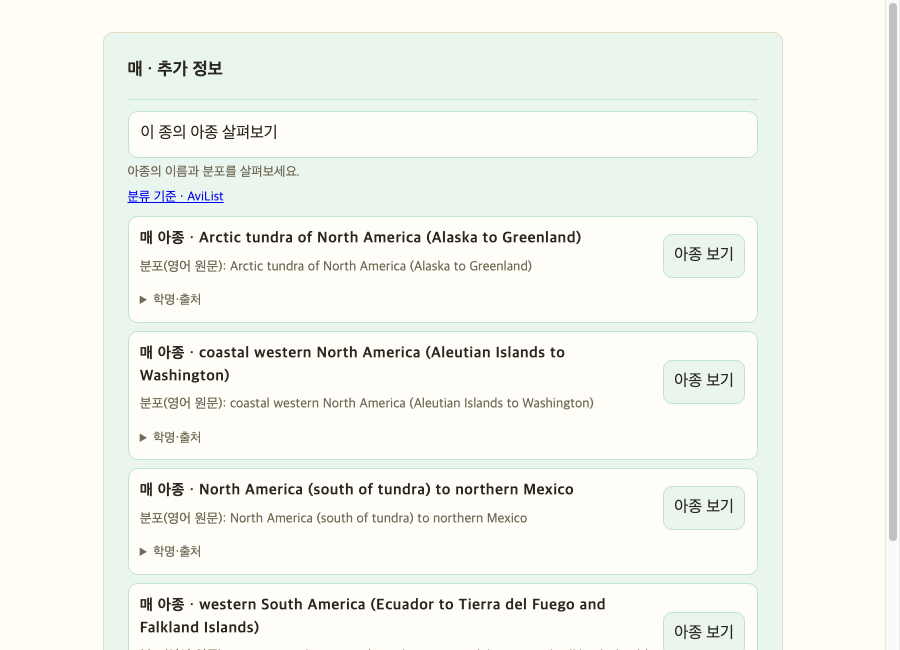
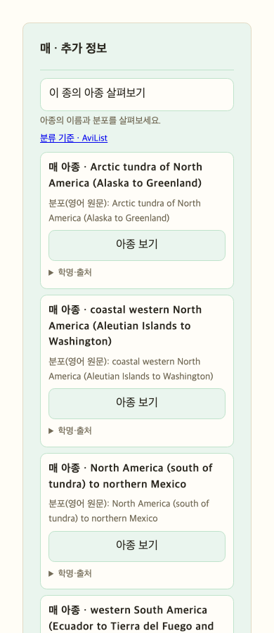
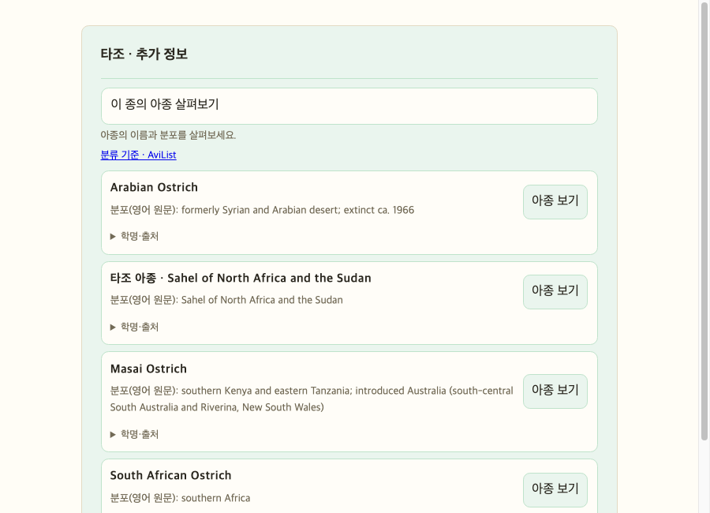
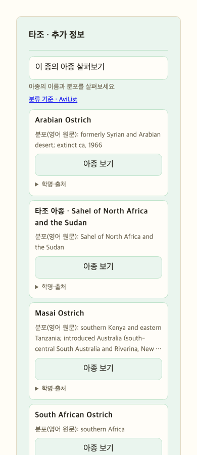

# 전체 아종 이름·분포 공통 처리와 출처 수집 — 2026-10-06

## 배경과 목표

사용자는 청둥오리·왜가리만 고치는 방식이 아니라 다른 종의 아종들도 확인된 한국어·영어 이름과 출처 있는 분포로 표시하도록 요청했다. Claude·Antigravity와 실제 협업하고 상세 작업 문서, Obsidian 기록, Git 커밋·푸시 및 기존 NAS TEST 배포 흐름을 이어간다. 임의 한국어 작명, 과거 분류명의 무조건적인 현재 종 치환, 학명을 숨겨 종 정체성을 잃는 처리는 허용하지 않는다.

## 원인과 전체 자료 확인

기존 AviList 분류 수집은 이미 아종의 분포문을 적재하고 있었다. 그러나 API가 이를 목록에 내보내지 않고 수동 검토한 청둥오리 두 아종·왜가리 네 아종만 보완해 다른 종은 구분 정보가 부족했다. AviList v2025b 원자료를 새로 내려받아 이전 캐시와 바이트 일치를 확인했다. 공식 JSON은 19,933,159바이트, SHA-256 `3b08845b54b8ab53908aee84d05b0fd8df765e9e01dc655599ca304d9f132411`이다.

공식 33,684행 중 아종은 19,879개이며 모두 Range가 있고 아종의 English_name_AviList/Clements/BirdLife 열은 비어 있다. 이는 별도 아종 영어 통칭이 세상에 없다는 뜻이 아니라 해당 원자료가 제공하지 않는다는 뜻이다. 한국어도 별도 근거 없이 만들지 않는다.

[AviList v2025b](https://www.avilist.org/checklist/v2025b/)는 CC BY 4.0이며 [컬럼 설명](https://www.avilist.org/checklist/components-of-the-avilist-checklist/)에서 분포문과 영어 이름의 구성 원칙을 설명한다. 이번에 이를 새로 웹 검색했지만 새로운 n8n 워크플로를 실행하거나 활성 DB를 다시 적재하지 않았다. 기존 n8n 수집이 저장한 분포를 공통 조회 경로에서 사용하고, 별도 통칭은 재현 가능한 오프라인 참고 자료로 보완한다.

## 협업과 책임

Orca orchestration Run `run_5cf03c61140a`를 사용했다.

- Claude Task `task_5ba506a07b6b` / Dispatch `ctx_4b8469d56908`: 전체 원자료와 1차 이름 출처를 대조해 정확한 아종 학명에 연결할 수 있는 영어 통칭을 수집하고 생성 스크립트·참고 JSON·검증·상세 출처 문서를 작성한다. 런타임·DB·배포는 수정하지 않는다.
- Antigravity Task `task_5534b0dc6360` / Dispatch `ctx_d28a979f129e`: 전체 데이터 가용성, 공통 폴백, 모바일, 출처 분리, 선택 프로필 검토. 읽기 전용 검토 성공 보고를 받았고 세션을 release했다. 보고서 `2026-10-06-subspecies-global-ux-review.md`. 전수 원자료 검사와 모의 테스트를 실제 DB 검사로 혼동하지 않는다.
- Codex(코디네이터): 공통 API/프로필/UI 구현, 통합 검증, 전체 NAS TEST 그래프 읽기 검사, 배포 및 문서 동기화.

Antigravity는 왜가리 외부 분포 설명의 출처가 AviList와 다르다는 이유로 카드 앞면에서 제외되는 결함도 발견했다. 이를 실제로 수정하고 안전한 외부 출처는 표시하되 위험한 URL은 제외하는 회귀 테스트를 추가했다. 검토 보고서의 일부 표현은 코디네이터가 정정했다. 원자료의 한국어 열 부재는 전 세계 공식 한국어 아종명의 부재를 입증하지 않으며, Parus major는 현재 한국의 박새 Parus cinereus와 구분해야 한다. 고정 스냅샷의 제목 중복 0건도 미래 자료의 구별성을 보장하지 않는다.

## 공통 구현

`_display_subspecies(row,parent,lineage)`가 목록과 선택 프로필에 함께 쓰인다. 모든 승인된 아종에 원자료 분포문, 출처, 언어와 상태를 제공한다. 한국어 검토 요약이 있는 기존 여섯 아종은 보존하고 다른 분포는 영어 원문으로 명시한다. 원문 자체를 추정 번역하거나 한국어 정식 이름으로 등록하지 않는다.

표시 우선순위는 확인된 한국어 이름 → 출처 있는 영어 이름 → 부모 종의 일반명과 분포 설명용 캡션이다. 캡션은 통칭 필드와 분리한 display_label이며 이름이 없는 아종에 대해서만 쓰인다. 첫 분포 절을 72자까지 제목으로 쓰고 전체 원문은 보존한다. 제목이 같으면 목록 번호를 추가해 구별한다. 아종 선택 시 프로필과 카드의 제목에도 같은 공통 표시 필드를 사용한다.

UI는 긴 설명을 목록에서 세 줄로 제한하고 학명·출처 토글에 전체 원문과 이름/분포 각각의 근거를 보존한다. 영어 원문 span에 lang=en을 주며 한국어 안내 문구는 한국어로 유지한다. 제목이 분포 설명용이며 정식 아종명이 아니라는 안내를 토글에 넣는다. 모든 텍스트는 textContent로 처리한다. 선택 요청은 계속 정확한 학명으로 수행하며 ID·rank·릴리스·concept set 가드, 대화 지우기 후 응답 폐기, 연속 선택 세대 가드를 유지한다.

## 검증 범위

전체 공식 스냅샷의 19,879개 아종을 공통 함수에 통과시켜 표시 이름/캡션과 분포·출처가 모두 존재함을 검사했다. scripts/audit_subspecies_display.py는 공식 URL 재수집 또는 로컬 원자료 경로를 지원하고 고정 SHA-256을 확인하므로 다른 원자료로 몰래 바뀌면 감사가 실패한다.

별도로 실제 NAS TEST PostgreSQL에서 활성 concept set·release를 읽고 Neo4j의 현재 승인된 부모·아종 관계 전체를 조회했다. 19,879개 ID·학명·분포문이 공식 원자료와 전부 일치했다. 읽기 전용 쿼리이며 실제 DB 데이터 변경은 하지 않았다. 이 검사는 로컬 수정 함수를 실제 DB 결과에 적용한 전수 검사로, HTTP로 19,879개 카드를 클릭한 검증은 아니다.

실제 통합 테스트는 별도 일회용 Neo4j 컨테이너와 TEST PostgreSQL의 ingest_test_subspecies_20261006 스키마를 사용했다. 기존 서비스 그래프와 ingest 스키마를 변경하지 않았다. 첫 연결은 PostgreSQL 외부 포트를 잘못 지정해 인증 오류로 실행 전 실패했다. 실제 컨테이너 설정과 포트 매핑을 확인해 5433으로 수정한 후 실행했다. 이름 일괄 참고 파일 통합 전 검사에서 553개 실행·553개 통과·실패/오류/건너뛰기 0, 81.294초. 로그 /tmp/robingraph-global-subspecies-python.log. 세 통합 실행 스위치를 모두 활성화했고 종료 후 생성한 컨테이너와 스키마를 삭제했다. tracing은 설치된 SDK의 로컬 모의 검증이며 외부 LLM 호출 성공을 의미하지 않는다.

프런트엔드 테스트는 별도 기록한 최종 결과를 따른다. 새 테스트는 다속 분포 폴백, 선택 프로필 일치, 긴/누락 분포, 제목 충돌, 출처 링크 구분, 위험 URL 제외, HTML 텍스트 처리, 접근성 버튼을 확인한다. 기존 릴리스 불일치·비동기 가드 테스트도 유지한다.

## 한계

전체 아종에 분포 정보가 연결되는 것과 전체 아종의 별도 통칭이 확인되는 것은 다르다. 통칭은 실제로 수집·검증한 부분집합에만 채운다. 아직 확인하지 못한 통칭은 비워두며, 분포 설명으로 구분한다. 대부분의 분포는 영어 원문이며 한국어 검토 요약이 전체에 존재한다고 주장하지 않는다. 새 분류판에는 현재 참고 이름을 자동 적용하지 않도록 ID와 학명을 대조한다. 분포는 외형 식별 특징이나 계통 거리·보전 등급을 뜻하지 않으며 부모 종의 자료를 아종 고유 형질로 바꾸지 않는다.


## 변경 파일과 검증 책임

- `src/robingraph/retrieval/subspecies.py`: 모든 아종의 분포·언어·출처·표시 캡션을 목록과 프로필의 공통 함수로 구성.
- `src/robingraph/retrieval/taxonomy_lineage.py`: 검증된 영어 참고 이름 파일을 캐시하고 스키마·릴리스·concept set·rank 및 개별 ID/학명을 대조. 기계 번역 한국어 아종명 제외.
- `src/robingraph/retrieval/species_profile.py`: 선택된 아종 프로필에 같은 표시 필드와 이름 출처를 전달.
- `src/robingraph/api/static/chat.js`, `styles.css`: 일반명 우선 제목, 분포 설명과 원문 상세, 안전한 출처 링크, 긴 텍스트와 모바일 레이아웃 처리.
- `scripts/build_subspecies_names.py`, `subspecies_name_references.json`: 공식 자료와 이름 참고 목록의 해시 고정, 출처 행/페이지 및 충돌·제외 이유를 포함한 생성 자료.
- `scripts/audit_subspecies_display.py`: 고정 원자료 전체를 읽기 전용으로 대조하는 재실행 가능한 감사.
- `tests/test_subspecies.py`, `tests/test_subspecies_name_references.py`, `tests/frontend/chat_ui.test.js`: 일반 아종·다른 속·정확한 동일성·출처/이름 충돌·비동기 상태 및 화면 표시 검증.
- `docs/subspecies-cards.md`: 현재 공통 동작 안내.
- 본 문서, Claude의 이름 자료 감사, Antigravity의 화면 검토: 구현·검증 범위와 남은 한계를 분리해 기록.

## 화면 검증 자료

실제 브라우저 엔진 Chrome headless에서 저장한 구성 요소 화면이다. 공식 AviList 자료를 공통 함수로 처리한 매의 네 아종을 주입한 독립 HTML 미리보기이며 공개 서비스에 대한 수동 사용자 클릭 기록은 아니다. 제품 코드의 JS/CSS를 그대로 사용했다. 390px 폭에서 문서 scrollWidth=390으로 가로 넘침이 없음을 확인하고 900px 화면도 시각적으로 확인했다. 개인 브라우저 프로필 대신 별도 임시 프로필을 사용하고 프로세스를 종료했다.





## 자료 수집 방식과 배포 범위

이번 자료 수집은 n8n workflow 실행이 아니다. 고정 SHA-256을 검증하는 Python 수집·생성 스크립트로 공식 체크리스트와 1차 기관 자료를 대조했다. 참고 이름 파일은 앱 이미지에 함께 포함되며 실행 시 외부 PDF 다운로드나 외부 LLM 호출에 의존하지 않는다. 이 작업의 배포 대상은 NAS TEST이다. 기존 그래프 노드에 번역명이나 캡션을 일괄 덮어쓰지 않고 공통 조회 단계에서 검증된 표시 필드를 결합한다.


영어 이름 수집이 실제로 사용되는 타조의 미리보기도 별도로 확인했다. Arabian Ostrich, Masai Ostrich, South African Ostrich는 출처 통칭을 제목으로 쓰고, 통칭이 확인되지 않은 타조 아종은 분포 설명용 캡션으로 구분된다. 아래도 구성 요소 미리보기이며 NAS HTTP 확인은 배포 기록을 따른다.






## 최종 이름 자료와 전수 감사 결과

DOF 2019와 Birds New Zealand 2022의 이름을 현재 AviList ID·학명·명명자에 대조했다. 생성 이름 1,074개(DOF 근거 978개·Birds NZ 근거 98개, 두 근거가 있는 이름 2개), 기존 수동 참조 포함 1,075개이다. 전체 아종 대비 생성 참고 이름 커버리지는 5.40%다. 별도 한국어 아종명은 이번 자료에서 수집·검증하지 않았으며 영어 이름을 한국어로 추정 번역하지 않았다.

320개 제외 레코드와 14건 충돌을 사유별로 남겼다. 현재 AviList ID로 연결하지 않은 영어 후보는 564개다. 예전 분류명이나 비슷한 철자라고 자동으로 같은 종에 붙이지 않는다. AviList·IOC의 확인한 아종 열은 비어 있고 Clements는 HTTP 403으로 원자료를 확보하지 못했으므로 내용이 없다고 단정하지 않았다. 검증하지 못한 통칭이 전 세계에 존재하지 않는다는 의미도 아니다.

코디네이터 최종 검토에서 독자 PDF/AES 구현을 제거하고 빌드에만 pypdf 6.19.0·cryptography 50.0.2를 사용하도록 줄였다. DOF는 논리 줄 순서를, NZ는 폰트가 붙은 run을 사용한다. 명명자 성의 불일치 한 건과 가축형 혼동 후보 Bengalese Munia를 추가로 제외했으며, NZ 원문 PDF 84쪽과 113쪽에서 두 추가 이름의 정확한 학명·명명자·통칭을 확인했다. 최종 개수는 제출 때와 같지만 구성은 다르다. 독자 판독기 대신 패키지를 쓰는 시도 중 처음의 좌표 기반 DOF 추출에서는 57개까지 감소했으나 채택하지 않고 논리 줄 추출로 수정한 후 전체 행 수와 후보 수를 다시 검증했다.

[Bengalese finch 게놈 논문](https://pmc.ncbi.nlm.nih.gov/articles/PMC5861438/)이 가축형 domestica/Society finch를 다루므로 Bengalese Munia의 야생 아종 표시를 보수적으로 제외했다. 이는 기존 참고 목록이 절대적으로 틀렸다는 판단이 아니라 앱에서 가축형과 야생 아종을 혼동하지 않기 위한 제외이며 사유·원출처 페이지를 보존한다. Society라는 지명 단어 전체를 제외하지 않는다.

원자료 분포는 AviList CC BY 4.0이고, DOF 개별 이름 자유 이용 고지 및 Birds NZ 저작권 표시를 별도로 기록했다. 개별 짧은 이름 사실·식별자·명명자·쪽수만 참고 파일에 남기며 두 책의 본문·전체 PDF·전체 추출문은 배포하지 않는다. 참고 이름 자료를 CC BY로 바꾸어 표시하지 않는다.

최종 공식 스냅샷 감사: 19,879개 아종·19,879개 분포, 통칭 1,075개, 분포 캡션 18,804개, 한국어 검토 분포 6개·영어 원문 분포 19,873개. 실제 NAS TEST DB 전수 조회에서도 같은 수치이며 19,879개 ID·학명·분포가 원자료와 전부 일치했다.

- [공식 스냅샷 감사 결과](assets/2026-10-06-global-subspecies-snapshot-audit.json)
- [실제 NAS TEST DB 감사 결과](assets/2026-10-06-global-subspecies-db-audit.json)
- [이름 자료 수집·제외 상세](2026-10-06-subspecies-name-source-audit.md)
- [Antigravity 화면·공통 처리 검토](2026-10-06-subspecies-global-ux-review.md)

390px와 추가 320px 구성 요소 미리보기에서 각각 scrollWidth=390, scrollWidth=320으로 가로 넘침이 없었다.

최종 참고 파일 SHA-256: `83a21444131accfcf17ab25c9981920ba557642015676e17dc0467dbd4c44751`.

협업 종료: Claude와 Antigravity 모두 유효한 worker_done으로 성공 종료했다. Antigravity 터미널은 해제 완료했다. Claude 해제 요청은 Orca가 `user_takeover` 상태라 보존해야 한다는 응답을 반환했으므로 사용자가 소유한 터미널을 강제 종료하지 않았다. 회수해야 할 터미널 조회 결과는 0개였다. Claude 최초 문서의 “581개 모두 통과” 표현은 총 발견 581개 중 건너뜀 34개를 포함한 결과였으므로 실제 실행·통과 547개로 정정했다. 코디네이터 최종 검사에서는 아래 최종 결과를 따른다.


## 최종 테스트 결과와 재현

| 검사 | 실제 범위 | 결과 |
|---|---|---|
| Python 전체 unittest | 실제 NAS TEST PostgreSQL의 격리 스키마·일회용 Neo4j, 세 통합 스위치 활성화, tracing SDK, 고정 소스 파일 | **580개 실행·580개 통과 / 실패 0 / 오류 0 / 건너뜀 0**, 87.869초 |
| 프런트엔드 node 테스트 | 실제 제품 JS를 DOM 모의 환경에서 실행 | **132개 실행·132개 통과 / 실패 0 / 건너뜀 0** |
| 소스 이름 재생성 | 실제 해시 고정 AviList + DOF + Birds NZ 원본 | 산출물 바이트 완전 일치; 전체 테스트 내 포함 |
| 전수 표시 감사 | 공식 고정 스냅샷 19,879개 | 이름/캡션·분포·출처 누락 0 |
| 실제 DB 전수 대조 | NAS TEST 승인 아종 19,879개 | 원자료 ID·학명·분포 전부 일치 |
| Chrome 구성 요소 미리보기 | 900px, 390px, 추가 320px | 육안 레이아웃 확인 / 390·320px 가로 넘침 0 |
| git diff 검사 | 실제 변경 파일 | whitespace 오류 0 |
| graphify update . | 수정 AST | API 비용 없이 갱신 완료, 3,365 nodes / 7,119 edges |

소스 의존성은 임시 uv 환경에만 설치했으며 프로젝트 pyproject.toml·uv.lock은 변경하지 않았다. 두 추가 소스 테스트는 원본 경로 환경변수를 지정해 실행하여 건너뛰지 않았다. 실제 PostgreSQL 스키마와 Neo4j 컨테이너는 테스트 종료 후 삭제되었다. 테스트 전후 공개 서비스의 기존 ingest 스키마와 그래프를 갱신하지 않았다.

```sh
ROBINGRAPH_SUBSPECIES_SOURCE_DIR=DIR uv run --locked --extra test --extra tracing --with pypdf==6.19.0 --with cryptography==50.0.2 python -m unittest discover -s tests -v
node --test tests/frontend/*.test.js
uv run --locked --extra test python scripts/audit_subspecies_display.py --output report.json
uv run --no-project --with pypdf==6.19.0 --with cryptography==50.0.2 python scripts/build_subspecies_names.py --cache-dir DIR --offline --check
```

첫 명령의 실제 DB 검사를 모두 활성화하려면 기존 세 통합 실행 변수와 격리 DB 연결 설정을 함께 제공해야 한다. 연결 암호는 문서나 로그에 남기지 않는다. 두 외부 PDF와 JSON 파일명은 소스 감사 문서의 목록을 따른다. 테스트 내 모의 HTTP/LLM 부분은 실제 외부 모델 API 성공을 뜻하지 않으며 출처 파일 대조·DB 연결 검사와 구분한다.


## NAS TEST 배포와 공개 HTTP 검증

- 런타임 커밋: `fdde55e0e51c2f476b7cbb5bcb97efd009eb85b1` (`Apply sourced names and distribution displays to all subspecies`). origin/dev push 완료.
- 배포 파일: 커밋 객체의 runtime allowlist만 패키징한 `robingraph-nas-release-fdde55e0e51c2f476b7cbb5bcb97efd009eb85b1.tar.gz`. 미커밋 환경 파일·개발 작업 문서·원본 PDF·개인 설정은 포함하지 않았다.
- 아카이브 SHA-256: `7945115b1a042103c61a22ddff61024d262278843e9afb18b5bf78f6dbada43e`. NAS 전송 후 같은 해시임을 검사하고 압축을 풀었다.
- NAS TEST 릴리스: `/home/kimdove/RobinGraph-global-subspecies-fdde55e`.
- Docker 이미지: `robingraph-api:test-global-subspecies-fdde55e`.
- OCI revision: 런타임 커밋 전체 값과 일치. `robingraph-api-test` 상태 healthy. `deploy_nas.sh update` 정상 종료.
- 공개 TEST 주소: https://robingraph-test.dove-nest.com

기존 TEST 연결 설정을 새 릴리스에 복사하고 ROBINGRAPH_IMAGE·ROBINGRAPH_VCS_REF만 새 값으로 바꿨다. 서비스 시작 직후 한 HTTP 검사에서는 502가 발생했다. 컨테이너가 healthy가 된 뒤 재검사하여 정상 통과했고, 배포 계약 검사는 passed=true였다. 이는 초기 재시작 구간 응답이며 최종 정상 결과와 분리해 기록한다.

| 공개 목록 조회 | 아종 수 | 확인된 통칭 수 |
|---|---:|---:|
| 청둥오리 | 2 | 2 |
| 왜가리 | 4 | 2 |
| Struthio camelus | 4 | 3 |
| Phasianus colchicus | 30 | 3 |
| Falco peregrinus | 18 | 0 |
| Parus cinereus | 20 | 1 |
| Parus major | 16 | 0 |
| Corvus macrorhynchos | 10 | 0 |
| Psittacula krameri | 4 | 0 |

아홉 목록에서 모든 반환 아종이 통칭 또는 캡션과 분포·출처를 가진다. 왜가리 Ardea cinerea cinerea, 타조 Struthio camelus australis, 매 Falco peregrinus anatum을 실제 POST /v1/chat으로 선택했다. 결과 disposition=answer, 목록과 프로필의 taxon ID·rank·학명·영어 이름/캡션·분포 설명·분포 출처가 일치했다. 외부 BirdLife 분포 설명과 source-original 영어 설명 모두 실제 응답에 존재한다. 공개 /static/chat.js와 styles.css SHA-256은 로컬 커밋 파일과 일치했다. 이 HTTP 검사는 9개 부모 목록·3개 선택 프로필에 한정하며 전체 19,879개 HTTP 프로필을 호출했다고 주장하지 않는다.

- [공개 HTTP 목록·선택 프로필·정적 파일 검사](assets/2026-10-06-global-subspecies-http.json)
- [배포 API 계약 검사](assets/2026-10-06-global-subspecies-contract.json)

PROD 서비스나 PROD 이미지를 배포하지 않았다. 작업 문서와 소스 감사·화면 검토·검증 JSON/이미지는 별도 문서 커밋으로 origin/dev에 저장하고 Obsidian Work 기록에 같은 핵심 내용을 동기화한다.
