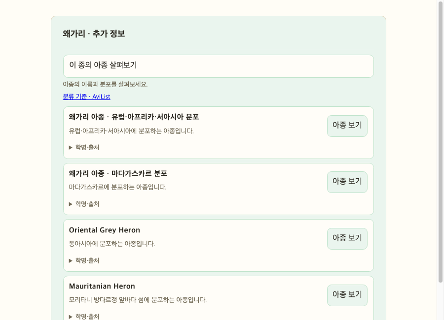
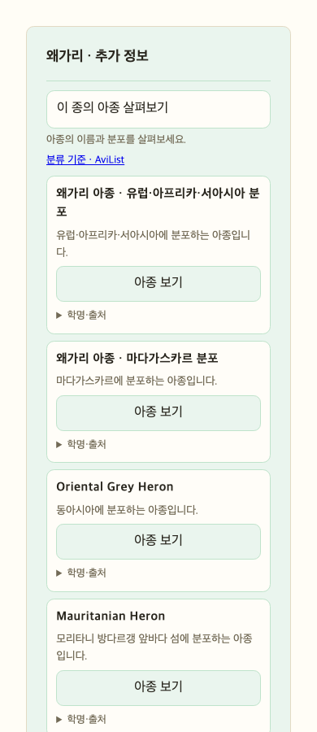

# 왜가리 아종 표시명·분포 안내 보완 — 2026-10-06

## 요청 배경과 목표

사용자는 아종 카드가 모두 `아종 1 · 이름 미등록`처럼 보여 서로 구분하기 어렵다는 실제 화면을 제시했다. 처음 언급한 종은 청둥오리였으나 곧 왜가리로 정정했다. 기존 카드 디자인은 유지하면서 확인된 한국어·영어 이름을 우선하고, 확인되지 않은 이름을 임의 번역하지 않는 것이 목표다.

## 확인한 원인과 실제 API 근거

수정 전 NAS TEST의 `/v1/taxa/subspecies?name=왜가리`는 AviList v2025b의 왜가리 `avilist-taxon:v2025b:5419`에 연결된 네 아종을 반환했다. 네 항목 모두 `english_name`과 `korean_name`이 null이었다. 앞선 수정은 청둥오리 아종 두 개에만 출처가 있는 영어 이름을 보완했으므로 다른 종의 이름 누락을 해결하지 못했다. 화면은 이 경우 학명을 토글에 넣고 제목을 번호와 `이름 미등록`으로 대체했다. 목록 자체와 분류 연결은 정상이며 표시명·구분 정보가 부족한 문제였다.

## 이름과 분포를 확인한 자료

- Birds New Zealand의 [2022 Checklist, 본문 175쪽/PDF 175번째 페이지](https://www.birdsnz.org.nz/wp-content/uploads/2022/05/checklist-2022.pdf): `Ardea cinerea jouyi`의 영어 이름 `Oriental Grey Heron`을 명시한다.
- Dansk Ornitologisk Forening의 [2019 세계 조류 이름 목록, PDF 157번째 페이지](https://www.dof.dk/images/organisationen/publikationer/Navne_pa_alverdens_fugle-til_DOF2019.pdf): `Ardea cinerea monicae`의 영어 이름 `Mauritanian Heron`을 명시한다. 같은 자료의 firasa 영어 이름 칸은 비어 있으므로 독일어·덴마크어 이름을 영어·한국어로 임의 변환하지 않았다.
- [BirdLife South Africa, Grey Heron, Taxonomy](https://www.birdlife.org.za/red-data-book/red-list/grey-heron/): cinerea는 유럽·아프리카·서아시아, jouyi는 동아시아, firasa는 마다가스카르, monicae는 모리타니 방다르갱 앞바다 섬으로 구분한다. 이를 짧은 한국어 설명으로 요약했다. 이 문구는 전체 분포의 상세 경계가 아니라 해당 출처의 분류 항목을 요약한 것이다.

종·아종의 분류 기준은 활성 AviList v2025b 그대로다. 위 자료는 이름과 분포 설명의 근거이며 외부 자료의 별도 분류 체계로 현재 그래프를 바꾸지 않는다. 한국어 아종 통칭은 이번에 확인되지 않아 새로 만들지 않았다.

## 변경 전후

| 아종 | 기존 제목 | 수정 후 제목 |
|---|---|---|
| cinerea | 아종 1 · 이름 미등록 | 왜가리 아종 · 유럽·아프리카·서아시아 분포 |
| firasa | 아종 2 · 이름 미등록 | 왜가리 아종 · 마다가스카르 분포 |
| jouyi | 아종 3 · 이름 미등록 | Oriental Grey Heron |
| monicae | 아종 4 · 이름 미등록 | Mauritanian Heron |

분포 제목은 공식 새 이름이 아니라 설명용 캡션이다. API에서는 `display_label`로 분리하고 `korean_name`/`english_name`은 null 그대로 둔다. 학명·출처 토글 안에는 별도 한국어·영어 통칭이 확인되지 않았다는 문구를 넣는다. 다른 종의 이름 없는 아종도 부모 종 이름과 번호로 표시해 빈 제목처럼 보이지 않게 한다. 검토되지 않은 종의 분포나 통칭은 추측하지 않는다.

각 카드에 한국어 분포 설명을 표시하고 토글에 분포 설명 출처를 추가했다. 아종 선택 시 학명으로 정확한 프로필을 조회하는 방식, 종·아종 ID 및 분류 버전 검증, 모바일 카드 배치, 접힘 기본값은 유지한다.

## 변경 파일과 안전한 적용 범위

- `taxonomy_lineage.py`: jouyi/monicae의 영어 참고 이름을 정확한 AviList ID와 학명에 결합. 기존의 다른 영어 이름을 강제로 덮어쓰지 않는다. 목록과 프로필에서 같은 함수 사용.
- `subspecies.py`: 네 아종 분포 설명과 출처, 이름 없는 두 아종의 `display_label` 제공. 정확한 ID·학명·concept set·v2025b를 확인할 때만 분포 적용. 선택된 아종의 설명 섹션에도 같은 출처 사용.
- `chat.js`: 한국어 이름 → 영어 이름 → 설명용 캡션 → 부모 이름+아종 번호 순으로 카드 제목 표시. 버튼 접근성 이름에도 같은 제목 사용. 통칭 미확인 안내와 분포 출처를 학명 토글에 추가.
- `tests/test_subspecies.py`: 네 아종 이름/캡션, 통칭 null 보존, 출처, 프로필 설명, 버전 불일치 시 설명 미적용 검증.
- `tests/frontend/chat_ui.test.js`: 설명용 제목, 학명 비노출, 출처 토글, 접근성 버튼 검증 및 일반 이름 누락 폴백 갱신.

그래프·DB 데이터 변경이나 n8n 수집은 수행하지 않았다. 검토된 작은 참고 목록으로 읽기 결과만 보완했다.

## 검증 결과와 범위

- 아종 Python 테스트: 7개 실행, 7개 통과, 실패·건너뛰기 0.
- 전체 Python: 552개 실행, 520개 통과, 실패·오류 0, 32개 건너뛰기. 이번 실행에서 실제 DB 통합 실행 조건을 활성화하지 않아 관련 테스트가 건너뛰어졌다. 전부 통과로 표현하지 않는다. 로그 `/tmp/robingraph-heron-python.log`.
- 프런트엔드: 129개 실행, 129개 통과, 실패·건너뛰기 0. 로그 `/tmp/robingraph-heron-ui.log`.
- `git diff --check` 통과, `graphify update .` 완료.
- 렌더 검증: 실제 chat.js/CSS와 API 생성 함수를 사용하는 모의 repository 결과로 Chrome headless 카드 컴포넌트를 렌더했다. 실제 공개 사이트를 수동 클릭한 검증은 아니다. 데스크톱 900px와 모바일 390px 이미지를 확인했고 모바일 scrollWidth=innerWidth=390으로 가로 넘침이 없었다.
- 공개 NAS TEST API: 네 아종 모두 확인된 영어 이름 또는 설명용 캡션, 한국어 분포, 분포 출처를 반환함을 확인했다. 영어 이름이 있는 두 아종은 실제 `/v1/taxa/profile`에서도 목록과 영어 이름이 같고 분포 설명이 존재하는지 확인했다. 배포된 JS/CSS는 로컬 커밋 파일의 SHA-256과 일치했다. 실제 데이터 검증이며 모의 테스트와 구분한다.

## 배포·커밋

런타임 커밋: `a2f3a499172025921b0f935232108c0a545c1558`, origin/dev push 완료.
배포 대상: `https://robingraph-test.dove-nest.com`, NAS TEST 전용 컨테이너. 패키지 SHA-256: `0d1ff532f8e5a5228c926c8d09595749e514ba1c006337c42178f3c61de65054`.

처음 배포 명령에서 이미지/리비전 환경 변수의 이름을 잘못 지정해 이전 TEST 태그로 새 런타임을 빌드했다. 공개 API의 내용은 수정됐지만 inspect 라벨은 이전 커밋이어서 이를 배포 검증 완료로 간주하지 않았다. 실제 compose 변수 `ROBINGRAPH_IMAGE`·`ROBINGRAPH_VCS_REF`로 수정한 뒤 전용 태그로 다시 배포했다. 최종 inspect 결과는 `robingraph-api:test-heron-a2f3a49`, 리비전 `a2f3a499172025921b0f935232108c0a545c1558`, 상태 `healthy`로 확인했다. 이전 TEST 태그는 이전 릴리스 디렉터리에서 build만 수행해 원래 코드 이미지로 복원했다. 현재 컨테이너를 되돌리는 deploy는 하지 않았다. 최종 공개 API·정적 파일 일치 재검증과 배포 계약 검사(`passed=true`)도 통과했다. PROD 배포는 수행하지 않았다. 인증 정보는 문서에 기록하지 않는다.

## 한계와 후속 사항

이번에 확인한 별도 영어 통칭은 왜가리 두 아종이며 나머지 두 개는 분포 설명으로 구분한다. 이름 없는 전 세계 모든 아종의 통칭을 수집한 것은 아니다. 다른 종은 부모 이름+번호 폴백을 사용하며, 개별 이름과 분포는 근거를 확인한 뒤 보완해야 한다. 분포 캡션을 한국어 정식 이름으로 등록하지 않는다. 상세 문서는 Obsidian에도 같은 내용으로 기록한다.
