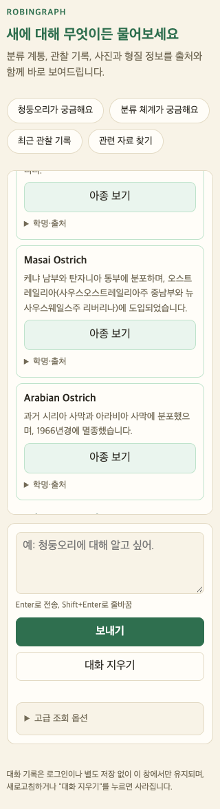
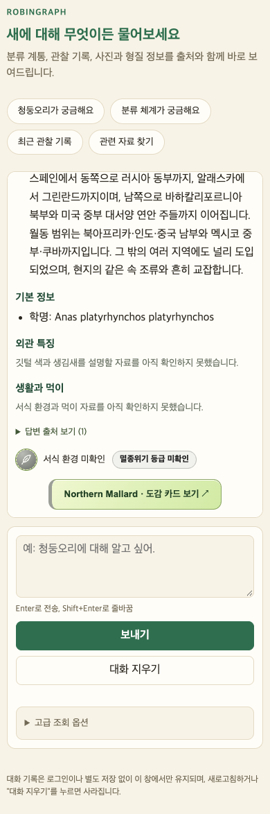

# RG-010 — 아종 분포 설명·설명용 제목 한국어화

## 요청 배경과 목표

2026-10-07 사용자가 Obsidian 백로그의 RG-010을 먼저 진행하도록 요청했다. 기준선은 AviList v2025b의 아종 19,879개, 한국어 분포 6개, 영어 원문 19,873개였다. 목표는 종별 예외 코드 대신 공통 생성·검토·조회 경로로 한국어 분포 설명과 설명용 제목을 제공하고, ID·학명·분류판·원문 해시가 달라지면 기존 번역을 재사용하지 않는 것이다. 정식 국명 수집은 RG-011이며 이번 설명용 제목을 국명으로 등록하지 않는다.

현재 상태는 **RG-010 공통 구현·1차 원문 대조 적용·NAS TEST 배포 및 실환경 검증 완료**이다. 전 세계 모든 아종의 한국어 검토가 완료되었다는 뜻은 아니다. 이후 검증 결과와 커밋 정보는 아래 최종 기록으로 갱신한다.

## 확인한 원인과 근거

- `src/robingraph/retrieval/subspecies.py`에 청둥오리 두 아종의 요약과 왜가리 네 아종의 외부 분포 설명이 하드코딩되어 있었다. 다른 아종은 AviList 영어 원문을 표시했다.
- 왜가리 예외는 ID·학명·분류판을 확인하지만 실제 조회된 분포 원문 변경과 결합되어 있지 않았다. 새 구조는 원문 해시까지 확인한다.
- 청둥오리 기준 아종의 기존 짧은 요약은 AviList의 상세 번식·월동 범위, 널리 도입된 분포 및 현지 동속 조류와의 교잡 내용을 모두 전달하지 않았다. 새 설명은 이 한정 정보를 보존한다.
- 고정 공식 자료: https://explore.avilist.org/data/avilist-2025b.json. SHA-256 `3b08845b54b8ab53908aee84d05b0fd8df765e9e01dc655599ca304d9f132411`. 실행 중 실제 내려받아 해시를 확인했다. 원자료는 CC BY 4.0이며 아종 이름 자체의 다른 출처·권리는 기존처럼 구분한다.
- 기존 Graphify 산출물이 checkout에 없었다. 소스와 작업 기록을 확인한 후 `graphify update .`로 AST 그래프를 생성했다.

## 변경 전후 동작

| 상황 | 변경 전 | 변경 후 |
|---|---|---|
| 검토 자료가 있는 아종 | 두 종의 전용 예외에 한정 | 동일 원문 표현을 공유하는 모든 아종에 ID별 검토 레코드 생성 |
| 분포 원문 변경 | 왜가리의 외부 설명 예외 유지 가능 | `stale-review`, 영어 원문 표시 |
| 분류판·개념집합·학명 변경 | 예외별 조건 | 공통 확인, 불일치 번역 재사용 차단 |
| 이름 없는 아종 | 부모 이름 + 영어 분포 캡션 | 검토된 한국어 설명용 제목; 별도 국명 필드 생성 안 함 |
| 미검토·충돌·번역 실패 | 명시적 처리 상태 없음 | 상태 구분, 영어 원문 유지 |
| 자료 없음 | 분포 미확인 안내 | 기존 안내 유지, `missing-source` 상태 |
| 목록·선택 카드·채팅 | 공통 표시 함수 + 종별 예외 | 동일한 공통 검토 자료와 표시 함수 |

왜가리는 이번부터 고정 AviList 원문에 맞춘 한국어 설명을 제공한다. 기존 BirdLife 외부 요약을 그대로 AviList 번역으로 표시하지 않는다. 예를 들어 jouyi는 원문에 적힌 일본·중국·인도차이나·말라야·수마트라·자바를 보존한다.

## 변경 파일과 구현

- `src/robingraph/retrieval/subspecies_ranges.py`: 오프라인 검토 자료 로딩, ID·학명·분류판·개념집합·정규화 원문 SHA-256 확인, reviewed/pending-review/stale-review/conflict/translation-failed/missing-source/invalid-review 판정. 검토 상태와 필요한 필드가 유효한 경우만 한국어 표시.
- `src/robingraph/retrieval/subspecies_range_reviews.json`: 런타임에 포함되는 ID별 한국어 설명·캡션·원문 해시·검토 주체와 방법. 요청 처리 중 외부 번역 API를 호출하지 않는다.
- `data/review/subspecies-range-ko.json`: 완전 일치하는 원문 표현을 기준으로 재사용하는 1차 한국어 원문 대조 자료. 특정 종에 대한 조건문이나 별도 분포 사전을 추가하지 않는다. 새 후보는 명시적 reviewed 상태가 없으면 검토 완료로 승격하지 않는다.
- `scripts/build_subspecies_ranges.py`: 고정 자료 해시 확인, 모든 아종의 처리 원장과 집계 생성, 검토 자료 생성 및 `--check` 바이트 재현 검증. 원문에 매칭되지 않는 검토 표현·중복 ID·잘못된 상태를 거부한다.
- `src/robingraph/retrieval/subspecies.py`: 이전 종별 예외 제거, 공통 검토 결과 연결, 영어 원문·출처 유지. 검토된 제목을 길이 때문에 잘라 멸종·도입 등 한정 표현을 없애지 않는다.
- `scripts/audit_subspecies_display.py`: 기존 전수 표시 감사에 검토 상태별 집계 추가.
- `tests/test_subspecies.py`, `tests/test_subspecies_ranges.py`: 실제 출처 원문을 쓰는 왜가리 fixture 및 원문 변경·불일치·후보 보류·멸종·계절·도입·잠정 표현·목록/프로필 일치 회귀 검증.
- 기존 프런트엔드가 API의 공통 설명·캡션과 영어 원문 출처 상세를 사용하므로 제품 JS/CSS 변경은 필요하지 않았다.

## 전수 처리·검토 범위

| 구분 | 수 |
|---|---:|
| 전체 처리 대상 | 19,879 |
| 한국어 원문 대조 적용 | 1,109 |
| 미검토·영어 원문 유지 | 18,770 |
| 확인된 충돌 | 0 |
| 번역 실행 실패 | 0 |
| 원문 분포 없음 | 0 |
| 원문 대조한 고유 표현 | 137 |

최초 번역·원문 대조는 Codex가 수행했고, 이후 Antigravity가 기준선 137개 표현을 독립 대조했다. 독립된 사람의 검토를 주장하지 않는다. 모델/API로 전체 자료를 자동 번역한 뒤 전부 검토 완료로 집계하지 않았다. 미검토 18,770개를 번역 실패나 근거 없음으로 해석해서는 안 된다. 스리랑카·타이완·자바·보르네오 등 여러 종이 공유하는 분포와 청둥오리·왜가리·타조·매·Parus major·큰부리까마귀의 복잡한 문장을 포함한다. 전체 한국어 검토 확대는 남은 작업이다.

## 검증 방법과 실제 결과

최종 실행 결과는 아래에 기록한다. 자동 통합 테스트는 로컬 일회용 Docker PostgreSQL·Neo4j에서 실행했으며, 추가 전수 감사는 실제 NAS TEST DB를 읽기 전용으로 조회했다. NAS와 PROD DB에 자료를 쓰거나 재적재하지 않았다. 원자료 감사, 실제 DB, 로컬 HTTP·브라우저, NAS 공개 HTTP를 서로 구분한다.

재현:

```sh
python scripts/build_subspecies_ranges.py --snapshot AVILIST_JSON --report report.json --ledger ledger.jsonl --check
python scripts/audit_subspecies_display.py --snapshot AVILIST_JSON --output display-audit.json
python -m unittest discover -s tests -v
node --test tests/frontend/*.test.js
graphify update .
```

실제 DB 통합 실행에는 기존 세 가지 통합 opt-in 변수와 격리 DB 설정이 필요하다. 연결 암호는 문서에 포함하지 않는다.

## 배포·커밋 정보

NAS 주소 192.168.219.99, SSH 포트 99는 사용자에게 재확인했다. 초기에는 SSH 인증이 거부되었으나 이후 사용자가 제공한 인증으로 접속에 성공했다. 인증 값은 파일·문서에 저장하지 않았다. 기존 TEST 환경 설정을 NAS 내부에서 새 릴리스에 복사하고 이미지·VCS revision만 변경했다.

NAS TEST 배포와 공개 API·화면 검증을 완료했다. PROD 컨테이너 ID와 이미지가 배포 전후 동일함을 확인했다. 런타임 커밋과 실제 배포 정보는 아래 최종 기록을 따른다.

## 한계와 후속 사항

- 남은 18,770개 분포 원문은 한국어 검토를 확대해야 한다. 새 표현은 같은 자료 파일과 빌드 경로로 추가한다.
- NAS TEST에서 여러 속 목록·선택 프로필·채팅과 320·390px 화면을 확인했다. 공개 HTTP 전수 프로필 검사는 아니며, 전체 19,879개에 대해서는 별도의 DB 전수 감사를 수행했다.
- 새로운 분류판·변경 원문은 이전 번역을 차단하며 재검토가 필요하다. 릴리스 비교·활성화·롤백의 운영 자동화는 RG-012 범위이다.
- 이번 작업은 아종 고유 형질·사진·정식 한국어 국명 수집을 하지 않는다. 부모 종 형질과 아종 직접 자료의 기존 분리는 유지한다.


## 협업 결과와 의견 반영

사용자의 협업 지적 후 Orca orchestration run `run_fd804850d4c6`에서 검토를 시작했다. 이후 사용자가 다음 작업부터 협업하면 된다고 설명했으므로 새 협업을 추가하지 않고 시작된 작업만 정리했다.

- **Antigravity / Gemini 3.8 Flash**: 기준선 137개 표현을 전수 대조하고 1,109개 매칭·18,770개 미검토를 독립 산출했다. 검토 상세 문서와 표현별 JSON을 작성했고 valid worker_done으로 성공 종료한 뒤 터미널을 해제했다.
- **Claude**: agent_readiness 시간 초과로 작업이 시작되지 않았다. 검토나 파일 편집을 수행했다고 기록하지 않는다. 실패 receipt에 따른 worker-release가 완료되었다. 실제 선택 모델은 확인되지 않았다.
- **Codex**: 구현·최초 번역·검토 의견 판정·공통 자료 재생성·통합 테스트·NAS TEST 배포·실환경 검증을 수행했다. 정리해야 할 reclaimable 협업 터미널 조회 결과는 0개였다.

Antigravity의 여섯 의견은 다음처럼 처리했다.

1. 매 calidus의 `winters`를 본문에서도 “이동해 월동합니다”로 명확히 했다.
2. 청둥오리 캡션에 실제 원문의 북아프리카·인도·중국 남부·멕시코 중부·쿠바를 표시했다. 제안의 “중미”로 원문 지리 범위를 바꾸지 않았다.
3. `Kuru=구로시마`는 보고서의 해석이며 별도 원출처가 확인되지 않았다. 동일성을 확정하지 않고 기존 원문 충실 표기를 유지했다. Bird's Head·Langbian 등도 공식 한국어 표준 지명이라고 주장하지 않는다.
4. 이란의 “동쪽 끝”을 “극동부”로 다듬었다.
5. “약 1966년에”를 “1966년경에”로 수정했다.
6. `the Sudan`을 국가만으로 단정하지 않도록 “수단 지역”으로 표시했다.

워커 완료 메시지의 “586건 통과”는 상세 문서와 구분해야 한다. 워커의 실제 독립 실행은 **586건 발견, 544건 통과, 42건 건너뜀**이었다. 코디네이터 최종 실제 DB 통합 결과는 아래 **576건 통과, 10건 건너뜀**이다. 워커는 일부 로컬 HTTP를 확인했으며, NAS 배포·브라우저 확인은 코디네이터가 별도로 수행했다.

## 최종 검증 결과

| 검사 | 실제 범위·환경 | 결과 |
|---|---|---|
| Python 전체 | 최종 런타임 자료, 로컬 일회용 PostgreSQL·Neo4j, 기존 세 통합 opt-in 활성화 | 586건 발견 / **576건 통과 / 10건 건너뜀 / 실패·오류 0**, 16.841초 |
| 아종 집중 검사 | 최종 번역 및 기존 아종 동작 | 41건 발견 / 39건 통과 / 기존 외부 소스 검사 2건 건너뜀 |
| 프런트엔드 전체 | 제품 JS의 DOM 모의 환경 | 132건 통과 / 실패·건너뜀 0 |
| 자료 재생성 | 고정 실제 AviList 전체 | `--check` 바이트 일치, 전체 처리 원장 19,879건 |
| 표시 전수 감사 | 실제 고정 공식 원본, 공통 표시 함수 | 한국어 1,109 / 영어 원문 18,770 / 원문·출처·표시 누락 0 |
| 실제 NAS DB 전수 감사 | 실제 TEST PostgreSQL 활성 릴리스 및 Neo4j, 배포된 공통 표시 함수 | 19,879개 ID·학명·분포 모두 공식 원자료와 일치 / reviewed 1,109 / pending-review 18,770 |
| 공개 TEST HTTP | 부모 6종의 목록 54개 아종, 선택 프로필·채팅 각 7건 | 모든 목록의 한국어 설명·원문·출처 확인, 목록/프로필/채팅 표시 일치 |
| 공개 API 계약 | 실제 TEST health/openapi/한국어 이름 canary | `passed=true` |
| Chrome 공개 TEST 구성 요소 화면 | 실제 TEST JS/CSS/API, 청둥오리·타조·Parus major, 320·390·900px | 9개 조합 모두 아종 선택 성공, 가로 넘침 0, page error 0 / 대표 모바일 이미지 육안 확인 |
| Docker 이미지 | 로컬 Python 3.12 이미지 빌드 및 자료 로딩; 실제 NAS 새 이미지 | 로컬 1,109개 자료 로딩 확인; NAS OCI revision 일치·healthy |
| Graphify | AST-only 갱신 | 3,337 nodes / 7,304 edges 기준; 최종 자료 수정 후 topology 변경 없음. SQL parser 미설치로 SQL 4개 추출은 제외됨 |

Python의 10건 건너뜀은 선택 tracing SDK 관련 8건과 기존 이름 자료의 외부 고정 파일 관련 2건이다. 이번 실제 AviList 분포 감사와 DB 연결 검사는 실행했다. 외부 Gemini/Jina 모델 호출 성공을 이번 테스트 결과로 주장하지 않는다. 최종 번역 수정 후 아종 집중 검사와 전체 실제 DB 통합 검사를 재실행했다. 프런트엔드 파일은 변경하지 않았고, 최종 실제 TEST 화면을 별도 확인했다.

공개 HTTP 검사에서 stdlib 기본 User-Agent 요청은 프록시의 HTTP 403을 반환했다. 기존 배포 검증기와 동일한 식별 User-Agent를 지정한 재검사는 통과했다. 이 실패를 서버 기능 오류나 통과 결과로 혼동하지 않는다. 첫 기본 scp 전송은 SFTP 연결이 닫혔으며, 기존 scp 프로토콜 전송 후 해시와 manifest 110개 파일 검증이 통과했다.

### 증거 파일

- [전체 처리 집계](assets/2026-10-07-RG010-processing.json), [전체 처리 원장 gzip](assets/2026-10-07-RG010-processing-ledger.jsonl.gz)
- [공식 원본 표시 감사](assets/2026-10-07-RG010-snapshot-audit.json), [실제 NAS DB 전수 감사](assets/2026-10-07-RG010-nas-db-audit.json)
- [공개 HTTP](assets/2026-10-07-RG010-public-http.json), [공개 계약](assets/2026-10-07-RG010-public-contract.json), [공개 TEST Chrome 검사](assets/2026-10-07-RG010-public-browser.json)
- [배포 묶음·이미지 정보](assets/2026-10-07-RG010-package.json)
- [Antigravity 검토](2026-10-07-RG010-antigravity-source-review.md), [표현별 대조](2026-10-07-RG010-antigravity-source-review.json)





## 최종 배포·커밋 정보

- 최초 구현: `be229a9a8401c6e5d5ddf40b4ca1c7d17538b80d`.
- 검토 반영 및 최종 런타임: `cd46b33148e3bb94237c8631dd3df4eaa2efbf2d`.
- NAS TEST 릴리스: `/home/kimdove/RobinGraph-rg010-cd46b33`.
- NAS TEST 이미지: `robingraph-api:test-rg010-cd46b33`, OCI revision은 최종 런타임 커밋과 일치, `healthy`.
- 배포 묶음 SHA-256: `78ab9b56917d561c69c23483eb4cd18f68f31e7bf0c644b5b5e6737002d85a05`. 전송 전후 동일하고 내장 manifest 110개 파일 해시를 실제 NAS에서 확인했다.
- `ROBINGRAPH_DEPLOY_TARGET=test` preflight·update·verify 정상 종료. 서비스 공개 주소: https://robingraph-test.dove-nest.com.
- 기존 TEST 설정은 NAS 내부에서 복사하고 이미지·VCS ref만 수정했다. 기존 DB 수집·활성 상태를 변경하지 않았다.
- PROD는 기존 `robingraph-api:prod-local`과 동일한 컨테이너 ID를 유지했다. PROD 배포·활성 자료 준비는 RG-002 별도 범위다.
- Git 커밋은 현재 로컬 `dev`에 있다. 이 작업에서 원격 push는 수행하지 않았다. NAS에는 커밋 객체에서 만든 런타임 allowlist 묶음을 전달했다.
- 저장소 상세 기록과 Obsidian 작업 노트·백로그는 동일한 완료 범위·검증 수치·미검토 건수를 기록한다. **RG-010 완료는 공통 경로와 첫 검토 자료의 TEST 실환경 검증까지이며, 전체 19,879개 한국어 검토 완료가 아니다.**

로컬 검증 종료 후 이 작업에서 만든 프리뷰 프로세스와 `rg010-neo4j`·`rg010-postgres` 일회용 컨테이너를 종료·삭제했다. 기존 로컬 서비스는 정리 대상에 포함하지 않았다.
