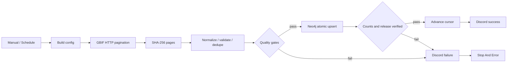

# 2026-09-07 작업 기록

## 오늘의 결과

NAS n8n이 GBIF 한국 조류 관찰 데이터를 직접 수집·검증하고 Neo4j에 적재하는 운영 workflow를 완성했다. 초기 Claude와 GPT-5.6 Terra 후보의 운영 통제 장점은 유지하되, 존재하지 않는 CLI를 SSH로 호출하던 구조는 폐기했다. 최종 workflow는 n8n 기본 노드 안에서 수집과 변환을 수행하며 Neo4j 적재 결과를 검증하고 Discord로 알린다.

`workflow.dove-nest.com`의 Public API로 기존 workflow ID `Mw9tbGM9vyzu6X1F`를 유지한 채 최종본을 배포했다. 실제 실행 `17238`은 전 노드 성공했고, 테스트 뒤 workflow는 다시 inactive 상태로 전환했다.

## 구현과 설계 변경

| 영역 | 완료한 작업 |
|---|---|
| 후보 평가 | Claude 후보 47/100, Terra 후보 53/100으로 재평가했다. 둘 다 운영 통제는 갖췄지만 n8n 내부 수집이 없고 미구현 CLI에 의존해 점수를 낮췄다. |
| 네이티브 수집 | GBIF Occurrence API를 HTTP Request 노드가 직접 호출한다. 대상은 한국(`KR`)의 조류(`taxon_key=212`)이며 좌표가 있는 `PRESENT` 기록만 수집한다. |
| 범위와 라이선스 | CC0 1.0과 CC BY 4.0만 요청하고 변환 단계에서 다시 검사한다. 최초 실행은 최근 30일이며 300건씩 최대 20페이지로 제한한다. |
| 무결성 | 각 GBIF 응답 페이지를 정규화 전에 SHA-256으로 해시한다. GBIF ID로 실행 내 중복을 제거하고 Neo4j에서는 `MERGE`한다. |
| 품질 제어 | 응답 오류, 빈 결과, 25% 초과 quarantine, pagination 미완료를 차단한다. 공개 좌표만 저장하고 문제가 있는 레코드는 최소 식별자와 사유만 quarantine에 남긴다. |
| Neo4j 적재 | HTTP Query API의 단일 implicit transaction으로 observation, 외부 분류 개념, 장소, source/license provenance, media, quarantine, ingestion state를 적재한다. |
| 검증 | HTTP 202 외에도 observation/media/quarantine 적재 건수와 `state.active_release` 반환을 입력값과 대조한다. 검증 성공 뒤에만 증분 cursor를 갱신한다. |
| 알림 | 기존 `Nesty API 키` Discord Bot credential을 재사용해 NestControl의 `전서구` 채널로 성공·실패 결과를 보낸다. |
| API 배포 | `.env`의 n8n API URL·key·workflow ID를 읽어 inactive workflow만 백업·교체하는 `scripts/deploy_n8n_operational_ingest.py`를 추가했다. |

최종 workflow는 Manual Trigger와 매일 02:00 KST Schedule Trigger를 포함한 15개 노드로 구성된다. SSH 노드는 없다.

## NAS 연결과 배포

브라우저 자동화 권한 문제를 피하기 위해 n8n Public API를 사용했다. API 연결 뒤 기존 workflow와 Credential 목록을 조회했으며 secret 값은 읽거나 출력하지 않았다.

- n8n: `https://workflow.dove-nest.com/api/v1`
- workflow ID: `Mw9tbGM9vyzu6X1F`
- workflow 이름: `RobinGraph — native GBIF ingest to Neo4j`
- Neo4j Query API: Docker network의 `http://neo4j:7474/db/neo4j/query/v2`
- Neo4j 인증: 기존 `Neo4j` credential을 HTTP Request의 predefined authentication으로 사용
- Discord 인증: 기존 `Nesty API 키` bot credential
- Discord 대상: NestControl `전서구`

NAS에 실제 사용 중인 HTTP Request 노드는 4.4였다. 로컬 최신 stable용 4.5 JSON은 NAS에서 publish할 때 실패했으므로 최종 산출물도 4.4로 맞췄다. 공식 n8n stable 컨테이너에서 4.4 workflow import가 되는 것도 다시 확인했다.

배포 전 workflow 백업은 `~/.local/state/robingraph/n8n-backups/`에 권한 `0600`으로 저장한다. n8n API key와 DB 비밀번호는 Git ignore 대상 `.env` 또는 n8n Credential store에만 두며 저장소에는 포함하지 않는다.

## 실제 실행 결과

| 실행 | 결과 | 판단 |
|---|---|---|
| Neo4j 읽기 진단 | Docker DNS `neo4j`에서 `RETURN 1`, HTTP 202 | Query API 경로와 기존 인증 정상 |
| `17236` | source 19, observation 19, media 11, quarantine 0을 적재했지만 검증 실패 | Query API 반환 필드 `state.active_release`를 `active_release`로 읽던 오류 발견 |
| `17237` | 이전 실패 실행 재시도 | Public API retry가 이전 노드 출력을 재사용해 수정 검증에는 부적합함을 확인 |
| `17238` | **성공** | 처음부터 새 trigger 실행으로 모든 노드와 Discord 성공 알림 완료 |

최종 성공 실행 `17238`의 결과는 다음과 같다.

| 항목 | 값 |
|---|---:|
| 수집 기간 | 2026-08-08 ~ 2026-09-07 |
| GBIF source | 19 |
| 검증 observation | 19 |
| Neo4j loaded observation | 19 |
| loaded media | 11 |
| loaded quarantine | 0 |
| `load_ok` | `true` |

적재 쿼리는 `MERGE` 기반이라 `17236` 이후 다시 실행해도 같은 GBIF ID의 observation을 중복 생성하지 않는다. `17236`과 `17237` 과정에서 실패 알림이 전송됐고, `17238`에서 최종 성공 알림이 전송됐다.

## 검증 결과

| 검증 | 결과 |
|---|---|
| 로컬 전체 테스트 | **114개 실행**, 93개 통과, opt-in Neo4j 테스트 21개 skip, 실패 0 |
| n8n workflow import | 공식 `docker.n8n.io/n8nio/n8n:stable`에서 성공 |
| NAS Neo4j 연결 | `http://neo4j:7474`에서 인증된 Query API 호출 성공 |
| NAS end-to-end | execution `17238` 성공, 적재 count와 active release 일치 |
| Discord | 실패 경로와 최종 성공 경로 모두 실제 전송 확인 |
| GitHub Actions | run `34086988343`의 Linux·Windows·macOS fixture 및 Neo4j 통합 job 모두 성공 |
| Git 상태 | 구현 커밋 `be62ff4`까지 `origin/dev`에 push 완료 |

오늘의 주요 커밋은 다음과 같다.

| 커밋 | 내용 |
|---|---|
| `484914b` | Claude·Terra 후보와 검토된 초기 n8n workflow 추가 |
| `3e900cd` | SMTP 알림을 Discord로 변경 |
| `8447096` | SSH/CLI 구조를 n8n 네이티브 GBIF 수집으로 교체 |
| `1d044b9` | 네이티브 ingest 통합 검증 결과 기록 |
| `be62ff4` | n8n Public API 배포, NAS 호환성 및 `state.active_release` 검증 수정 |

## 종료 상태와 다음 작업

- NAS workflow는 **inactive**다. Schedule Trigger는 `0 2 * * *`로 저장되어 있지만 workflow를 publish하기 전에는 자동 실행되지 않는다.
- n8n Public API 스키마는 UI 전용 `concurrency` 필드를 받지 않는다. 운영 publish 전에 n8n UI에서 workflow concurrency를 1로 확인해야 한다.
- 현재는 page hash와 source URI를 보존하며 원본 response body 자체를 영속 파일로 보관하지 않는다. 원본 장기 보존이 필요하면 NAS 전용 volume과 파일 노드를 추가한다.
- GBIF taxon key는 승인된 AviList crosswalk가 없으므로 `ExternalTaxonConcept`로 저장한다. canonical `Taxon` 연결은 별도 승인 데이터가 준비된 뒤 수행한다.
- 운영 활성화 뒤에는 첫 자동 실행의 GBIF 기간, 적재량, quarantine 비율과 Discord 알림을 확인한다.

상세 운영 절차는 [n8n 실행 런북](../n8n/README.md), 후보 비교와 최종 계약은 [n8n 최종 설계](../n8n/final-operational-ingest.md)에 있다.
