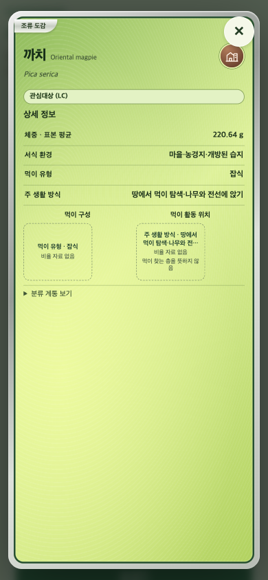
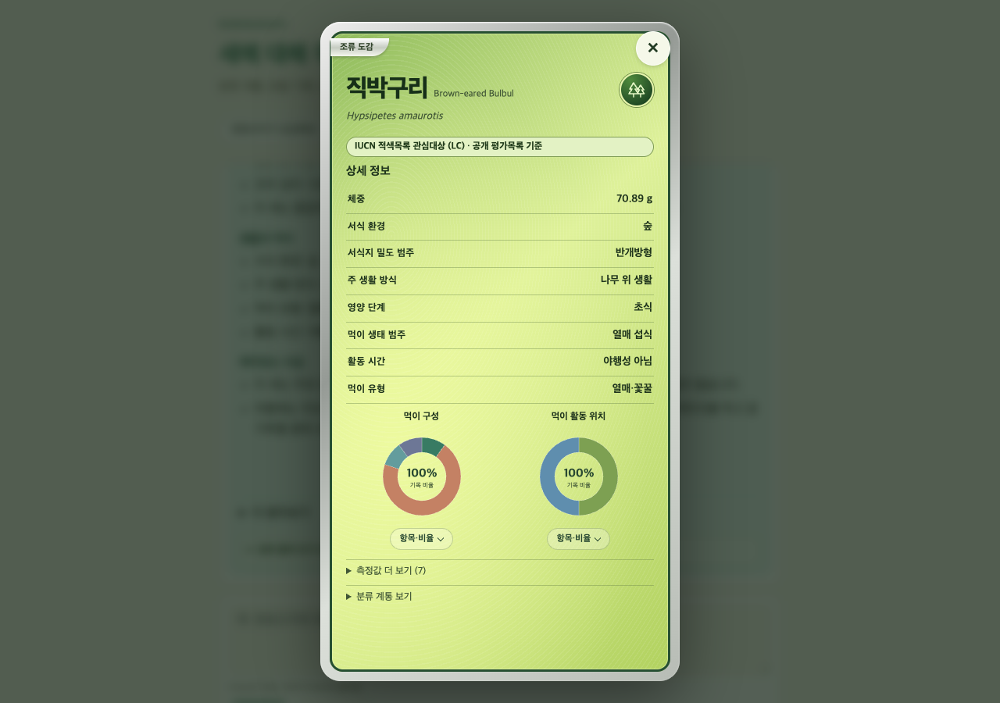

# 전체 종 형질 자료 연결 복구와 카드의 비율 부재 표시

작성일: 2026-10-09. 작업 시작 기준 `4c62562eca085122c0edd399149f5d179928303b` / dev. 구현·실 DB 검증·NAS TEST 배포·공개 HTTP 및 PC/모바일 브라우저 검증을 완료했다.

## 배경과 목표

까치 카드에 생태 설명과 LC 배지가 추가되어도 먹이 구성·먹이 활동 위치가 빈 박스로 남았다. 앞선 작업은 까치의 정성 설명과 표본 체중을 추가했지만 두 비율의 원본 유무와 전체 종의 연결 문제까지 해결하지 못했다. 사용자는 Ponytail의 Claude와 GPT-6.1-sol 협업, 까치에 한정하지 않는 공통 처리, Antigravity의 신뢰할 수 있는 IUCN 출처 조사를 요청했다. 필요하면 n8n을 수집에 사용해도 된다고 허용했다.

목표는 저장 누락·옛 학명 매핑 보류·원본 필드 부재·분류 개념 차이를 구분하고, 입증 가능한 연결만 복구하여 실제 화면에서 확인하는 것이다. 비율이 없는 종에 다른 종의 비율을 복사하지 않는다.

## 협업과 책임

Orca orchestration run `run_884af743b57d`에서 실제 에이전트 터미널로 협업했다.

| 담당 | 작업 | 산출물 |
|---|---|---|
| Claude / Ponytail | 원본 분류 대응 조사, 결정적 교차표 생성, 공통 카드 UI | `scripts/build_trait_crosswalk.py`, `trait_crosswalk.json`, frontend 코드·테스트 |
| GPT-6.1-sol | 실제 TEST 전수 저장/조회 감사, 공통 조회 복구 | `scripts/audit_trait_coverage.py`, `trait_mapping.py`, backend 테스트 |
| Antigravity | 공식 보전 등급 출처와 불일치 원인 조사 | 별도 IUCN 검토 문서·집계 |
| Codex /root | 결과 검토·통합, 독립 검증, TEST 배포, 기록 동기화 | 본 문서 및 실제 응답·브라우저 검증 |

Claude는 기존 Ponytail 작업 트리의 옛 코드를 병합하지 않고 최신 dev-3의 지정 파일에 직접 작업했다. GPT 워커는 Orca 실행 정보에서 `gpt-6.1-sol`임을 확인했다. 조사 초안의 검증 범위를 넘는 확정 표현은 검토 후 제외했다.

## 원인과 실제 감사 근거

[전체 종 감사](../verification/2026-10-09-all-species-trait-audit.md)와 [집계 JSON](../verification/2026-10-09-all-species-trait-audit-summary.json)에 상세 근거가 있다.

- AviList 11,131종이 활성 TEST PostgreSQL 및 Neo4j에 모두 저장되어 있었다. 원본과 DB의 양방향 종 ID 누락·학명 불일치·중복은 0이었다.
- EltonTraits 9,993개 유효 프로필, AVONET 11,009개 원기록도 누락 0이었다. 이미 연결된 형질 claim은 각각 46,512개·128,331개이며 원본값 불일치 0이었다.
- 현재 학명과 정확히 같지 않은 원본은 Elton 2,241개·AVONET 1,130개 후보로 남아 있었다. 후보 `profile_json`의 정규화 값은 원본과 모두 같았고 누락·중복·값 불일치 0이었다. PostgreSQL 원기록에는 주로 식별 메타데이터가 있고 전체 형질값은 graph claim/후보 JSON에 있다는 차이도 확인했다.
- 기존 비율 차트의 원자료 연결 범위는 7,752종이었다. 현재 학명의 원본행이 없다는 것이 생물학적 자료 자체가 전혀 없다는 뜻은 아니다. 직박구리·대백로 등은 옛 이름으로 원자료에 존재했다.
- Pica serica는 두 원본에 독립된 행이 없고 이번 개념 교차표에도 승인 연결이 없다. Pica pica의 비율을 까치로 복사할 수 없다.
- IUCN 등급 연결은 형질 자료와 별도다. [Antigravity 조사 통합본](../verification/2026-10-09-iucn-source-review.md)에 현재 목록 연결 7,507종과 미연결 사유, 개별 평가 검증의 한계를 기록했다. 이번에 보전 매핑 기준을 완화하지 않았다.

## 연결 규칙과 변경 내용

[교차표 생성 보고](../verification/2026-10-09-trait-crosswalk-build.md)에 원본 URL·전체 해시·구조 검사·규칙·사유별 집계를 기록했다.

- AVONET은 원본 Avibase 개념 ID와 현재 AviList 종의 ID가 고유하게 일치할 때만 승인한다.
- EltonTraits는 BL3 행에 한해, 공개 BirdLife–BirdTree 대응표의 양방향 일대일 관계와 AVONET Avibase ID를 거쳐 현재 종 개념이 일치할 때 승인한다.
- 이름 유사도·종소명만으로 고르지 않는다. 일대다/다대일·충돌·IOC27 분류 기준 미확인은 승인에서 제외한다.
- 동일 학명이라도 개념 일치가 입증되지 않은 기존 값은 `needs_review`로 출처에 설명한다. 모든 차이를 분할 전 자료라고 단정하지 않는다.
- 최종 교차표의 이름 변경 승인 행은 Elton 1,868개·AVONET 703개다. 이는 원자료 행 단위이며 서로 다른 종 2,571개라는 뜻은 아니다.

조회 복구는 기존 후보값과 활성 원기록을 읽어 적용한다. 대상 종/개념집합/분류 릴리스, 원본 고정 해시, 활성 자료 릴리스, 후보 수집 run, 허용 정책과 원기록 식별자를 함께 검증한다. 패키지에 교차표를 포함하고 정적 인덱스를 캐시한다. DB의 후보나 graph 관계를 영구 갱신하지 않는다. 원본이 바뀌면 현재 고정 스냅샷 기준의 승인을 자동 재사용하지 않는다.

카드에서는 비율이 없을 때 같은 크기의 두 영역 안에 출처가 있는 먹이 유형/생태 범주 또는 주 생활 방식을 표시하고 `비율 자료 없음`을 명시한다. 주 생활 방식에서 지면·수관 등의 먹이층이나 비율을 추정하지 않는다. 범주값도 없으면 자료 없음 상태를 유지한다. 정성 대체 영역에 별도 출처를 중복 추가하지 않고 기존 답변 출처 토글을 사용한다.

## 검증 기록

완료된 독립 검증(최종 배포 후 HTTP/브라우저 결과는 아래에 추가):

- 고정 원본을 제공한 교차표·감사 도구 테스트: 36개 통과, 실패·건너뜀 0.
- 전체 Python 테스트(교차표 원본 제공): 744개 실행, 통과 709, 실패 0, 건너뜀 35. 별도 DB 실행 설정/격리 DB가 필요한 33개와 별도 아종 이름 원본이 없는 2개가 건너뜀이다. 이번 조회 복구의 실제 TEST DB 검증은 별도로 수행했다.
- 프론트엔드 최종 단위 테스트: 273개 통과, 실패·건너뜀 0.
- Claude의 실제 Chrome + 모의 API 검증: PC 1280×900, 모바일 390×844의 자료 없음/정성/혼합/긴 값 네 시나리오. 카드·대체 영역 크기 유지, 가로/뒷면 스크롤과 JS 오류 없음. 실제 NAS 응답 검증과 구분한다.
- Antigravity의 고정 IUCN/AviList 분석을 Codex가 독립 재실행: 11,131/7,507/3,624 및 원인별 합계 일치. IUCN ZIP EML 라이선스·날짜도 직접 확인했다.

- 새 조회 함수를 실제 TEST 후보·활성 원기록으로 검증: Elton 1,868개 → 9,340형질, AVONET 703개 → 9,131형질 복구, 원값 불일치·검증 문제 0. 전체는 실 DB 일괄 조회 결과를 새 단일 종 함수에 재현했고 2,571회 실제 HTTP 호출은 아니다.
- 대표 실제 DB 단일 조회: 직박구리·대백로 13→18형질, Tachyspiza badia 0→18, Pica serica 0→0(별도 문헌 보완은 profile 단계), Pica pica 18→18 + 연결 검토 필요 표시.
- `graphify update .`: AST 갱신 완료, 4,410 노드·9,291 관계. SQL 파서 미설치로 SQL 4개가 제외됐고 LLM 재라벨링은 실행하지 않았다.

## 원자료의 추정값 구분

[EltonTraits 원저자 메타데이터](https://ndownloader.figshare.com/files/5631093)를 추가 확인했다. BodyMass-SpecLevel/ForStrat-SpecLevel 0, Diet-Certainty D1/D2는 종별 자료가 없는 추정값임을 명시한다. 기존 claim과 복구 후보 모두에서 해당 항목에 `inferred: true`를 표시하고 원래 `certainty`와 `source_note`를 보존한다. C는 불확실성과 특정 동속 종으로부터의 추정을 함께 포함하므로 코드만으로 추정임을 단정하지 않는다. 숫자·비율은 바꾸지 않는다.

## 배포·커밋 및 남은 한계

구현 커밋은 `663ef4ffb25c96c44214153797deadb516926c41`이다. Git 객체에서 비밀정보 없는 NAS 패키지를 만들고 파일별 MANIFEST 및 전송 아카이브 SHA-256을 검증한 뒤 TEST에 배포했다.

- TEST 이미지: `robingraph-api:test-traits-663ef4f`.
- TEST OCI revision: `663ef4ffb25c96c44214153797deadb516926c41` (환경 변수 `ROBINGRAPH_VCS_REF`로 빌드에 명시하고 실제 라벨 대조).
- TEST 컨테이너: `55e27687a4e0405f433d43a62425f936088b878dad6d7e5d5b9e3acdda68af1a`, healthy.
- NAS 실행 경로: `/home/kimdove/RobinGraph-traits-663ef4f`.
- 패키지 SHA-256: `9e5ceaec9bdebc7ad360c464af66c6483bd17f5190c79273fe09726b9bc1b9a4`.
- PROD 이미지 `robingraph-api:prod-e90ff85`, 컨테이너 `71d938bb700e8b75ccc8f470357b38c4f96f03d67da30736d70fe769ec4423cf`와 revision은 배포 전후 동일, healthy였다. PROD 변경 없음.
- DB/후보/graph 관계 변경 및 n8n 실행 없음. 환경 파일은 NAS 내부에서 기존 TEST 설정을 새 실행 경로에 복사했고 문서·전송 패키지에는 포함하지 않았다.

### 공개 주소 검증

[실 HTTP 결과](../verification/2026-10-09-trait-recovery-api.json), [실 브라우저 결과](../verification/2026-10-09-trait-recovery-browser.json), [함수 실 DB 검증 상세](../verification/2026-10-09-trait-runtime-verification.md)를 보존했다.

`https://robingraph-test.dove-nest.com`에서 실제 profile HTTP 9건이 모두 200이고 다음을 확인했다.

| 조회 | 실제 결과 |
|---|---|
| Hypsipetes amaurotis / Ardea alba / Tachyspiza badia | 각각 18형질, 두 비율의 승인된 옛 학명 연결·원값 확인 |
| Pica serica / 까치 | 둘 다 까치·Oriental magpie·LC, 문헌 보완 4형질, 없는 비율 미생성 |
| Pica pica | Eurasian magpie, 기존 18형질, 개념 연결 `needs_review` 표시 |
| Anas platyrhynchos | 기존 18형질 유지 |
| Tinamus osgoodi / Megapodius decollatus | 기존 정확연결/복구 연결 양쪽 식이 D1의 `inferred: true`와 원 certainty 확인 |

실제 배포 `chat.js`, `styles.css` 바이트가 검증한 로컬 파일과 일치했다. Playwright의 실제 Chrome에서 API 응답 모킹 없이 까치·직박구리 질문을 PC 1280×900/모바일 390×844로 각각 실행했다. 네 시나리오 모두 카드가 화면 안에 들어왔고 기본 상태 휠 스크롤 이동 0, JS 오류 0이었다. PC 실제 마우스 드래그와 모바일 CDP 터치 스와이프로 뒷면→앞면 전환을 확인했다. 직박구리 출처 토글에 원자료 학명 `Ixos amaurotis`가 표시됐다. 물리 모바일 기기와 Safari/Firefox 검증은 하지 않았다. 펼쳐진 상세 토글의 기존 스크롤 정책을 이번 수정으로 바꾸지는 않았다.

### 알려진 한계

- 까치의 수치 비율은 새로 확보하지 못했다. 기존 연구·문헌의 정성 정보와 표본 체중을 사용하며 비율 부재를 유지한다.
- 읽기 시점 복구이므로 후보 상태/graph 관계 자체는 바뀌지 않는다. graph 전용 질의·순위 산정의 자료 범위까지 모두 확장했다고 주장하지 않는다.
- 추정 코드 보완의 실 TEST 재검증에서도 값·플래그 불일치 0이었다. 복구 Elton의 추정 표시는 체중 191개, 활동 위치 45개, 식이 유형/구성 각각 139개다. 기존 정확연결에서도 같은 규칙을 적용하며 C 코드를 확정 추정으로 단정하지 않는다.
- n8n 사용 허용은 받았으나 기존 후보값이 온전하여 이번 복구에는 재수집이 필요하지 않았다. 신규 n8n 워크플로 작성·실행은 없고 향후 IUCN 배포본 갱신 절차를 조사 문서에 제안했다.
- 공식 세계 등급과 국가 적색목록/법정 보호등급은 구분한다. 이번 보전 조사는 읽기 전용이며 추가 2,816개 후보를 확정 연결 수로 계산하지 않는다.
